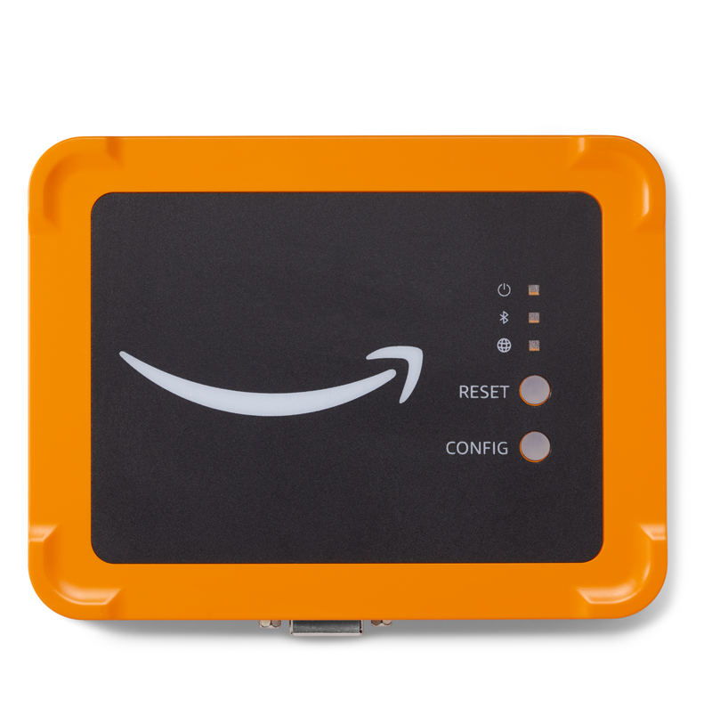
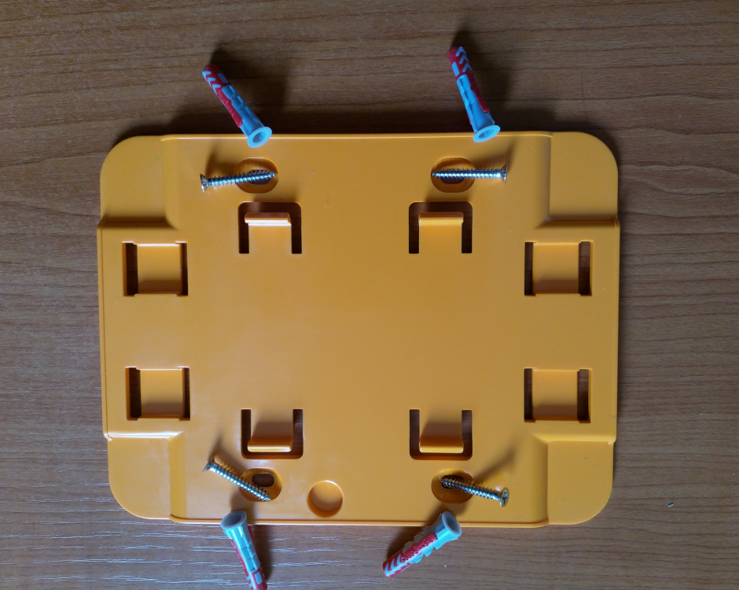
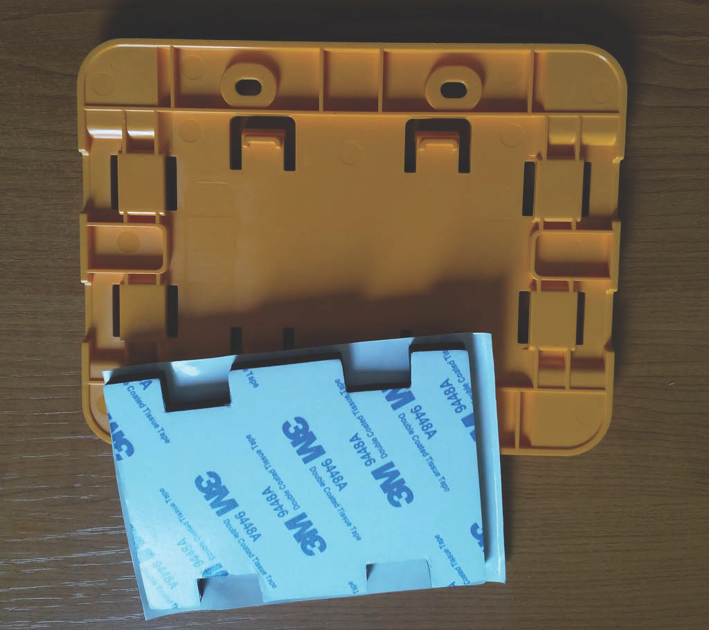
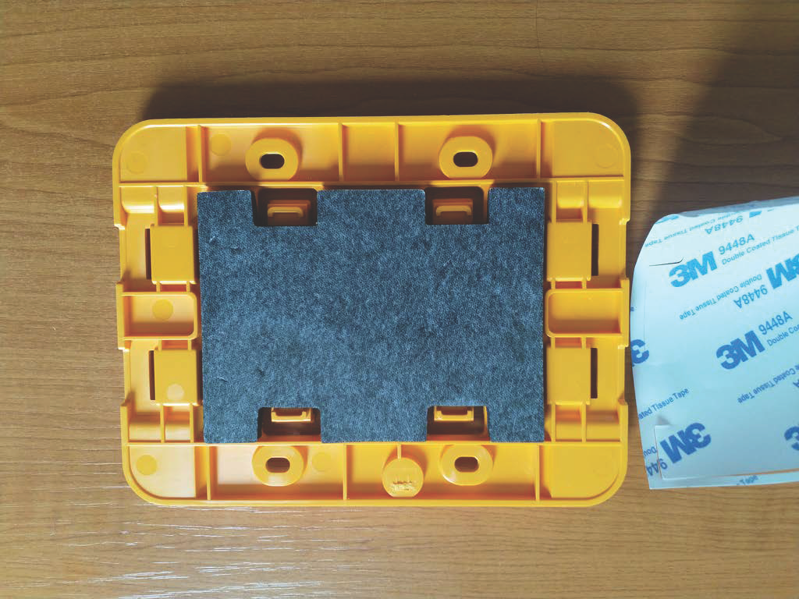
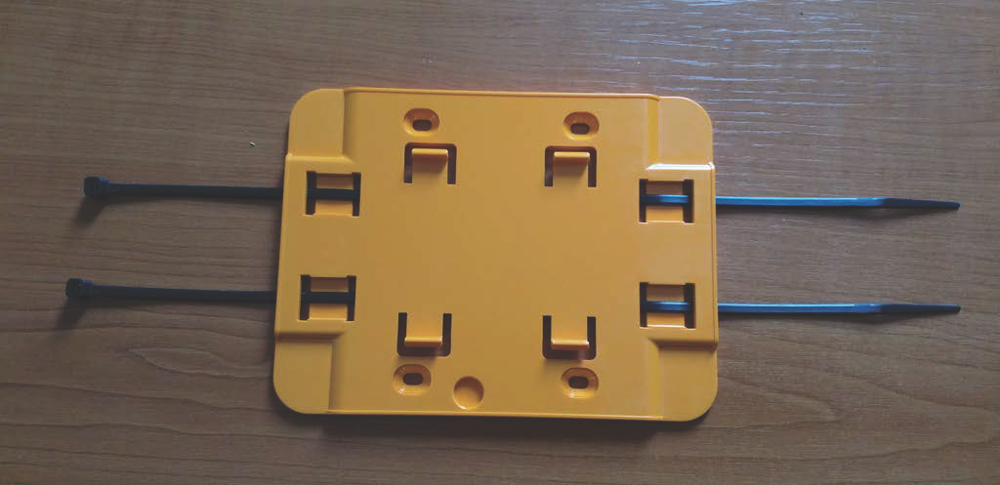

Amazon Monitron is no longer open to new customers. Existing customers can
continue to use the service as normal. For capabilities similar to Amazon
Monitron, see our [blog post](https://aws.amazon.com/blogs/machine-learning/maintain-access-and-consider-alternatives-for-amazon-monitron "https://aws.amazon.com/blogs/machine-learning/maintain-access-and-consider-alternatives-for-amazon-monitron").

# Placing and installing an Ethernet

gateway

Unlike sensors, an Ethernet gateway doesn't need to be attached to the machines
that are being monitored. However, it does need an available Ethernet network
through which Amazon Monitron can connect to the AWS Cloud.

###### Topics

- [Where to place a gateway](#where-gateway-ethernet "#where-gateway-ethernet")
- [Installing an Ethernet gateway](#how-gateway-ethernet "#how-gateway-ethernet")
- [Turning on the gateway](#Gateway-on "#Gateway-on")

## Where to place a gateway

You can install a gateway anywhere within your work area, depending on its
layout. Typically, gateways are mounted on walls, but you can mount them on
ceilings, pillars, or in any other location. A gateway must be within 20 to 30
meters of the sensors it will support, and an Ethernet gateway must be close
enough to an Ethernet cable to plug in. Note that an Ethernet gateway draws
power from the Ethernet cable.

Consider these other factors when mounting a gateway:

- Mounting the gateway higher than sensors (2 meters or above) can
  improve coverage.
- Keeping an open line of sight between the gateway and sensors improves
  coverage.
- Avoid mounting the gateway on building structures, such as exposed
  steel beams. They can cause interference with the signal.
- Try to work around any equipment that might produce electronic
  interference with the signal.
- If possible, install more than one gateway within transmission
  distance of your sensors. If a gateway becomes unavailable, the sensors
  will switch their data transmission to another gateway. Having multiple
  gateways helps to eliminate data loss. There is no minimum required
  distance between two gateways.

## Installing an Ethernet gateway

Almost everything you need to install your gateway in your work area is
contained in the box that contains the gateway:

- The gateway
- A wall mounting bracket
- Double-sided tape
- Four mounting screws

To install the gateway, position the wall mounting bracket on the wall or on
another location, then mount the gateway on the bracket, Ethernet cable on the
downwards side.

There are three ways to mount the mounting bracket: screw mounting, tape
mounting, and plastic-tie mounting. The method you use depends on whether you're
mounting the gateway on a wall or another location, and on the surface
material.

To mount the bracket, choose one of the following.

**Screw mounting**

Typically, you mount the bracket directly to the wall using the mounting
screws included in the gateway box. Mount the bracket from the front. You might
need to use an expansion plug or toggle bolt (not included) to secure the screw
in the wall.

**Tape mounting**

A shaped piece of double-sided tape is included in the gateway box. Use it
when you can't place a screw into the mounting surface. You can also use it in
combination with the other methods of mounting for a more secure
installation.

Remove the backing on one side of the tape and apply the tape to the back of
the wall mounting bracket between the four raised sections.

Remove the remaining backing and apply the bracket to the mounting location.
Press hard on the bracket to make sure that the tape firmly adheres to the
surface.

**Plastic-tie mounting**

To mount a gateway to a smaller non-wall location, such as a pillar or fence,
use cable ties (also known as zip ties) to fasten the wall mounting bracket. Put
the ties through the holes in the four raised sections on the back of the
bracket, wrap them around the mounting location, and pull tight.

After the bracket is mounted, attach the gateway to the bracket.

## Turning on the gateway

1. With the wall mounting bracket in place, place the gateway against the
   bracket, with the two plastic hooks on the back of the gateway inserted
   in the slots at the bottom of the bracket.
2. Press the top of the gateway against the bracket so that the plastic
   hooks on the back of the gateway latch into the top of the
   bracket.

###### Note

Install the gateway with the Ethernet cable going downwards.

If you have a problem with connecting to your gateway, see [Troubleshooting
Ethernet gateway detection](troubleshooting-gateway-detection-ethernet.md "troubleshooting-gateway-detection-ethernet.md").
