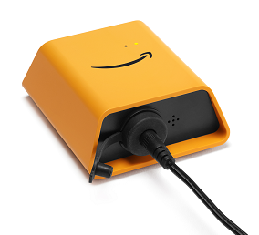
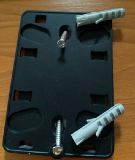
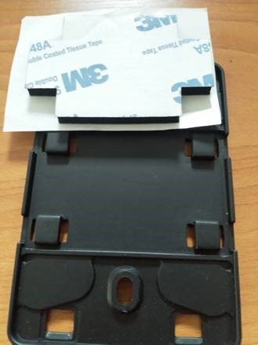
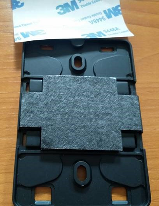
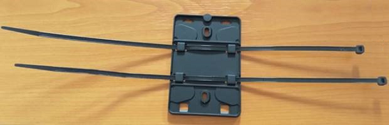
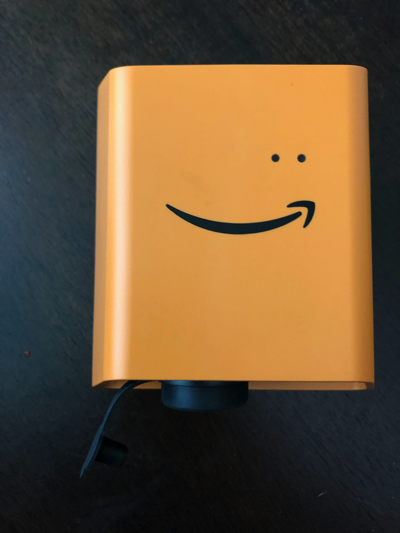
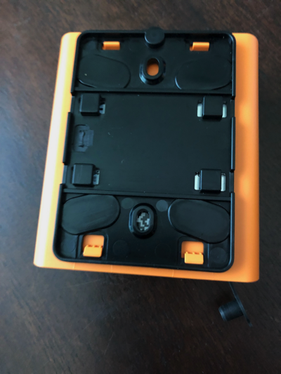
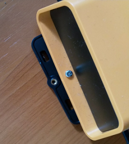
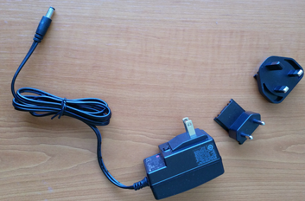

Amazon Monitron is no longer open to new customers. Existing customers can
continue to use the service as normal. For capabilities similar to Amazon
Monitron, see our [blog post](https://aws.amazon.com/blogs/machine-learning/maintain-access-and-consider-alternatives-for-amazon-monitron "https://aws.amazon.com/blogs/machine-learning/maintain-access-and-consider-alternatives-for-amazon-monitron").

# Placing and installing a Wi-Fi gateway

Unlike sensors, a Wi-Fi gateway doesn't need to be attached to the machines that
are being monitored. However, it does need an available Wi-Fi network through which
Amazon Monitron can connect to the AWS Cloud.

###### Topics

- [Choosing a location for your gateway](#where-gateway "#where-gateway")
- [Mounting the bracket](#how-gateway "#how-gateway")
- [Mounting the gateway on the bracket](#gateway-on "#gateway-on")

## Choosing a location for your gateway

You can install a gateway almost anywhere within your factory, depending on
its layout. Typically, gateways are mounted on a wall, but you can mount them on
the ceiling, on pillars, or in almost any other location. A gateway must be
within 20 to 30 meters of the sensors it supports. It also must be close enough
to a power outlet that it can be plugged in.

Consider these other factors when mounting a gateway:

- Mounting the gateway higher than sensors (2 meters or more) can
  improve coverage.
- Keeping an open line of sight between the gateway and sensors improves
  coverage.
- Avoid mounting the gateway on building structures, such as exposed
  steel beams. They can cause interference with the signal.
- Try to work around any equipment that might produce electronic
  interference with the signal.
- If possible, install more than one gateway within transmission
  distance of your sensors. If a gateway becomes unavailable, the sensors
  will switch their data transmission to another gateway. Having multiple
  gateways helps to reduce data loss. There is no minimum required
  distance between two gateways.

## Mounting the bracket

To install a gateway, position the wall mounting bracket on the wall or on
another location, then mount the gateway on the bracket.

Almost everything you need comes in the box that contains the gateway:

- The gateway
- An AC adapter
- AC adapter plugs for the EU, UK, and US
- The wall mounting bracket
- Double-sided tape
- Two mounting screws
- One small screw to attach the gateway to the bracket

There are three ways to mount the mounting bracket: screw mounting, tape
mounting, and plastic-tie mounting. The method you use depends on whether you're
mounting the gateway on a wall or another location, and on the surface material.
You mount the gateway on the wall mounting bracket through the small screw hole
in the center of one of the short sides.

To mount the bracket, choose one of the following techniques.

**Screw mounting**

Typically, you mount the bracket directly to the wall using the
mounting screws included in the gateway box. Mount the bracket from
the front. You might need to use an expansion plug or toggle bolt to
secure the screw in the wall. An expansion plug or toggle bolt is
not included.

**Tape mounting**

A shaped piece of double-sided tape is included in the gateway
box. Use it when you can't place a screw into the mounting surface.
You can also use it in combination with the other methods of
mounting for a more secure installation.

Remove the backing on one side of the tape and apply the tape to
the back of the wall mounting bracket between the four raised
sections.

Remove the remaining backing and apply the bracket to the mounting
location. Press hard on the bracket to make sure that the tape
firmly adheres to the surface.

**Plastic-tie mounting**

To mount a gateway to a smaller non-wall location, such as a
pillar or fencing, use cable ties (also known as zip ties) to fasten
the wall mounting bracket. Put the ties through the holes in the
four raised sections on the back of the bracket. wrap them around
the mounting location, and pull tight.

After the bracket is mounted, attach the gateway to the
bracket.

## Mounting the gateway on the bracket

In the following procedure, we talk about the "top" and "bottom" of the
gateway and the bracket. The two images below demonstrate this standard
orientation. As noted below, the device does not have to be upright in order to
function. This explanation is just to help you understand the mounting
instructions.

When the gateway is upright, the Amazon logo on the front of the device is
right-side up. The two holes that will reveal the LEDs are just above the logo,
on the right side. The hole for the small screw that will attach the bracket to
the gateway is at the top, in the center.

On the back of the device, there are two pairs of orange plastic hooks. The
large hooks, near the bottom of the device, point downward. The small hooks,
near the top of the device, point upward.

1. With the wall mounting bracket in place, place the gateway against the
   bracket. The two large plastic hooks on the back of the gateway should
   be in the slots at the bottom of the bracket.
2. Press the top of the gateway against the bracket so that the two small
   plastic hooks on the back of the gateway latch into the top of the
   bracket.
3. Using the small screw that came with the gateway, fasten the gateway
   to the bracket through the hole at the top of the gateway.

 4. Insert the appropriate AC plug into the AC adapter. The following
picture shows the US plug attached to the adapter.

 5. Plug the AC adapter into the bottom of the gateway and a power
outlet.

When the LED lights on the gateway blink slowly, alternating orange
and blue, the gateway is turned on and ready to be commissioned.

###### Note

The gateway is designed to be mounted with the small screw securing it at
the top. However, installing it upside down doesn’t affect its
performance.

If you have problems connecting to your gateway, see [Troubleshooting Wi-Fi gateway
detection](gateway-failure-Wi-Fi.md "gateway-failure-Wi-Fi.md").
