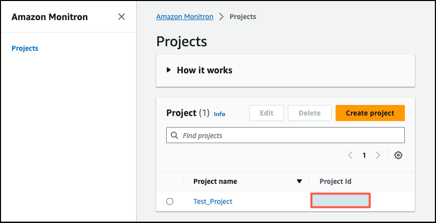
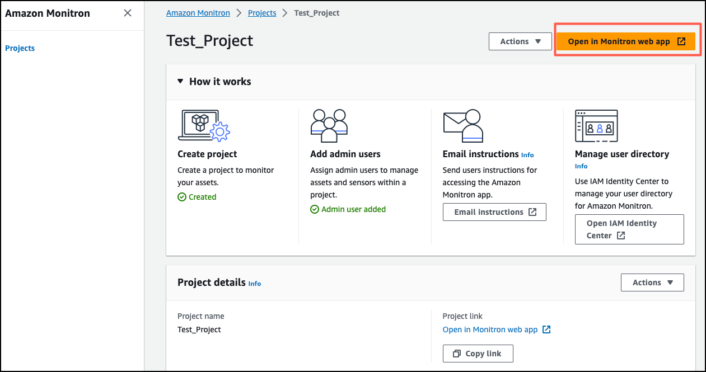
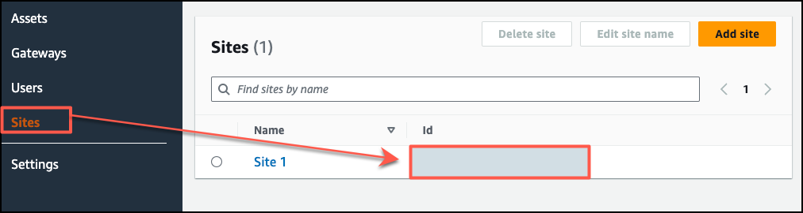
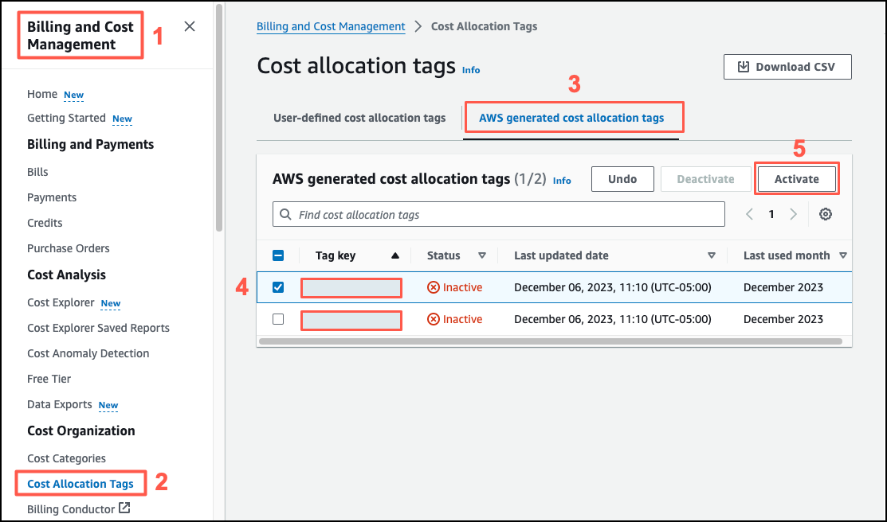
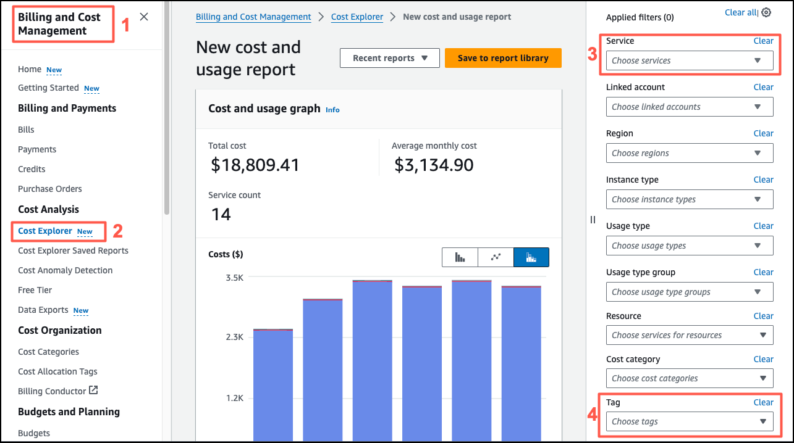

Amazon Monitron is no longer open to new customers. Existing customers can
continue to use the service as normal. For capabilities similar to Amazon
Monitron, see our [blog post](https://aws.amazon.com/blogs/machine-learning/maintain-access-and-consider-alternatives-for-amazon-monitron "https://aws.amazon.com/blogs/machine-learning/maintain-access-and-consider-alternatives-for-amazon-monitron").

# Monitoring costs

Amazon Monitron assigns [AWS–generated tags](../../../awsaccountbilling/latest/aboutv2/aws-tags.md "../../../awsaccountbilling/latest/aboutv2/aws-tags.md") to each sensor: a
project tag and a site tag. If you use [AWS Cost Explorer](../../../cost-management/latest/userguide/ce-what-is.md "../../../cost-management/latest/userguide/ce-what-is.md"), you can use these assigned tag values to get cost
reports filtered to specific Amazon Monitron projects and sites.

###### Topics

- [Conceptual overview](#monitoring-use-case "#monitoring-use-case")
- [Billing tag keys and tag values](#billing-tag-values "#billing-tag-values")
- [Retrieving project tag values](#retrieving-tag-values-project "#retrieving-tag-values-project")
- [Retrieving site tag values](#retrieving-tag-values-site "#retrieving-tag-values-site")
- [Activating billing tags](#using-billing-tags "#using-billing-tags")
- [Viewing cost reports](#viewing-cost-reports "#viewing-cost-reports")

## Conceptual overview

When you set up Amazon Monitron, you create a project in which you configure and
install your Amazon Monitron resources. Every project, in turn, can be linked to
mutliple sites, or organized collections of assets, gateways, and sensors linked
together based on either a common location or function.

Each site can contain multiple Amazon Monitron sensors, attached to multiple assets
or machines, transmitting the asset data collected through multiple gateways.

While all your sites, assets, gateways, and sensors exist conveniently within one
project, your Amazon Monitron setup might be more distributed in practice. For
example, your company may own one project to monitor sites located in different
geographical locations, or grouped together by different business use cases and needs.
Or you may own multiple projects, each with its own specific configuration. Partners who
integrate Amazon Monitron, may also wish to assign a project to each of their own
customers

While getting an overall understanding of your Amazon Monitron costs is useful,
what your business may need is a more granular understanding of the usage and costs
attached to each project, location, or business use case. This may also be necessary for
internal cost allocation purpose between different divisions.

In these situations, using Amazon Monitron assigned [AWS–generated tags](../../../awsaccountbilling/latest/aboutv2/aws-tags.md "../../../awsaccountbilling/latest/aboutv2/aws-tags.md") in [AWS Cost Explorer](../../../cost-management/latest/userguide/ce-what-is.md "../../../cost-management/latest/userguide/ce-what-is.md") can help you understand and plan your business
resources better.

## Billing tag keys and tag values

Amazon Monitron uses [AWS–generated tags](../../../awsaccountbilling/latest/aboutv2/aws-tags.md "../../../awsaccountbilling/latest/aboutv2/aws-tags.md") to internally
assign project and site level tag values. You can use these tags to find your projects
and sites on the AWS Cost Explorer console. The tag keys are of the
following format:

- **Project** –
  `aws:monitron:project`
- **Site** –
  `aws:monitron:location_level4`

## Retrieving project tag values

You can retrieve your assigned project value using your Amazon Monitron web app.
The tag value for your project is the project ID.

###### To retrieve the specific tag value assigned to your Amazon Monitron

project:

1. Open the Amazon Monitron console at [https://console.aws.amazon.com/monitron](https://console.aws.amazon.com/monitron/ "https://console.aws.amazon.com/monitron/").
2. Choose **Create Project**.
3. In the navigation pane, choose **Projects**.

The list of projects is displayed under **Projects**.

 4. Choose the project that you want to get details on. 5. Copy the tag value from your **Project Id**.

You can use this project id to filter costs in AWS Cost
Explorer console.

## Retrieving site tag values

You can retrieve your assigned site tag value using your Amazon Monitron web app.
The tag value for your site is the Id.

###### To retrieve the specific tag value assigned to your Amazon Monitron

site:

1. Open the Amazon Monitron console at [https://console.aws.amazon.com/monitron](https://console.aws.amazon.com/monitron/ "https://console.aws.amazon.com/monitron/").
2. Choose **Create project**.
3. If you're creating a project for the first time, follow the steps outlined in
   [Creating a project](mp-creating-project.md "mp-creating-project.md").

If you're choosing an existing project, from the left navigation menu, select
**Projects**, and then select the project you want to
create custom asset classes for. 4. From the project details page, choose **Open in Amazon Monitron web
app**.

 5. From the left navigation pane, choose **Sites**.

The list of sites is displayed.

 6. Choose the site that you want to get details on. 7. Copy the tag value from your **Id**.

You can use this id to filter costs in AWS Cost Explorer
console.

## Activating billing tags

To begin using project and site level cost tracker tags, you must do the
following:

1. **Prerequisite** – You must activate
   AWS Cost Explorer on the AWS Management Console. This requires minimal
   setup. We recommend you follow the steps outlined in the [AWS Cost Management](../../../cost-management/latest/userguide/ce-what-is.md "../../../cost-management/latest/userguide/ce-what-is.md") guide.
2. **Activate the Amazon Monitron
   [AWS–generated
   tags](../../../awsaccountbilling/latest/aboutv2/aws-tags.md "../../../awsaccountbilling/latest/aboutv2/aws-tags.md")** in your AWS billing account.

**From your **AWS Billing and Cost
Management** left navigation pane:**

    1. From **Cost Organization**, select **Cost
     allocation tags**. You will find the **AWS
     generated cost allocation tags** in this section.
    2. Select the tags you want to use and choose
     **Activate**.

    ###### Note

It takes up to 96 hours for the tags to be activated. The billing data
starts being tagged only after the tags are active.

## Viewing cost reports

After your Amazon Monitron
AWS generated tags have been activated and are active, you can view usage
and cost reports filtered by these tags using AWS Cost Explorer on the
AWS Cost Management console.

You can filter usage and cost history by choosing a tag key value pair. For example,
if you want to view usage reports a particular project, you would first choose a tag
value `aws:monitron:project` and then select the project id value from the
options available.

###### To generate cost and usage reports

1. Open the AWS Cost Management console at [https://console.aws.amazon.com/costmanagement](https://console.aws.amazon.com/costmanagement "https://console.aws.amazon.com/costmanagement").
2. From the left navigation pane, select **Cost
   Explorer**.
3. From the **New cost and usage report** page, from the right
   navigation menu, in **Filters**, choose Amazon Monitron as
   the **Service**.
4. From the right navigation menu, for **Tags** choose the
   assigned tag key for your project or site from the dropdown options.
5. Then, choose the Amazon Monitron assigned tag value for your project or
   site.

###### Note

You can save the report with the filters selected to the report library to easily
review it later. You can also adjust and customize your report further, including
the date range and granularity of your report.
