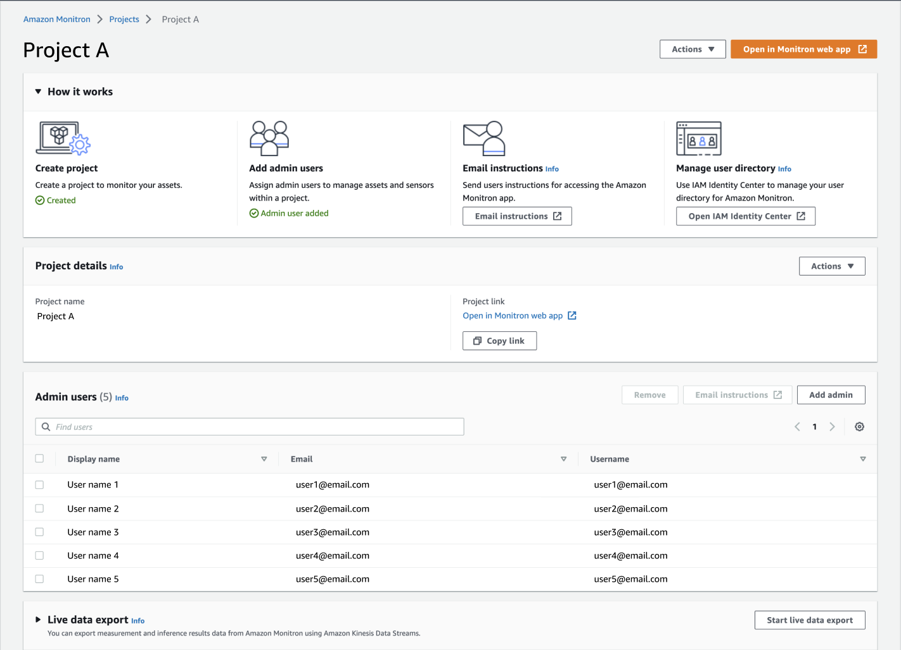
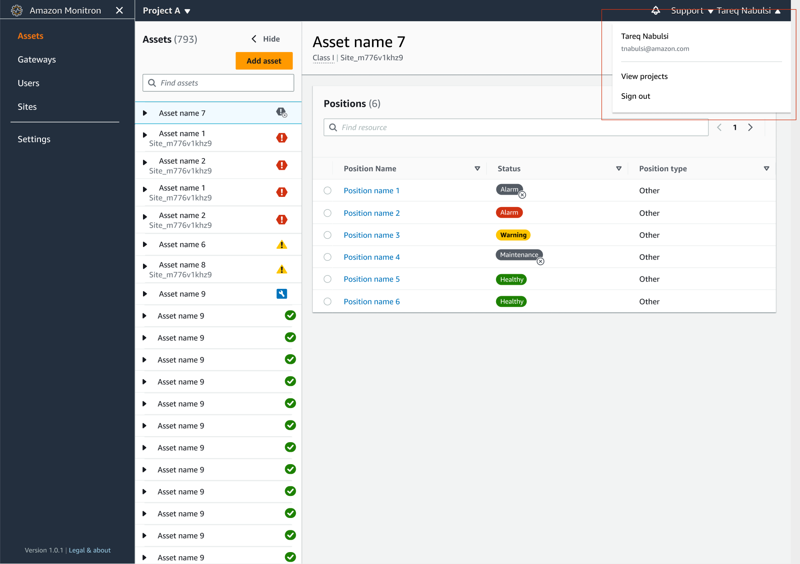
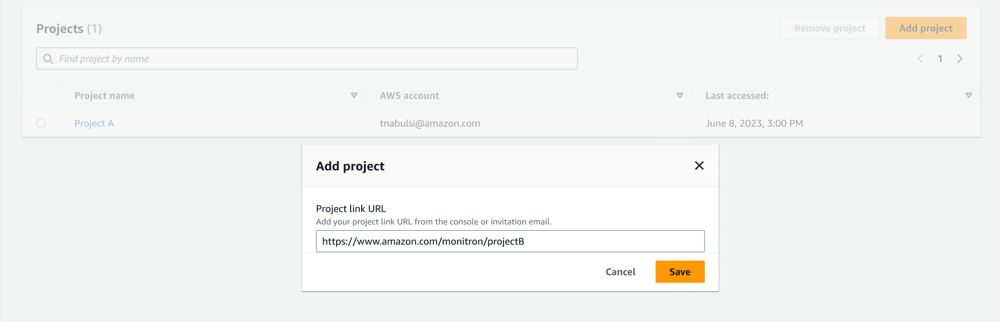
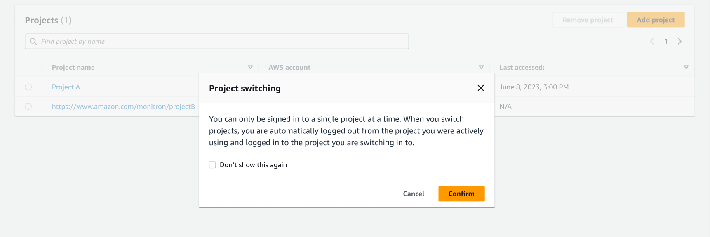

Amazon Monitron is no longer open to new customers. Existing customers can
continue to use the service as normal. For capabilities similar to Amazon
Monitron, see our [blog post](https://aws.amazon.com/blogs/machine-learning/maintain-access-and-consider-alternatives-for-amazon-monitron "https://aws.amazon.com/blogs/machine-learning/maintain-access-and-consider-alternatives-for-amazon-monitron").

# Switching between projects

You can switch between Amazon Monitron projects from both your mobile and web app
to manage your resources.

###### Note

You can only be signed in to a single project at a time. When you switch projects
you are automatically logged out from the project you were actively using.

When you log into a project using your account credentials, Amazon Monitron
automatically adds your project to the Amazon Monitron projects page to make tracking
easier. You can also choose to add projects manually to your projects page using the
project URL in your Amazon Monitron invitation email.

When you add a project, it gets saved only on the platform you are adding it on. A
project added or saved on the Amazon Monitron web app doesn't automatically get saved
on the Amazon Monitron mobile app unless you also add it to the web app.

###### Topics

- [Switching between projects in the web
  app](#monitron-switch-projects-web "#monitron-switch-projects-web")
- [Switching between projects in the mobile
  app](#monitron-switch-projects-mobile "#monitron-switch-projects-mobile")

## Switching between projects in the web

app

###### To switch between projects in the web app

1. Open the Amazon Monitron console at [https://console.aws.amazon.com/monitron](https://console.aws.amazon.com/monitron/ "https://console.aws.amazon.com/monitron/") .
2. Choose **Open in Amazon Monitron web app**.

 3. Enter your **Username** and **Password**
on the **Sign in** screen. 4. From the **Assets** list page, select your account
details dropdown menu, and then choose **View
projects**.

 5. If you want to add a project, choose **Add project** and
enter your project link url.

 6. If you want to switch between projects, choose the project you want to
view from the projects list. You will see this message before you
switch.

## Switching between projects in the mobile

app

###### To switch between projects in the mobile app

1. Open the Amazon Monitron mobile app and login using your username and
   password.

|                                                                                                     |                                                                                                   |
| --------------------------------------------------------------------------------------------------- | ------------------------------------------------------------------------------------------------- | --------------------------------------------------------------------------------------------------------------------------------------------------- |
| AWS sign-in page with username field, password input, and Next button.                              | AWS logo and Amazon Monitron sign-in screen for detecting abnormal machine behavior.              | 2. From the **Assets** list page, select your account details dropdown menu, and then choose **View projects**.                                     |
|                                                                                                     |                                                                                                   |
| ---                                                                                                 | ---                                                                                               |
| Asset management interface showing a list of 12 assets with status icons and an "Add asset" button. | User interface showing project details, menu options, and status indicators for various settings. | 3. If you want to add a project, choose **Add project** and enter your project link url.                                                            |
|                                                                                                     |                                                                                                   |
| ---                                                                                                 | ---                                                                                               |
| Amazon Monitron projects page showing one project with last access date and email.                  | Add Projects screen with a text field for entering a project link URL from Amazon.                | 4. If you want to switch between projects, choose the project you want to view from the projects list. You will see this message before you switch. |
|                                                                                                     |                                                                                                   |
| ---                                                                                                 | ---                                                                                               |
| Amazon Monitron projects page showing two projects and a success message for adding Project B.      | Project switching dialog box explaining single project sign-in and automatic logout.              |
