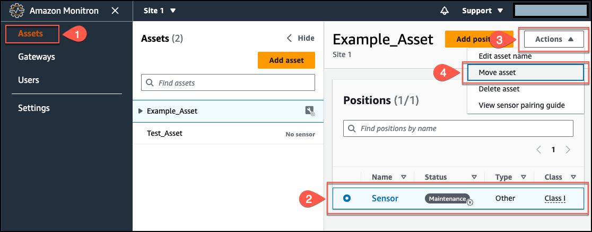
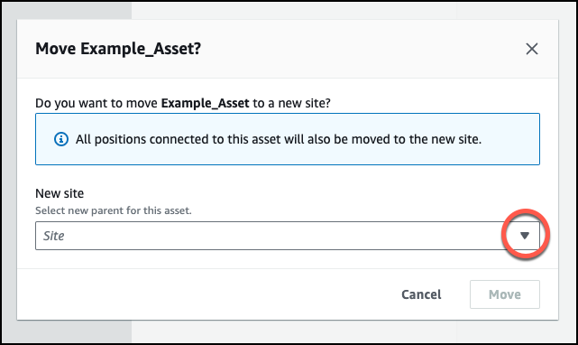
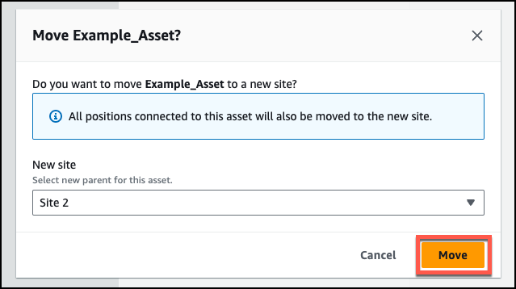
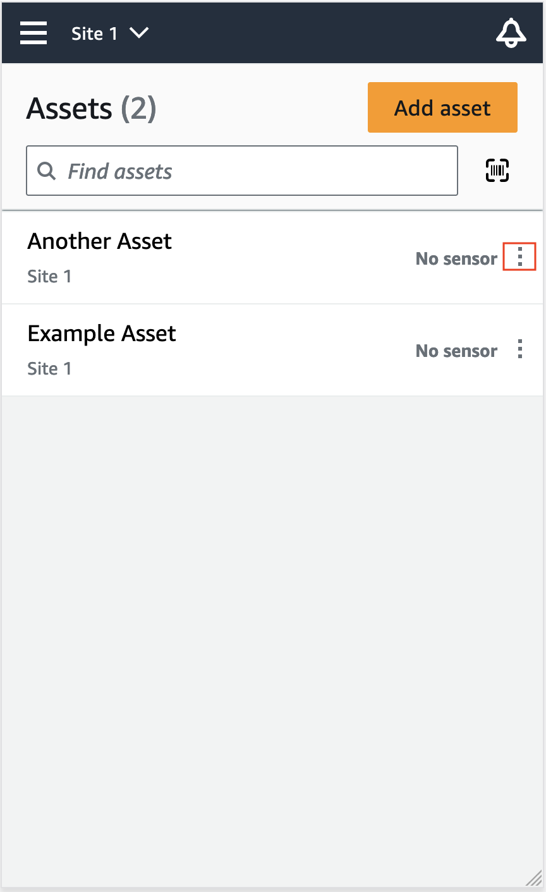
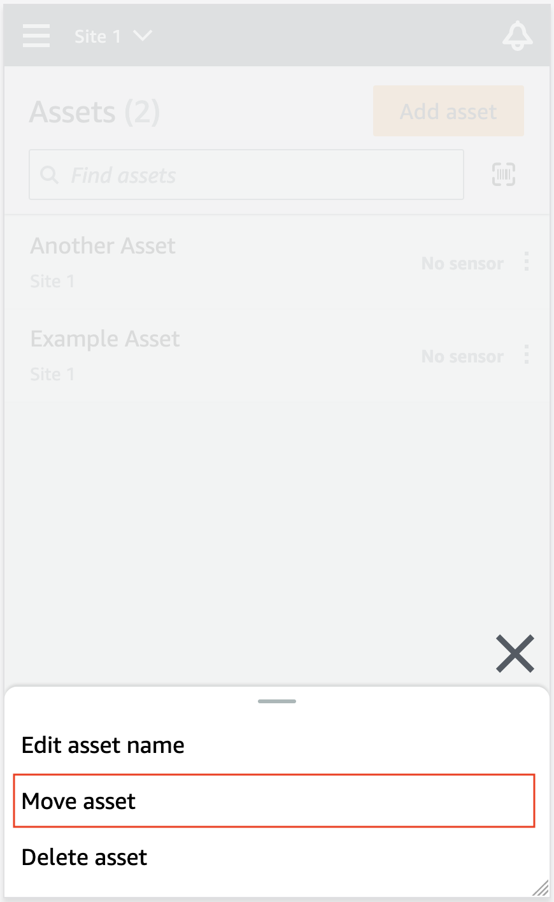
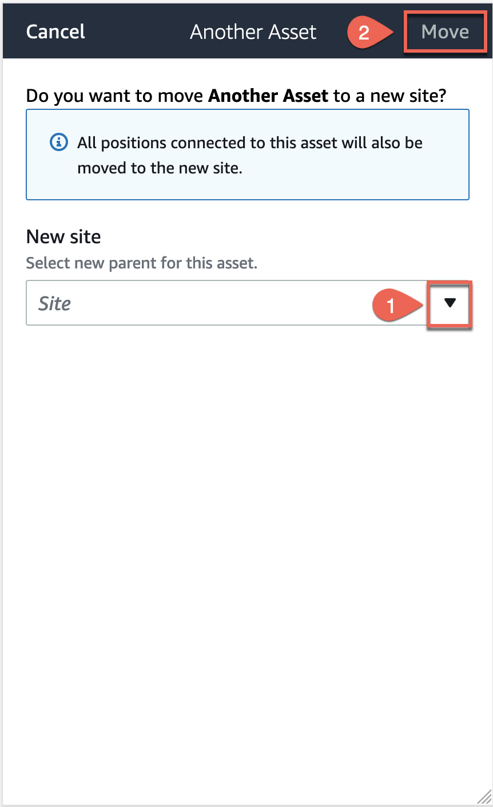

Amazon Monitron is no longer open to new customers. Existing customers can
continue to use the service as normal. For capabilities similar to Amazon
Monitron, see our [blog post](https://aws.amazon.com/blogs/machine-learning/maintain-access-and-consider-alternatives-for-amazon-monitron "https://aws.amazon.com/blogs/machine-learning/maintain-access-and-consider-alternatives-for-amazon-monitron").

# Moving an asset

Assets in a project can be grouped under various [sites](site-management-chapterSM.md "site-management-chapterSM.md"). If you need to re-organize your assets and sites, you can choose to
move an asset from one site to another without having to create each asset again.

###### Note

You can move assets from the project level to the site level. However, you can't
move assets from the site level to the project level.

Once an asset is moved, it continues generating notifications in its new destination
site. All positions associated with the asset move to the new site. However, it stops
generating notifications and being visible to users in its older source site.

###### Important

Only an user with admin access to _both_ source and destination
sites can move an asset.

###### Topics

- [To move an asset on the web app](#asset-move-web "#asset-move-web")
- [To move an asset on the mobile app](#asset-move-mobile "#asset-move-mobile")

## To move an asset on the web app

1. From the web app's main menu, choose **Assets**.
2. Choose the asset that you want to move.
3. From the asset menu, choose **Actions**, and then choose
   **Move asset**.

 4. From the dialog box that opens, select a site to move your asset to from
the **New site** dropdown menu, and then select
**Move**.

The app displays a success message if your asset is moved
successfully.

## To move an asset on the mobile app

1. From the mobile app's main menu, choose
   **Assets**.
2. Choose asset that you want to move to a new site. Then, open the asset
   details menu.

 3. From the asset details menu, choose **Move asset**.

 4. From the asset page, from **New site**, choose the new
site you want to move the asset to. Then, choose **Move**.

The app displays a success message if your asset is moved
successfully.
