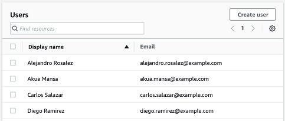
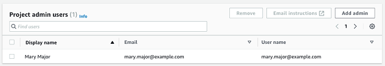
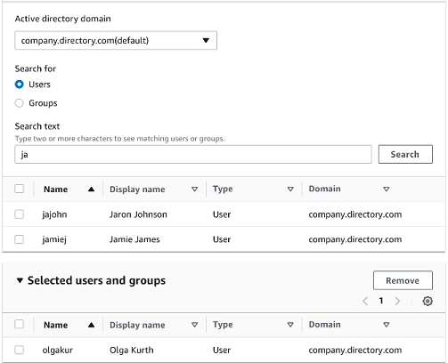
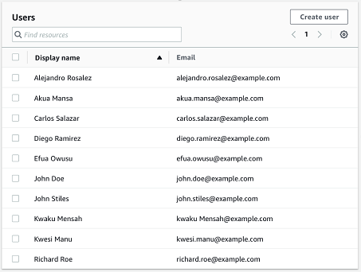
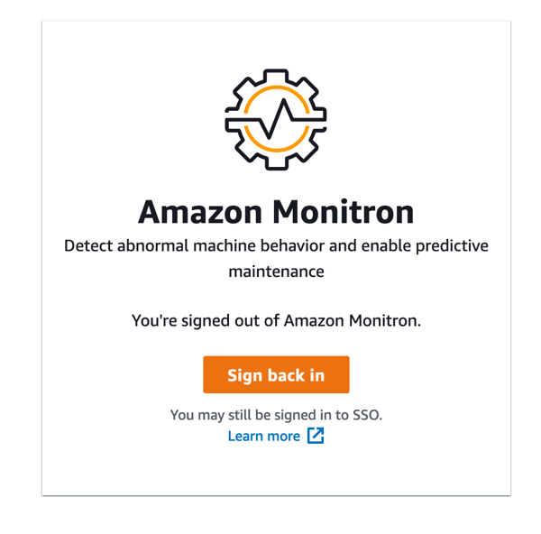

Amazon Monitron is no longer open to new customers. Existing customers can
continue to use the service as normal. For capabilities similar to Amazon
Monitron, see our [blog post](https://aws.amazon.com/blogs/machine-learning/maintain-access-and-consider-alternatives-for-amazon-monitron "https://aws.amazon.com/blogs/machine-learning/maintain-access-and-consider-alternatives-for-amazon-monitron").

# User directory setup

Amazon Monitron uses AWS IAM Identity Center to manage user access. Users are added from this IAM Identity Center
user directory.

How you add an admin user depends on how IAM Identity Center has been set up for your
organization.

###### Important

Amazon Monitron requires an email address for each app user. If you use
directories like Microsoft Active Directory or an external ID provider, you need
to make sure that email addresses for your users are added and synced.

###### Topics

- [Understanding SSO requirements](#sso-requirements "#sso-requirements")
- [Adding admin users using the native IAM Identity Center
  directory](#mp-project-admin2 "#mp-project-admin2")
- [Adding admin users using Microsoft Active
  Directory](#mp-project-admin3 "#mp-project-admin3")
- [Adding admin users using an external ID
  provider](#mp-project-admin4 "#mp-project-admin4")
- [Returning to Amazon Monitron with IAM Identity Center](#logging-mon-sso "#logging-mon-sso")

## Understanding SSO requirements

When you create a project, Amazon Monitron automatically detects whether IAM Identity Center has
been enabled and configured on your account and whether all prerequisites for
using IAM Identity Center with Amazon Monitron are satisfied. If not, Amazon Monitron produces an error
and provides a list of prerequisites that are needed. You must meet all
prerequisites before you can add admin users. For more information about
enabling and configuring IAM Identity Center for your organization, see [AWS Single Sign-On](../../../singlesignon/latest/userguide/what-is.md "../../../singlesignon/latest/userguide/what-is.md").

###### Important

Amazon Monitron supports all IAM Identity Center regions except opt-in and government
regions. The list of regions supported are:

- US East (N. Virginia)
- US East (Ohio)
- US West (N. California)
- US West (Oregon)
- Asia Pacific (Mumbai)
- Asia Pacific (Tokyo)
- Asia Pacific (Seoul)
- Asia Pacific (Osaka)
- Asia Pacific (Singapore)
- Asia Pacific (Sydney)
- Canada (Central)
- Europe (Frankfurt)
- Europe (Ireland)
- Europe (London)
- Europe (Paris)
- Europe (Stockholm)
- South America (São Paulo)

### IAM Identity Center prerequisites

Before you can set up IAM Identity Center, you must:

- Have first set up the AWS Organizations service and have **All
  features** set to enabled. For more information about
  this setting, see [Enabling All Features in Your Organization](../../../organizations/latest/userguide/orgs_manage_org_support-all-features.md "../../../organizations/latest/userguide/orgs_manage_org_support-all-features.md") in the
  _AWS Organizations User Guide_.
- Sign in with the AWS Organizations management account credentials before you
  begin setting up IAM Identity Center. These credentials are required to enable
  IAM Identity Center. For more information, see [Creating and Managing an AWS Organization](../../../organizations/latest/userguide/orgs_manage_org.md "../../../organizations/latest/userguide/orgs_manage_org.md") in the
  _AWS Organizations User Guide_. You cannot set up IAM Identity Center
  while signed in with credentials from an Organization’s member
  account.
- Have chosen an identity source to determine which pool of users
  has SSO access to the user portal. If you choose to use the default
  IAM Identity Center identity source for your user store, no prerequisite tasks are
  required. The IAM Identity Center store is created by default once you enable
  IAM Identity Center and is immediately ready for use. There is no cost for using
  this store. Alternatively, you can choose to [Connect to your external identity provider](../../../singlesignon/latest/userguide/manage-your-identity-source-ad.md "../../../singlesignon/latest/userguide/manage-your-identity-source-ad.md") using Azure
  Active Directory. If you choose to connect to an existing Active
  Directory for your user store, you must have the following:
  - An existing AD Connector or AWS Managed Microsoft AD directory set
    up in AWS Directory Service, and it must reside within your
    organization's management account. You can connect only one
    AWS Managed Microsoft AD directory at a time. However, you can change it
    to a different AWS Managed Microsoft AD directory or change it back to
    an IAM Identity Center store at any time. For more information, see [Create a AWS Managed Microsoft AD Directory](../../../directoryservice/latest/admin-guide/ms_ad_getting_started.md#ms_ad_getting_started_create_directory "../../../directoryservice/latest/admin-guide/ms_ad_getting_started.md#ms_ad_getting_started_create_directory") in the
    _AWS Directory Service Administration Guide_.
  - Set up IAM Identity Center in the Region where your AWS Managed Microsoft AD
    directory is set up. IAM Identity Center stores the assignment data in the
    same Region as the directory. To administer IAM Identity Center, you
    should switch to the Region where you have setup IAM Identity Center.
    Also, note that IAM Identity Center’s user portal uses the same [access URL](../../../directoryservice/latest/admin-guide/ms_ad_create_access_url.md "../../../directoryservice/latest/admin-guide/ms_ad_create_access_url.md") as your connected directory.

- If you currently filter access to specific Amazon Web Service
  (AWS) domains or URL endpoints using a web content filtering
  solution such as next-generation firewalls (NGFW) or secure web
  gateways (SWG), you must add the following domains and/or URL
  endpoints to your web-content filtering solution allow-lists in
  order for IAM Identity Center to work properly:

**Specific DNS domains**

    + \*.awsapps.com (http://awsapps.com/)
    + \*.signin.aws

**Specific URL End-points**

    + https://[yourdirectory].awsapps.com/start
    + https://[yourdirectory].awsapps.com/login
    + https://[yourregion].signin.aws/platform/login

We highly recommend that before you enable IAM Identity Center you first check to see if
your AWS account is approaching the quota limit for IAM roles. For more
information, see [IAM object quotas](../../../IAM/latest/UserGuide/reference_iam-quotas.md#reference_iam-quotas-entities "../../../IAM/latest/UserGuide/reference_iam-quotas.md#reference_iam-quotas-entities"). If you are nearing the quota limit,
consider increasing the quota. Otherwise, you may have issues with IAM Identity Center as
you provision permission sets to accounts that have exceeded the IAM role
limit.

## Adding admin users using the native IAM Identity Center

directory

The simplest way to add admin users to your project is by using the IAM Identity Center
native directory. You can use it by starting to use Amazon Monitron and letting it
configure IAM Identity Center at a basic level for you. You can also set up IAM Identity Center before using
Amazon Monitron and set it to use the native directory. Either way, you can add users
manually and without potentially exposing user identity information to other
admin users beyond name and email.

###### To add an admin user when using the native IAM Identity Center directory

1. Open the Amazon Monitron console at [https://console.aws.amazon.com/monitron](https://console.aws.amazon.com/monitron/ "https://console.aws.amazon.com/monitron/") .
2. Choose **Create Project**.
3. In the navigation pane, choose the project you want.
4. On the **Users** page, choose the users that you want
   to assign as admin users. If you can't see a user, search for them.

The users you choose are displayed in the **Selected
users** section. 5. If the user you want isn't in the directory, choose **Create
user** to add the user.

    1. Under **Create a user**, for
     **Email**, enter the new admin user's email
     address.

    
    2. For **First name** and **Last
     name**, enter the admin's name.
    3. Choose **Create User**.

6. When the user's name appears in the directory list, choose
   **Add** to add the admin users you've selected.
7. Email the admin users an invitation to the project that includes a
   link to download the Amazon Monitron mobile app. For more information, see [Sending an email invitation](resending-email.md "resending-email.md").

Amazon Monitron takes you to the project page for your project, where it
lists all admin users.

 8. To add additional admin users, choose **Add admin**.

Any admin user can add other users using the Amazon Monitron mobile app. For
more information, see [Adding a User](adding-user.md "adding-user.md") in the _Amazon Monitron User
Guide_.

## Adding admin users using Microsoft Active

Directory

If you use Microsoft Active Directory (AD) for your organization's primary
user directory, you can configure IAM Identity Center to use it. IAM Identity Center enables you to connect
your self-managed Active Directory as your AWS Managed Microsoft AD directory
using AWS Directory Service. This Microsoft AD directory provides you with the
pool of identities that you can pull from when using the Amazon Monitron console (or Amazon Monitron
mobile app) to assign user roles.

###### Important

Amazon Monitron requires an email address for each app user. Make sure
that email addresses for your users are added and synced.

All Amazon Monitron admin users have access to identity information in the user
directory that is configured in IAM Identity Center for Amazon Monitron. We strongly recommend using
an isolated directory if you want to limit access to user organization
information.

###### To add an admin user using Microsoft Active Directory

1. Configure IAM Identity Center to connect with your Microsoft Active Directory. The
   steps involved in this differ depending on whether you're using a
   self-managed Active Directory or an AWS Managed Microsoft AD
   directory. For more information, see [Connect to Microsoft AD Directory](../../../singlesignon/latest/userguide/manage-your-identity-source-ad.md "../../../singlesignon/latest/userguide/manage-your-identity-source-ad.md").
2. Open the Amazon Monitron console at [https://console.aws.amazon.com/monitron](https://console.aws.amazon.com/monitron/ "https://console.aws.amazon.com/monitron/") .
3. Choose **Create Project**.
4. In the navigation pane, choose the project you want.
5. For **Active directory domain**, choose the directory
   domain from which you want to add identities.

 6. Choose **Users** or **Groups**,
depending on how you want to search the user directory. 7. Enter a string in the search box to find the identity you want to add
and then choose **Search**.

To limit the number of users returned, enter a longer string in the
search box. For example, if you enter "olg" in the search box, the list
returns all users with the letters "olg" in their names, such as "Olga
Kurth" and "Jamie Folgman." 8. Choose the users you want to assign as admin users. 9. Choose **Add** to add the admin users.

## Adding admin users using an external ID

provider

If you're using an external Identity provider (IdP), you can configure IAM Identity Center
to use that provider through the Security Assertion Markup Language (SAML) 2.0
standard. This provides you with the pool of identities in your IdP directory.
You can pull this pool when using the Amazon Monitron console (or Amazon Monitron mobile app) and
assign them as admin users. This also enables your users to sign in to Amazon Monitron
with their corporate credentials.

###### Important

Amazon Monitron requires an email address for each app user. Make sure
that email addresses for your users are added and synced.

All Amazon Monitron admin users have access to identity information in the user
directory that is configured in IAM Identity Center for Amazon Monitron. We strongly recommend using
an isolated directory if you want to limit access to user organization
information.

###### To add an admin user using an external ID provider (IdP)

1. Configure AWS IAM Identity Center to connect with your external IdP. The steps
   involved in this differ based on the provider you're using. For more
   information, see [Connect to Your External ID Provider](../../../singlesignon/latest/userguide/manage-your-identity-source-idp.md "../../../singlesignon/latest/userguide/manage-your-identity-source-idp.md").
2. Open the Amazon Monitron console at [https://console.aws.amazon.com/monitron](https://console.aws.amazon.com/monitron/ "https://console.aws.amazon.com/monitron/") .
3. Choose **Create Project**.
4. In the navigation pane, choose the project you want.
5. On the **Users** page, choose the users that you want
   to assign as admin users. If you can't see a user, search for them.

 6. Choose **Add** to add the admin users.

## Returning to Amazon Monitron with IAM Identity Center

When you
log
out of the Amazon Monitron web app, you may still be signed in to AWS IAM Identity Center. Any other
applications that you have opened from the user portal remain open and
running.

There are two ways to log out of IAM Identity Center:

- Log out directly through the IAM Identity Center portal.
- Once an hour, AWS IAM Identity Center checks to see if you are actively using any
  AWS services. If you are not, then you are logged out of IAM Identity Center
  automatically.

To learn about admin users using IAM Identity Center, see [User directory setup](mu-adding-user.md "mu-adding-user.md").

To learn about security best practices with Amazon Monitron and IAM Identity Center, see [Security best
practices for Amazon Monitron](security-best-practices.md "security-best-practices.md").

To learn about using the SSO user portal, see [Using the user
portal](../../../singlesignon/latest/userguide/using-the-portal.md "../../../singlesignon/latest/userguide/using-the-portal.md").
