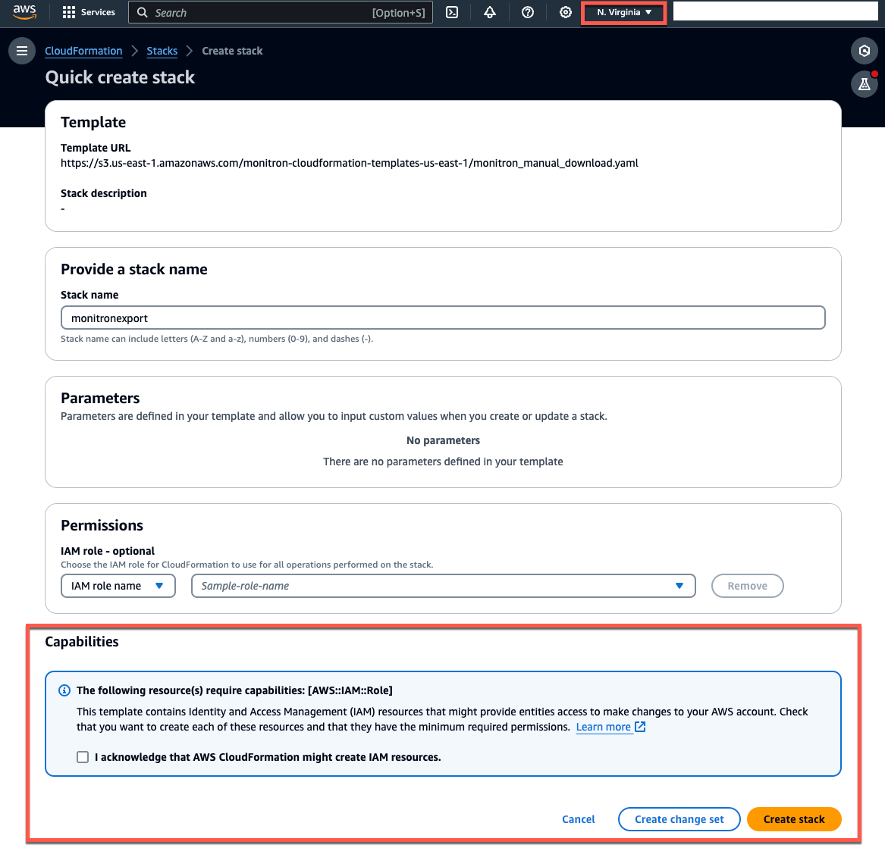
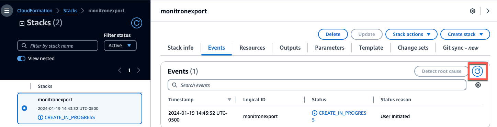
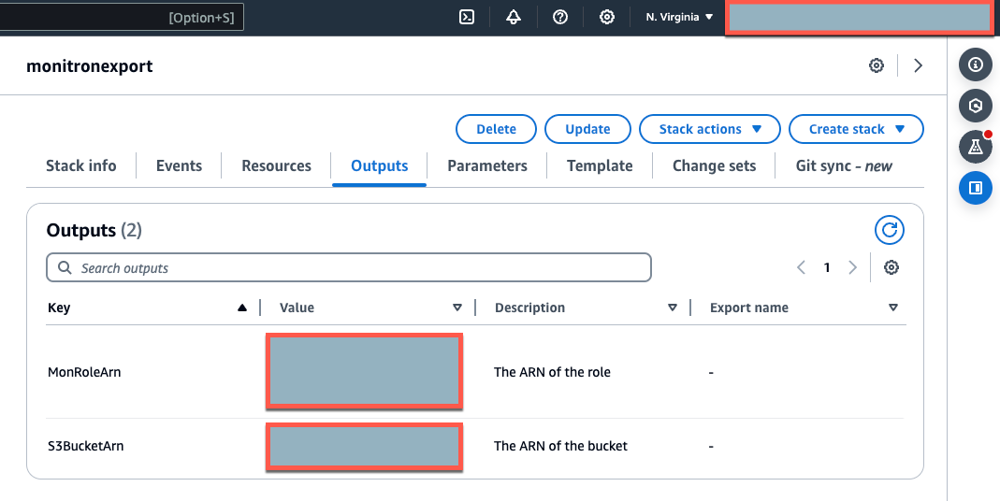

Amazon Monitron is no longer open to new customers. Existing customers can
continue to use the service as normal. For capabilities similar to Amazon
Monitron, see our [blog post](https://aws.amazon.com/blogs/machine-learning/maintain-access-and-consider-alternatives-for-amazon-monitron "https://aws.amazon.com/blogs/machine-learning/maintain-access-and-consider-alternatives-for-amazon-monitron").

# Exporting your data with CloudFormation

(recommended option)

###### Topics

- [Step 1: Create your Amazon S3 bucket,
  IAM role, and IAM policies.](#gdpr-cloudfront-makestack "#gdpr-cloudfront-makestack")
- [Step 2: Note your resources](#gdpr-cloudfront-resources "#gdpr-cloudfront-resources")
- [Step 3: Create the support case](#gdpr-cloudfront-case "#gdpr-cloudfront-case")

## Step 1: Create your Amazon S3 bucket,

IAM role, and IAM policies.

1. Sign in to your AWS account.
2. Open a new browser tab with the following URL.

```
https://console.aws.amazon.com/cloudformation/home?region=us-east-1#/stacks/create/review?templateURL=https://s3.us-east-1.amazonaws.com/monitron-cloudformation-templates-us-east-1/monitron_manual_download.yaml&stackName=monitronexport
```

3. On the CloudFormation page that opens, in the upper right corner, select the
   region in which you are using Amazon Monitron.
4. Choose **Create stack**.

 5. On the next page, choose the refresh icon as often as you like until
the status of the stack (monitronexport) is CREATE_COMPLETE.



## Step 2: Note your resources

1. Choose the **Outputs** tab.
2. Note the value of the key `MonRoleArn`.
3. Note the value of the key `S3BucketArn`.
4. Note your account ID from the upper right corner of the page).
5. Note the region you chose in Step 1. It also now appears at the top of
   the page, to the left of your account ID.



## Step 3: Create the support case

1. From your AWS console, choose the question mark icon near the upper
   right corner of any page, then choose **Support
   Center**.

 2. On the next page, choose **Create case**.

 3. On the **How can we help?** page, do the
following:

    1. Choose **Account and billing support**.
    2. Under **Service**, choose
     **Account**.
    3. Under **Category**, choose
     **Compliance & Accreditations**.
    4. Choose **Severity**, if that option is
     available to you based on your support subscription.
    5. Choose **Next step: Additional information**.


    

4. In **Additional information** do the
   following:
   1. Under **Subject**, enter **Amazon Monitron data
      export request**.
   2. In the **Description** field, enter:
      1. your account ID
      2. the region of the bucket you created
      3. the ARN of the bucket you created (for example:
         "arn:aws:s3:::bucketname")
      4. the ARN of the role you created (for example:
         "arn:aws:iam::273771705212:role/role-for-monitron")

    3. Choose **Next step: Solve now or contact
   us**.

5. In **Solve now or contact us** do the
   following:
   1. In **Solve now**, select
      **Next**.

    2. In **Contact us**, choose your
   **Preferred contact language** and
   preferred method of contact. 3. Choose **Submit**. A confirmation screen with
   your case ID and details will be displayed.

   

An AWS customer support specialist will get back to you as soon as
possible. If there are any issues with the steps listed, the specialist may ask
you for more information. If all the necessary information has been provided,
the specialist will let you know as soon as your data has been copied to the
Amazon S3 bucket that you created above.
