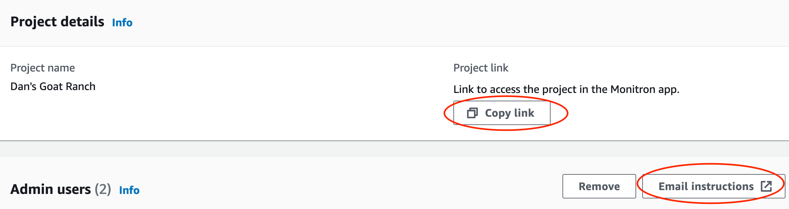
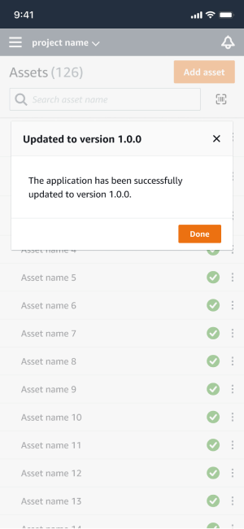

Amazon Monitron is no longer open to new customers. Existing customers can
continue to use the service as normal. For capabilities similar to Amazon
Monitron, see our [blog post](https://aws.amazon.com/blogs/machine-learning/maintain-access-and-consider-alternatives-for-amazon-monitron "https://aws.amazon.com/blogs/machine-learning/maintain-access-and-consider-alternatives-for-amazon-monitron").

# Choosing your measurement viewing platform

There are two ways to use Amazon Monitron to view your assets' measurements and
abnormalities. You can view them in the mobile app, or you can view them in the web app.
Each way has its advantages.

With the mobile app, you use your phone's Bluetooth and Near Field Communication (NFC)
capabilities to install and configure gateways and sensors, as explained in [Wi-Fi gateways](setting-up-Wi-Fi-gateways.md "setting-up-Wi-Fi-gateways.md").

With the web app, you download your data to a .csv file. Also, your monitor is
probably bigger than your phone, so the web app may be a better place to see
measurements using line graphs.

You can activate either the mobile app or the web app by clicking on a link to your
project. This is the link that the administrator sends to the user, as explained in
[Sending an email invitation](resending-email.md "resending-email.md"). But you can
re-generate this link from the **Projects** page by selecting a user
and then choosing **Email instructions**, or by choosing **Copy
link** under **Project details.**

###### Topics

- [In-app updates](#in-app-updates "#in-app-updates")

## In-app updates

For access to the latest Amazon Monitron features, regularly check your mobile
device for updates. Periodically, Amazon Monitron releases new application versions that
you'll need to manually update if you don't enable automatic updates. These
notifications will be provided on the web app as they become available.

**Flexible and immediate updates**

Amazon Monitron provides two kinds of in-app updates: flexible and immediate.
**Flexible updates** allow you to elect whether or not to
update the Amazon Monitron app once you’ve signed in. **Immediate
updates** contain security updates, and must be installed in order to
use the app. You can install updates from the Amazon Monitron app, or directly from Google
Play or the App Store.

To manually install the latest updates:

1. Sign in to the Amazon Monitron app and choose
   **Update**.

|                                                                                        |                                                                                    |
| -------------------------------------------------------------------------------------- | ---------------------------------------------------------------------------------- |
| Amazon Monitron app sign-in screen with logo and description of service functionality. | Mobile app interface showing assets list and update notification to version 1.0.0. |

2. When you select **update**, you'll be directed to Google
   Play or the App Store. Select **Update** or
   **Install** to start the update.

|                                                                                     |                                                                                            |
| ----------------------------------------------------------------------------------- | ------------------------------------------------------------------------------------------ |
| Amazon Monitron app interface showing asset details and commission gateway screens. | Google Play store page for Amazon Monitron app showing rating, downloads, and screenshots. |

3. If you start the update process within the Amazon Monitron app, you'll see a
   success message in the app once the update has been installed.

###### Note

You will not see the success message if the update happens
automatically, or if you initiate the update process within the App
Store or Google Play.
