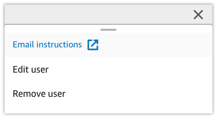

Amazon Monitron is no longer open to new customers. Existing customers can
continue to use the service as normal. For capabilities similar to Amazon
Monitron, see our [blog post](https://aws.amazon.com/blogs/machine-learning/maintain-access-and-consider-alternatives-for-amazon-monitron "https://aws.amazon.com/blogs/machine-learning/maintain-access-and-consider-alternatives-for-amazon-monitron").

# Sending an email invitation

When you add a user to an Amazon Monitron project or site, you send them an email and invite
them to download and log in to the Amazon Monitron mobile or web app. This invitation also
contains instructions for connecting to your project.

###### Topics

- [To generate an email invitation to a site or project using the mobile
  app](#w28aac28c15c27b7 "#w28aac28c15c27b7")
- [To generate an email invitation to a site or project using the web
  app](#w28aac28c15c27b9 "#w28aac28c15c27b9")

## To generate an email invitation to a site or project using the mobile

app

1. Add the user to the site or project.
2. Choose the vertical ellipse icon (
   
   ) next to the user that you added.
3. Choose **Email instructions**.

Your email application opens with a draft of the email invitation
addressed to that user. It contains two links. One link is to download
the Amazon Monitron mobile app from the Google Play Store. The other is to open
the project to which the user has been added. 4. Verify that the email is correct, and then send it to the user.

## To generate an email invitation to a site or project using the web

app

1. Add the user to the site or project.
2. Choose **Users** from the left nav.
3. Choose **Email instructions**.
4. Your email application opens with a draft of the email invitation
   addressed to that user. It contains two links. One is to download the
   Amazon Monitron mobile app from the Google Play Store. The other link opens the
   project to which the user has been added.
5. Verify that the email is correct, and then send it to the user.

###### Warning

Beware of phishing attacks. An attacker may send an email impersonating a
Amazon Monitron project invitation email to your users. Warn them to make sure that the
directory name is visible on the login screen before entering their sign-in
credentials.
