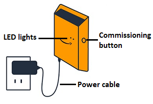

Amazon Monitron is no longer open to new customers. Existing customers can
continue to use the service as normal. For capabilities similar to Amazon
Monitron, see our [blog post](https://aws.amazon.com/blogs/machine-learning/maintain-access-and-consider-alternatives-for-amazon-monitron "https://aws.amazon.com/blogs/machine-learning/maintain-access-and-consider-alternatives-for-amazon-monitron").

# Wi-Fi gateways

This topic explains how to install your Wi-Fi gateway. It also explains how to delete
an unnecessary gateway.

To learn about using Amazon Monitron with Ethernet gateways, see [Ethernet gateways](setting-up-ethernet-gateways.md "setting-up-ethernet-gateways.md").

The Amazon Monitron gateway is easy to install and operate. After plugging in the
power cable, you can put the gateway in commissioning mode by pressing the commissioning
button.

###### Topics

- [Reading the LED lights on a Wi-Fi gateway](LED.md "LED.md")
- [Placing and installing a Wi-Fi gateway](installing-gateway.md "installing-gateway.md")
- [Commissioning a Wi-Fi gateway](adding-gateway-Wi-Fi.md "adding-gateway-Wi-Fi.md")
- [Troubleshooting Wi-Fi gateway
  detection](gateway-failure-Wi-Fi.md "gateway-failure-Wi-Fi.md")
- [Troubleshooting
  Bluetooth pairing](troubleshooting-Bluetooth-pairing-wireless.md "troubleshooting-Bluetooth-pairing-wireless.md")
- [Resetting the Wi-Fi gateway to factory
  settings](commissioning-button-Wi-Fi.md "commissioning-button-Wi-Fi.md")
- [Viewing the list of gateways](wi-fi-gateway-list.md "wi-fi-gateway-list.md")
- [Viewing Wi-Fi gateway details](viewing-gateway-details-wifi.md "viewing-gateway-details-wifi.md")
- [Editing Wi-Fi gateway name](editing-gateway-wifi.md "editing-gateway-wifi.md")
- [Deleting a Wi-Fi gateway](deleting-gateway-Wi-Fi.md "deleting-gateway-Wi-Fi.md")
- [Retrieving MAC address details](mac-address-wifi-gateway.md "mac-address-wifi-gateway.md")
