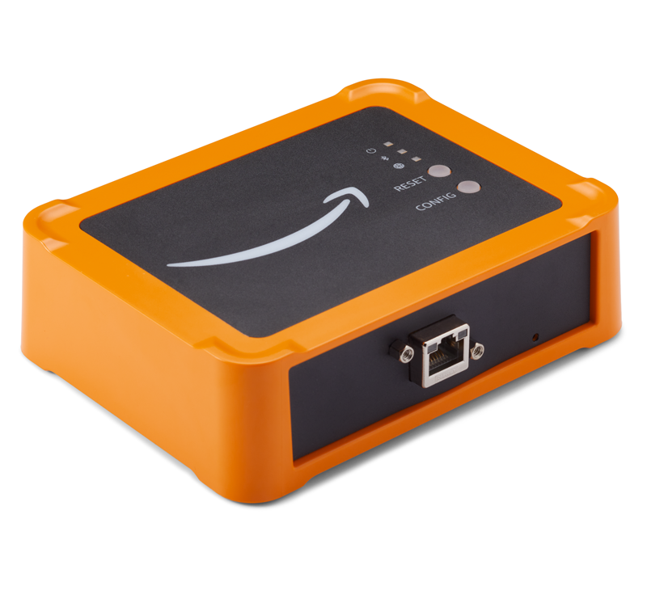

Amazon Monitron is no longer open to new customers. Existing customers can
continue to use the service as normal. For capabilities similar to Amazon
Monitron, see our [blog post](https://aws.amazon.com/blogs/machine-learning/maintain-access-and-consider-alternatives-for-amazon-monitron "https://aws.amazon.com/blogs/machine-learning/maintain-access-and-consider-alternatives-for-amazon-monitron").

# Ethernet gateways

The Amazon Monitron Ethernet Gateway comes equipped with an RJ-45 socket, so you
can connect it to your Ethernet network using a Cat 5e or Cat 6 Ethernet cable. You
power your gateway over the Ethernet cable, using Power over Ethernet (POE). Therefore,
you need either a router that supports POE or a POE power injector.

After you have inserted an Ethernet cable into your gateway, put the gateway in
commissioning mode by pressing the **Config** button.

To learn about using Amazon Monitron with Wi-Fi gateways, see [Wi-Fi gateways](setting-up-Wi-Fi-gateways.md "setting-up-Wi-Fi-gateways.md").

###### Topics

- [Reading the LED lights on an Ethernet
  gateway](reading-LED-lights-ethernet.md "reading-LED-lights-ethernet.md")
- [Placing and installing an Ethernet
  gateway](installing-gateway-ethernet.md "installing-gateway-ethernet.md")
- [Commissioning an Ethernet gateway](adding-gateway-ethernet.md "adding-gateway-ethernet.md")
- [Troubleshooting
  Ethernet gateway detection](troubleshooting-gateway-detection-ethernet.md "troubleshooting-gateway-detection-ethernet.md")
- [Troubleshooting
  Bluetooth pairing](troubleshooting-Bluetooth-pairing-ethernet.md "troubleshooting-Bluetooth-pairing-ethernet.md")
- [Resetting the Ethernet gateway to
  factory settings](commissioning-button-ethernet.md "commissioning-button-ethernet.md")
- [Viewing the list of gateways](ethernet-gateway-list.md "ethernet-gateway-list.md")
- [Viewing Ethernet gateway
  details](viewing-gateway-details-ethernet.md "viewing-gateway-details-ethernet.md")
- [Editing Ethernet gateway name](editing-gateway-ethernet.md "editing-gateway-ethernet.md")
- [Deleting an Ethernet gateway](deleting-gateway-ethernet.md "deleting-gateway-ethernet.md")
- [Retrieving MAC address details](mac-address-ethernet-gateway.md "mac-address-ethernet-gateway.md")
