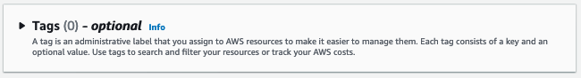
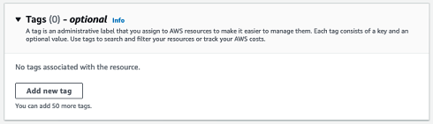
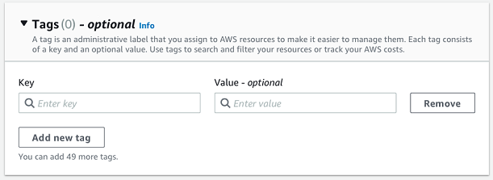
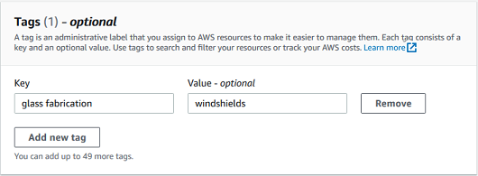
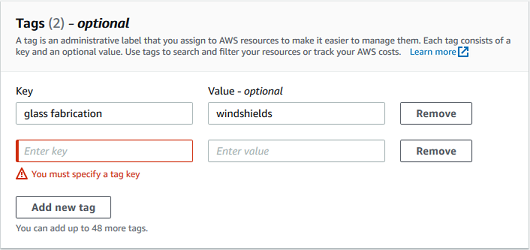
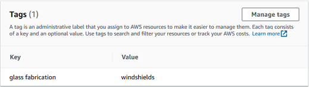
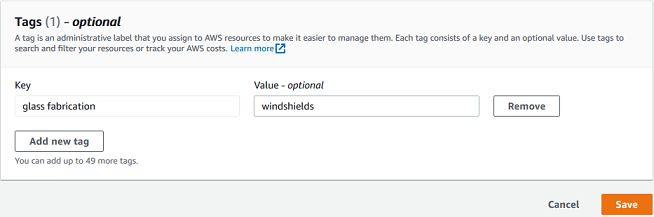
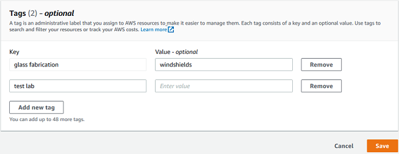

Amazon Monitron is no longer open to new customers. Existing customers can
continue to use the service as normal. For capabilities similar to Amazon
Monitron, see our [blog post](https://aws.amazon.com/blogs/machine-learning/maintain-access-and-consider-alternatives-for-amazon-monitron "https://aws.amazon.com/blogs/machine-learning/maintain-access-and-consider-alternatives-for-amazon-monitron").

# Using tags with your project

A _tag_ is a key-value pair that you can use to
categorize your projects. For example, if you have multiple projects, you might
categorize them by purpose, owner, location, or any other factor.

Use tags to:

- Organize your projects. You can search and filter by tag. For example, you
  could add tags such as ‘test lab’ or ‘paint shop' to easily find those projects.
- Identify and organize your AWS resources. Many AWS services support tagging, so you can assign the same tag to resources in
  different services to indicate that the resources are related. For example, you
  can tag a project and the Amazon Simple Storage Service (Amazon S3) bucket that stores related data with
  the same tag.
- Control access to your resources. You can use tags in AWS Identity and Access Management (IAM)
  polices that control access to Amazon Monitron projects. You can attach these
  policies to an IAM role or user to enable tag-based access control. For more
  information, see [Controlling access using tags](../../../IAM/latest/UserGuide/access_tags.md "../../../IAM/latest/UserGuide/access_tags.md") in the _IAM user
  Guide_.
  Each tag key must be unique within a project.

The following restrictions also apply to Amazon Monitron project tags:

- The maximum number of tags per project is 50.
- The maximum length of a tag key is 128 characters.
- The maximum length of a tag value is 256 characters.
- Valid characters for keys and values are a–z, A–Z, space, \_ . : / = + - and
  @.
- Tag keys and values are case sensitive.
- The `aws:` prefix is reserved for AWS use.
- If you plan to use your tagging schema across multiple services and resources,
  remember that other services might have different restrictions for valid
  characters. Refer to the documentation for that service.

###### Topics

- [Adding a tag to a project when you create
  it](#tag-original-1 "#tag-original-1")
- [Adding a tag to a project after it’s been
  created](#tag-existing-1 "#tag-existing-1")
- [Modifying or removing a tag](#modify-tag-1 "#modify-tag-1")

## Adding a tag to a project when you create

it

###### To add a tag to a project when creating it

1. Open the Amazon Monitron console at [https://console.aws.amazon.com/monitron](https://console.aws.amazon.com/monitron/ "https://console.aws.amazon.com/monitron/") .
2. Choose **Create Project**.
3. In the navigation pane, choose the project you want.
4. Expand the **Tags** section.

 5. Choose **Add new tag**.

 6. Enter the key-value pair for your tag.

The key must be unique for the project. The value is optional.

 7. Choose **Add new tag**. 8. To add more tags, repeat steps 2 and 3. 9. To remove a tag, choose **Remove**.

 10. Remove blank tag entries and then choose **Next**.

## Adding a tag to a project after it’s been

created

You can add a tag to a project on the project detail page.

###### To add a tag to an existing project

1. Open the Amazon Monitron console at [https://console.aws.amazon.com/monitron](https://console.aws.amazon.com/monitron/ "https://console.aws.amazon.com/monitron/") .
2. Choose **Create Project**.
3. In the navigation pane, choose **Projects**, and then
   choose the project you want.
4. Under **Tags**, choose **Manage
   tags**.

 5. Choose **Add new tag**

 6. Enter the key-value pair for your tag.

###### Note

Remember that the key must be unique for the project. The value is
optional.

 7. Choose **Save**.

## Modifying or removing a tag

You can modify a tag value, but not a tag key. To change a tag key, remove the
tag, then create a new tag with a different key. You can also remove any tag. You
modify or remove tags on the project detail page.

###### To modify or remove a tag

1. Open the Amazon Monitron console at [https://console.aws.amazon.com/monitron](https://console.aws.amazon.com/monitron/ "https://console.aws.amazon.com/monitron/").
2. Choose **Create Project**.
3. In the navigation pane, choose **Projects**, and then
   choose the project you want.
4. Under **Tags**, choose **Manage
   tags**.
5. To modify the tag value, make the change. To remove the tag, choose
   **Remove** next to the tag.

 6. Choose **Save**.
