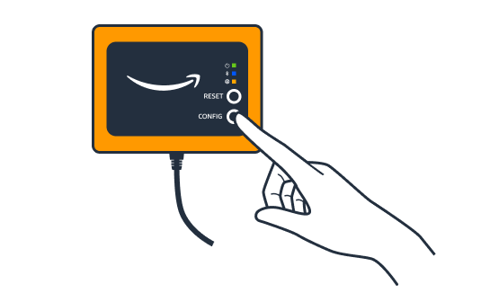

Amazon Monitron is no longer open to new customers. Existing customers can
continue to use the service as normal. For capabilities similar to Amazon
Monitron, see our [blog post](https://aws.amazon.com/blogs/machine-learning/maintain-access-and-consider-alternatives-for-amazon-monitron "https://aws.amazon.com/blogs/machine-learning/maintain-access-and-consider-alternatives-for-amazon-monitron").

# Troubleshooting

Ethernet gateway detection

When you add a gateway to your project or site, as soon as you choose
**Add Gateway**, the Amazon Monitron mobile app starts
scanning for the gateway. If the app can't find the gateway, try the following
troubleshooting tips.

- **Make sure that the gateway is powered up.**
  Check the small green light near the upper right corner of the gateway. If
  it's on, the gateway has power.

If the gateway has no power, check the following:

    + Is the Ethernet cable firmly seated in the RJ-45 socket?
    + Is the router at the other end of the Ethernet cable functioning
     properly?
    + Is the Ethernet cable working? To test this, try using the cable
     with another gateway.
    + Is the RJ-45 socket clean? Be sure to also check the socket at the
     other end of the Ethernet cable.

- **Make sure the gateway is in configuration
  mode.** The Amazon Monitron mobile app finds a new gateway
  only when it's in configuration mode. When you turn a gateway on, the
  **Bluetooth** and **Network** LED
  lights blink slowly, alternating orange and blue. When you press the
  **Config** button to enter commissioning mode, they
  blink rapidly, again alternating orange and blue.

- If the LEDs show any sequence other than slow blinking before you press
  the button, the gateway might not go into configuration mode. In this case,
  reset the gateway by pressing the **Reset** button.
- **Make sure your smartphone's Bluetooth is
  working.** The gateway connects to your smartphone using
  Bluetooth, so it's a potential source of interruption. Check the
  following:
  - Is you smartphone's Bluetooth on and working? Try switching it off
    and on. If that doesn't help, restart your phone and check
    again.
  - Are you within your smartphone's Bluetooth range? Bluetooth range
    is relatively short, usually less than 10 meters, and its
    reliability can vary dramatically.
  - Is there anything that might be interfering electronically with
    the Bluetooth signal?

- **Make sure this gateway is not already commissioned
  to any of your projects.** The device must be deleted from all
  existing projects before commissioning.
  If none of these actions resolves the issue, try the following:

- View and copy your gateway MAC address and get in touch with your IT
  admin. See [Retrieving MAC address details](mac-address-ethernet-gateway.md "mac-address-ethernet-gateway.md").
- Log out of the mobile app and restart it.
- Perform a factory reset of the gateway by holding down
  **Config** and pressing
  **Reset**.
