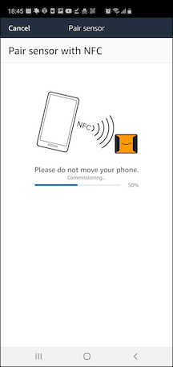
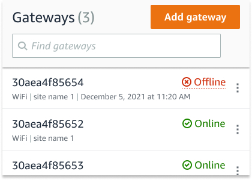

Amazon Monitron is no longer open to new customers. Existing customers can
continue to use the service as normal. For capabilities similar to Amazon
Monitron, see our [blog post](https://aws.amazon.com/blogs/machine-learning/maintain-access-and-consider-alternatives-for-amazon-monitron "https://aws.amazon.com/blogs/machine-learning/maintain-access-and-consider-alternatives-for-amazon-monitron").

# Troubleshooting Amazon Monitron device issues

If you have problems with one of your Amazon Monitron devices, use these suggestions to
troubleshoot the problem. Then, if you're still having trouble, contact AWS
Support.

###### Note

We recommend Safari as a default browser for iOS and Chrome as a default browser for
Android.

###### Topics

- [Troubleshooting Issues with Amazon Monitron
  Sensors](#trouble-sensor-issues "#trouble-sensor-issues")
- [Troubleshooting issues with Amazon Monitron
  gateways](#gateway-fail2 "#gateway-fail2")

## Troubleshooting Issues with Amazon Monitron

Sensors

As a completely self-contained unit, there aren't many things that are likely to go
wrong with a sensor. However, some issues can still occur.

###### Topics

- [If you can't commission your
  sensors](#trouble-cannot-commission "#trouble-cannot-commission")
- [If your sensor is offline](#trouble-sending-measurements "#trouble-sending-measurements")
- [If your sensor falls off](#trouble-sensor-falling-off "#trouble-sensor-falling-off")

### If you can't commission your

sensors

Consider the following questions.

- **Does the mobile phone running the Amazon Monitron
  App have a stable internet connection?**

For commissioning a sensor, the mobile phone running the Amazon Monitron App should have internet connectivity.

- **Are you holding your smartphone close to the
  sensor?**

At the moment of commissioning, your phone should be within two
centimeters of the sensor. Don't move your phone while the sensor is being
commissioned.

- Does your smartphone have NFC
  activated?

Some iOS devices require that NFC Tag Reader be manually turned on in
Control Center. To see if your device is one of them, check the [iPhone User Guide.](https://support.apple.com/guide/iphone/aside/asd-nfc-reader/14.0/ios/14.0 "https://support.apple.com/guide/iphone/aside/asd-nfc-reader/14.0/ios/14.0")

- Are you holding your NFC antenna close to the
  sensor?

On an iPhone, the NFC antenna is close to the top of the device. On an
Android device, it could be in a different location. Check the documentation
for [Samsung](https://www.samsung.com/hk_en/nfc-support/#devicelist "https://www.samsung.com/hk_en/nfc-support/#devicelist"), [Google
Pixel](https://support.google.com/pixelphone/answer/7157629 "https://support.google.com/pixelphone/answer/7157629"), or your device's manufacturer.

- Does the commissioning progress bar show up?
  (Android only)

If the commissioning progress bar doesn't show up (Android only), or
resets to the beginning, then the NFC communication between the sensor and
your smartphone is weak or can't be established. Move your smartphone around
to try and establish the NFC connection. Smartphones often have different
locations for transmitting NFC, depending on the brand. Check the hardware
specifications of your smartphone and tap the sensor specifically with that
part of your phone. Confirm that NFC is turned on and broadcasting.

- Do you get an error saying that the sensor is
  already in use?

Delete the sensor from its previous asset or position, and then retry the
commissioning process. If that doesn't work, try and commission another
sensor that is not currently in use.

### If your sensor is offline

Once a sensor has been paired to an asset, Amazon Monitron will make two
attempts (over the course of 30 seconds) to take the initial measurement. If neither
of those attempts is successful, then an alert like the one below will appear in the
app.

If your sensor has stopped sending data, try the following:

- Try [taking a one-time
  measurement](anom-take-measure.md "anom-take-measure.md"). If you can do so, then the sensor is working. If you
  cannot, then the sensor is not working, and may have run out of battery
  power. Replace it with a new sensor.
- Confirm that an available gateway is within range. Amazon Monitron
  sensors and gateways communicate using Bluetooth Low Energy (BLE), with a
  typical range of 20 to 30 meters. In a completely open space, a sensor and a
  gateway may communicate with each other at greater distances.
- Check for obstacles. Concrete walls and metal objects attenuate the
  signals.
- Check for signal interference. The Bluetooth signal that sensors and
  gateways use to communicate occupies the 2.4GHz ISM (industrial, scientific
  and medical) band. Other devices that may use that band include wireless
  headsets and mice, wireless cameras, microwave ovens, and garage door
  openers.
- If the measurement action starts (you see a loading bar), but does not
  complete, try to retake the measurement. If the same thing happens again,
  try to [delete the sensor](as-delete-sensor.md "as-delete-sensor.md") and [recommission it](as-add-sensors.md "as-add-sensors.md").
- If the measurement action fails, or you are not able to commission the
  sensor, contact customer support.

### If your sensor falls off

[Re-mount it](as-how-sensors.md "as-how-sensors.md").

## Troubleshooting issues with Amazon Monitron

gateways

###### Topics

- [If your mobile app can't pair with the
  gateway](#gateway-detection-fail "#gateway-detection-fail")
- [If commissioning the gateway
  fails](#gateway-commissioning-fail "#gateway-commissioning-fail")
- [If your gateway goes offline](#gateway-stops-working "#gateway-stops-working")

### If your mobile app can't pair with the

gateway

If you choose **Add gateway** in your mobile app, but the app
can't find the gateway, try the following.

|                                                                                                                             |                                                                                                                                 |
| --------------------------------------------------------------------------------------------------------------------------- | ------------------------------------------------------------------------------------------------------------------------------- | ----------------------------------------------------------------------------------------------------------------------------------------------------------------------------------------------------------------------------------------------------------------------------------------------------------------------------------------------------------------------------------------------------------------------------------------------------------------------------------------------------------------------------------------------------------------------------------------------------------------------------------------------------------------------------------------------------------------------------------------------------------------------------------------------------------------------------------------------------------------------------------------------------------------------------------------------------------------------------------------------------------------------------------------------------------------------------------------------------------------------------------------------------------------------------------------------------------------------------------------------------------------------------------------------------------------------------------------------------------------------------------------------------------------------------------------------------------------------------------------------------------------------------------------------------------------------------------------------------------------------------------------------------------------------------------------------------------------------------------------------------------------------------------------------------------------------------------------------------------------------------------------------------------------------------------------------------------------------------------------------------------------------------------------------------------------------------------------------------------------------------------------------------------------------------------------------------------------------------------------------------------------------------------------------------------------------------------------------------------------------------------------------------------------------------------------------------------------------------------------------------------------------------------------------------------------------------------------------------------------------------------------------------------------------------------------------------------------------------------------------------------------------------------------------------------------------------------------------------------------------------------------------------------------------------------------------------------------------------------------------------------------------------------------------------------------------------------------------------------------------------------------------------------------------------------------------------------------------------------------------------------------------------------------------------------------------------------------------------------------------------------------------------------------------------------------------------------------------------------------------------------------------------------------------------------------------------------------------------------------------------------------------------------------------------------------------------------------------------------------------------------------------------------------------------------------------------------------------------------------------------------------------------------------------------------------------------------------------------------------------------------------------------------------------------------------------------------------------------------------------------------------------------------------------------------------------------------------------------------------------------------------------------------------------------------------------------------------------------------------------------------------------------------------------------------------------------------------------------------------------------------------------------------------------------------------------------------------------------------------------------------------------------------------------------------------------------------------------------------------------------------------------------------------------------------------------------------------------------------------------------------------------------------------------------------------------------------------------------------------------------------------------------------------------------------------------------------------------------------------------------------------------------------------------------------------------------------------------------------------------------------------------------------------------------------------------------------------------------------------------------------------------------------------------------- |
| Smartphone connected to AWS service via Bluetooth, represented by icons and symbols. Bluetooth pairing with a Wi-Fi gateway | Smartphone connected to Amazon device via Bluetooth, illustrated with simple icons. Bluetooth pairing with an Ethernet gateway. |  • Make sure that the gateway is turned on. Check the lights on the front of the gateway. If at least one of them is on, then the gateway has power. If the gateway has no power, check the following: + Is the power cord firmly attached to the back of the gateway and the power outlet? + Is the power outlet functioning properly? + Is the gateway power cable working? To test this, try using the cable with another gateway. + Is the outlet where the cable plugs into the gateway clean, with no debris stuck inside? Be sure to check the outlet in the gateway and the connecting end of the cable.  • Make sure that the gateway is in commissioning mode. See [Commissioning a Wi-Fi gateway](adding-gateway-Wi-Fi.md "adding-gateway-Wi-Fi.md") or [Commissioning an Ethernet gateway](adding-gateway-ethernet.md "adding-gateway-ethernet.md").  • Make sure your smartphone's Bluetooth is working. + Try switching it off and on. If that doesn't help, restart your phone and check again. + Are you within your smartphone's Bluetooth range? Bluetooth range is typically less than 10 meters. + Is there anything that might be interfering electronically with the Bluetooth signal? See [If your sensor is offline](#trouble-sending-measurements "#trouble-sending-measurements"). If none of these actions resolves the issue, try the following:  • Log out of the mobile app and restart it.  • [Reset your Wi-Fi gateway](commissioning-button-Wi-Fi.md "commissioning-button-Wi-Fi.md") or [reset your Ethernet gateway](commissioning-button-ethernet.md "commissioning-button-ethernet.md"). ### If commissioning the gateway fails If the Amazon Monitron gateway commissioning process fails, try the following:  • Check that the mobile phone running Amazon Monitron App has internet connectivity.  • If commissioning of a Wi-Fi gateway fails, try commissioning it using a mobile hotspot provided by your mobile device. If that succeeds, it suggests a configuration issue with the Wi-Fi network or in firewall settings. ### If your gateway goes offline Your mobile or web app may tell you that your gateway is offline, or not connected to the network. In such cases, try the following:  • If you recently added the gateway to your configuration, wait for its status to update. A newly commissioned gateway may take up to 20 seconds to go online.  • Be sure that you aren't trying to configure a Wi-Fi gateway with static IPs. The Wi-Fi gateway does not currently support static IPs. However, you can configure your network to always assign the same IP address to the same device.  • Make sure that your firewall is not blocking the gateway. Amazon Monitron gateways use TCP port 8883. You must allow connections to TCP port 8883 for amazonaws.com subdomains in order to provide firewall access to Amazon Monitron gateways.  • Confirm that the issue is not network congestion. There are two ways in which Amazon Monitron may notify you that a gateway is offline: + When looking at information about your gateways in the mobile or web app, you may notice that a gateway is listed as offline.  The timestamp for an offline gateway marks the last time Amazon Monitron recieved a signal from that gateway. In this case, you may not have received a notification about the gateway's offline status. Amazon Monitron will not issue a notification every single time a gateway appears to be offline. A newly commissioned gateway is considered offline until it connects to the internet. A gateway on a congested network is considered offline if Amazon Monitron hasn't heard from that gateway in 15 minutes.  • Confirm that you're not dealing with a newly commissioned gateway or a newly paired sensor. If so, wait an hour. Sensors send data once per hour. If you don't want to wait, you can [take a one-time measurement](anom-take-measure.md "anom-take-measure.md").  • Confirm that your gateway is connected to a power source. If it is, unplug the gateway and then plug it back in.  • If it's a Wi-Fi gateway, check the Wi-Fi connection. If the password for the Wi-Fi network has been changed since the gateway was added, it won't be able to connect. To reconnect, you'll have to delete the gateway and add it again, connecting to the Wi-Fi network using the new password. For more information about how to add a gateway, see [Commissioning a Wi-Fi gateway](adding-gateway-Wi-Fi.md "adding-gateway-Wi-Fi.md") or [Commissioning an Ethernet gateway](adding-gateway-ethernet.md "adding-gateway-ethernet.md").  • If it's an Ethernet gateway, check the network configuration.  • Delete the gateway using the Amazon Monitron mobile app, do a factory reset of the gateway, and then install the gateway again. For more information, see [Resetting the Wi-Fi gateway to factory settings](commissioning-button-Wi-Fi.md "commissioning-button-Wi-Fi.md") or [Resetting the Ethernet gateway to factory settings](commissioning-button-ethernet.md "commissioning-button-ethernet.md"). If none of these suggestions helps to get your Amazon Monitron device working again, contact AWS Support. |
