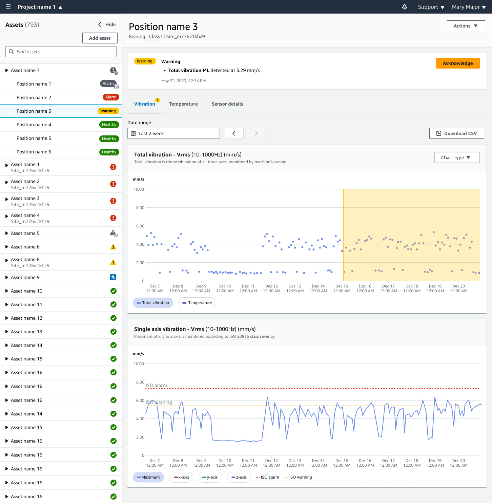

Amazon Monitron is no longer open to new customers. Existing customers can
continue to use the service as normal. For capabilities similar to Amazon
Monitron, see our [blog post](https://aws.amazon.com/blogs/machine-learning/maintain-access-and-consider-alternatives-for-amazon-monitron "https://aws.amazon.com/blogs/machine-learning/maintain-access-and-consider-alternatives-for-amazon-monitron").

# Viewing sensor measurements

You can choose to view your sensor measurement data in two chart formats: scatter plot
and line plot. The following image shows the scatter plot view on the top and the line
plot view on the bottom.

###### Note

You can select your sensor measurement view from the **Chart
type** menu in your mobile and web app.

