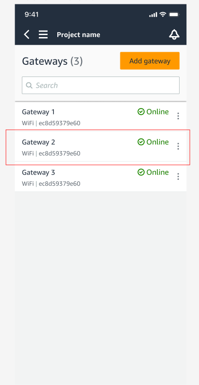
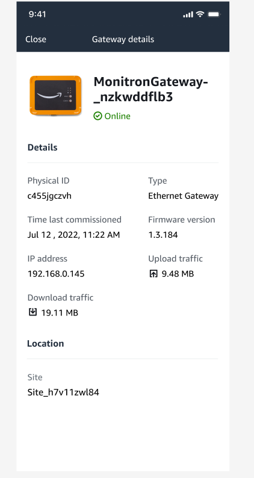
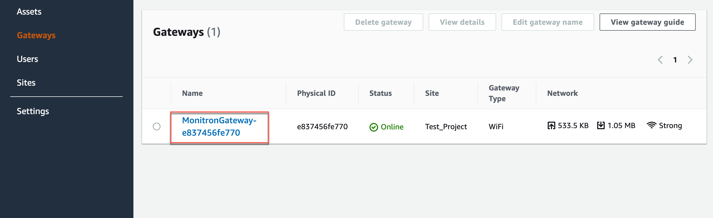
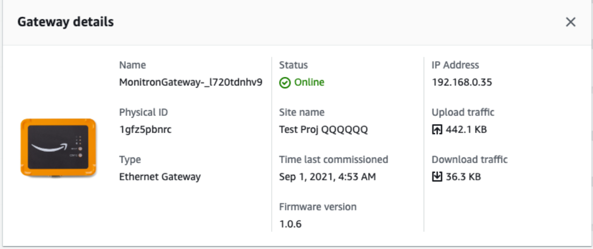

Amazon Monitron is no longer open to new customers. Existing customers can
continue to use the service as normal. For capabilities similar to Amazon
Monitron, see our [blog post](https://aws.amazon.com/blogs/machine-learning/maintain-access-and-consider-alternatives-for-amazon-monitron "https://aws.amazon.com/blogs/machine-learning/maintain-access-and-consider-alternatives-for-amazon-monitron").

# Viewing Ethernet gateway

details

You can view gateway details on your mobile or web app. The following gateway
details are viewable:

- IP address
- Firmware version
- Last time commissioned

###### Note

You can also view and copy gateway MAC addresses. See [Retrieving MAC address details](mac-address-ethernet-gateway.md "mac-address-ethernet-gateway.md").

You can view sensor details on both the mobile and web app. The following section
shows you how.

###### Topics

- [To view Ethernet gateway
  details in the mobile app](#w2aac19c13c43c13 "#w2aac19c13c43c13")
- [To view Ethernet gateway
  details in the web app](#w2aac19c13c43c15 "#w2aac19c13c43c15")

## To view Ethernet gateway

details in the mobile app

1. From the **Gateways** list, choose the gateway whose
   details you want to view.

 2. From the options box that pops open, select **View gateway
details**.

 3. The **Gateway details** page is displayed.

## To view Ethernet gateway

details in the web app

1. From the **Gateways** list, choose the gateway whose
   details you want to view.

 2. The **Gateway details** page is displayed.

