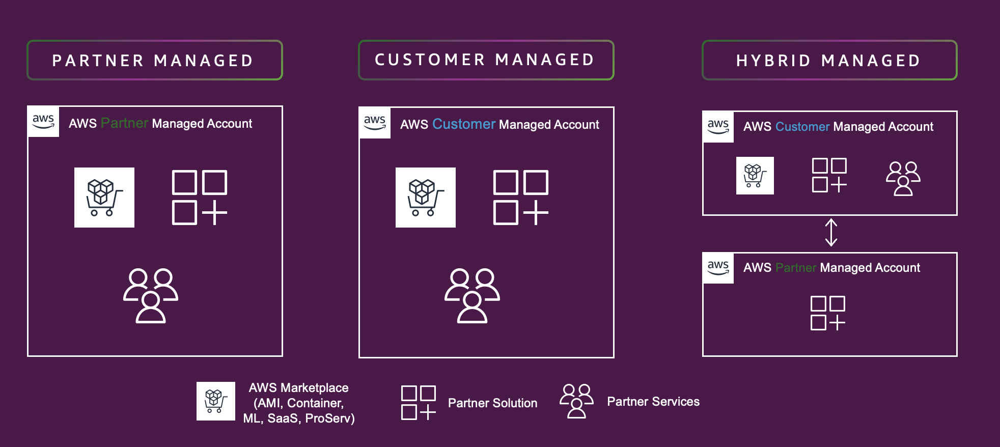

# Getting started with Partner Revenue Measurement

Partner Revenue Measurement tracks AWS service consumption driven by partner products through resource tagging. This enables AWS to attribute revenue to partner solutions and provide aggregated consumption data back to partners.

To implement Partner Revenue Measurement, consider the following requirements:

- What AWS services does your product use (Amazon EC2, Amazon S3, Amazon ECS, Amazon RDS)?
- Do you have a SaaS, AMI, or Container product listed on AWS Marketplace?
- Which architecture pattern does your solution follow (Partner account, Customer account, or Hybrid)?

###### Note

Partner Revenue Measurement requires resource tagging to enable revenue attribution for [supported AWS services](included-aws-services.md "included-aws-services.md").

## Partner Revenue Measurement Architecture Patterns

**Pattern #1 - Partner Account:** All components reside within the partner's AWS account or VPC.

**Pattern #2 - Customer Account:** All components are deployed in the customer's AWS account and VPC.

**Pattern #3 - Hybrid:** Components are distributed across both partner and customer AWS accounts and VPCs.

## Implementation Steps

###### Partner Revenue Measurement Implementation Process

1. **Step 1: Complete Prerequisites**

Review [Resource Tagging Prerequisites](resource-tagging-prerequisites.md "resource-tagging-prerequisites.md") 2. **Step 2: Retrieve Product Code**

[Retrieve your product code from AWS Marketplace Management Portal](product-code-retrieval.md "product-code-retrieval.md") 3. **Step 3: Implement Resource Tagging**

Follow [Resource Tagging implementation guide](prm-resource-tagging.md "prm-resource-tagging.md")
