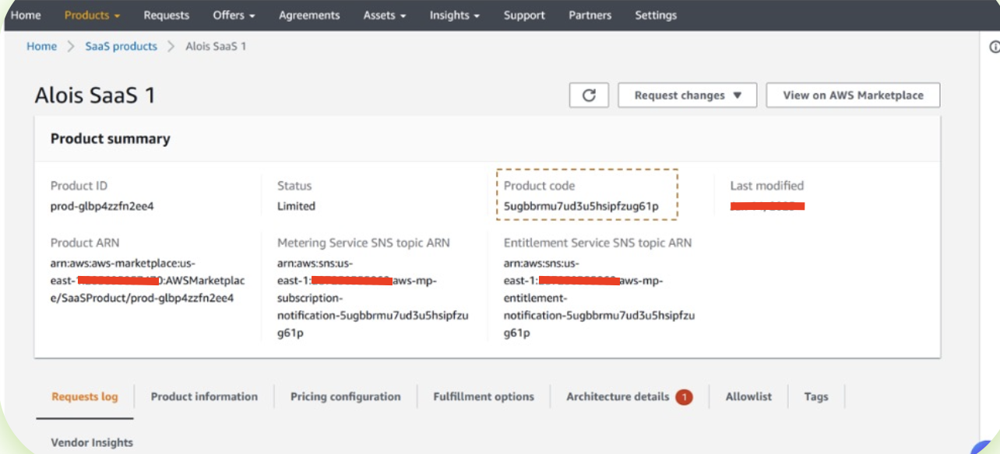

# Product Code Retrieval

Your AWS Marketplace product code is required for resource tagging. This code uniquely identifies your product for revenue attribution.

###### To retrieve your product code

1. Open the [AWS Marketplace Management Portal](https://aws.amazon.com/marketplace/management/tour/ "https://aws.amazon.com/marketplace/management/tour/"), and then sign in to your seller account
2. Navigate to **Products** page
3. Select your product
4. Find the product code in the **Product Summary** section
   Example product code format: `5ugbbrmu7ud3u5hsipfzug61p`

The following screenshot shows where to find the product code in the AWS Marketplace Management Portal:

