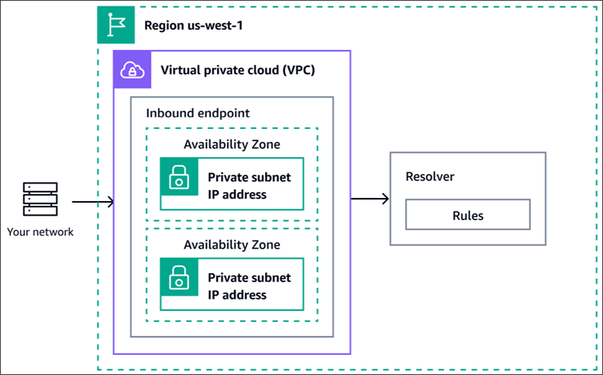
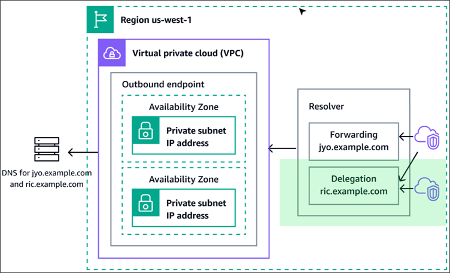

# Resolving DNS queries between

VPCs and your network

The VPC Resolver contains endpoints that you configure to answer DNS queries to and
from your on-premises environment.

###### Note

Forwarding private DNS queries to any VPC CIDR + 2 address from on-premises or other VPC DNS
servers is not supported, and can cause unstable results. Instead, we recommend that
you use a Resolver inbound endpoint.

You also can integrate DNS resolution between VPC Resolver and DNS resolvers on your network by configuring forwarding rules.
_Your network_ can include any network that is reachable from your VPC, such as the following:

- The VPC itself
- Another peered VPC
- An on-premises network that is connected to AWS with Direct Connect, a VPN, or a
  network address translation (NAT) gateway
  Before you start to forward queries, you create Resolver inbound and/or outbound endpoints in the connected VPC.
  These endpoints provide a path for inbound or outbound queries:

**Inbound endpoint: DNS resolvers on your network can forward DNS queries to Route 53 VPC Resolver via
this endpoint**
There are two types of inbound endpoints, a **default inbound
endpoint** that forwards to IP addresses, and a **delegation inbound endpoint** that delegates the
authority for a subdomain hosted in Route 53 private hosted Zone to the
Route 53 VPC Resolver. Inbound endpoints allow your DNS resolvers to easily resolve
domain names for AWS resources such as EC2 instances or records in a Route 53
private hosted zone. For more information, see [How DNS resolvers on your network
forward DNS queries to Resolver endpoints](resolver-overview-forward-network-to-vpc.md "resolver-overview-forward-network-to-vpc.md").

**Outbound endpoint: VPC Resolver conditionally forwards queries to resolvers on your network via this endpoint**
To forward selected queries, you create Resolver rules that specify the domain names for the DNS
queries that you want to forward (such as example.com), and the IP addresses
of the DNS resolvers on your network that you want to forward the queries
to. If a query matches multiple rules (example.com, acme.example.com),
VPC Resolver chooses the rule with the most specific match (acme.example.com) and
forwards the query to the IP addresses that you specified in that rule.
There are three types of rules, **forward**,
**system**, and **delegation**. For more information, see [How Resolver endpoints forward DNS
queries from your VPCs to your network](resolver-overview-forward-vpc-to-network.md "resolver-overview-forward-vpc-to-network.md").

Like Amazon VPC, VPC Resolver is regional. In each region where you have VPCs, you can choose whether to forward queries from your VPCs
to your network (outbound queries), from your network to your VPCs (inbound queries), or both.

You can't create Resolver endpoints in a VPC that you don't own.
Only the VPC owner can create VPC-level resources such as inbound endpoints.

###### Note

When you create a Resolver endpoint, you can't specify a VPC that has the instance tenancy attribute set to `dedicated`.
For more information, see
[Using VPC Resolver in VPCs that are configured for dedicated instance tenancy](resolver-choose-vpc.md#resolver-considerations-dedicated-instance-tenancy "resolver-choose-vpc.md#resolver-considerations-dedicated-instance-tenancy").

To use inbound or outbound forwarding, you create a Resolver endpoint in your VPC. As part of
the definition of an endpoint, you specify the IP addresses, or DNS delegation, that you
want to forward inbound DNS queries to or the IP addresses that you want outbound
queries to originate from. For each IP address and delegation that you specify, VPC Resolver
automatically creates a VPC elastic network interface.

The following diagram shows the path of a DNS query from a DNS resolver on your network to
Route 53 Resolver endpoints.

The following diagram shows the path of a DNS query from an EC2 instance in one of your VPCs
to a DNS resolver on your network. The jyo.example.com domain uses a forwarding rule,
whereas the ric.example.com subdomain has delegated the forwarding authority to
VPC Resolver.

For an overview of VPC network interfaces, see
[Elastic network interfaces](../../../vpc/latest/userguide/VPC_ElasticNetworkInterfaces.md "../../../vpc/latest/userguide/VPC_ElasticNetworkInterfaces.md") in the
_Amazon VPC User Guide_.

**Topics**

- [How DNS resolvers on your network
  forward DNS queries to Resolver endpoints](resolver-overview-forward-network-to-vpc.md "resolver-overview-forward-network-to-vpc.md")
- [How Resolver endpoints forward DNS
  queries from your VPCs to your network](resolver-overview-forward-vpc-to-network.md "resolver-overview-forward-vpc-to-network.md")
- [Considerations when creating inbound and outbound endpoints](resolver-choose-vpc.md "resolver-choose-vpc.md")
