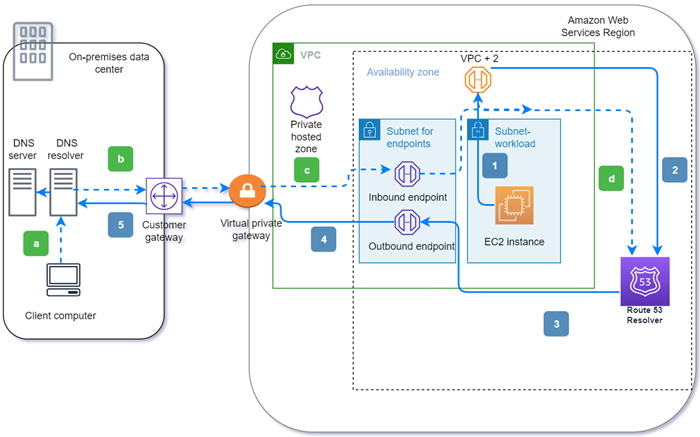

# What is Amazon Route 53 Resolver?

Amazon Route 53 Resolver responds recursively to DNS queries from AWS resources for public records,
Amazon VPC-specific DNS names, and Amazon Route 53 private hosted zones, and is available by default in
all VPCs.

###### Note

Amazon Route 53 Resolver was previously called Amazon DNS server, but was renamed when Resolver rules, and
inbound and outbound endpoints were introduced. For more information, see [Amazon DNS
server](../../../vpc/latest/userguide/vpc-dns.md#AmazonDNS "../../../vpc/latest/userguide/vpc-dns.md#AmazonDNS") in the _Amazon Virtual Private Cloud User Guide_.

An Amazon VPC connects to a Route 53 Resolver at a VPC+2 IP address. This VPC+2 address connects to a Route 53 Resolver
within an Availability Zone.

A Route 53 Resolver automatically answers DNS queries for:

- Local VPC domain names for EC2 instances (for example,
  ec2-192-0-2-44.compute-1.amazonaws.com).
- Records in private hosted zones (for example, acme.example.com).
- For public domain names, Route 53 Resolver performs recursive lookups against public name servers on
  the internet.

If you have workloads that leverage both VPCs and on-premises resources, you also need to
resolve DNS records hosted on-premises. Similarly, these on-premises resources may need to
resolve names hosted on AWS. Through Resolver endpoints and conditional forwarding rules,
you can resolve DNS queries between your on-premises resources and VPCs to create a hybrid
cloud setup over VPN or Direct Connect (DX). Specifically:

- Inbound Resolver endpoints allow DNS queries to your VPC from your on-premises network or
  another VPC.
- Outbound Resolver endpoints allow DNS queries from your VPC to your on-premises network or
  another VPC.
- Resolver rules enable you to create one forwarding rule for each domain name and
  specify the name of the domain for which you want to forward DNS queries from your
  VPC to an on-premises DNS resolver and from your on-premises to your VPC. Rules are
  applied directly to your VPC and can be shared across multiple accounts.
  The following diagram shows hybrid DNS resolution with Resolver endpoints. Note that the
  diagram is simplified to show only one Availability Zone.

The diagram illustrates the following steps:

**Outbound (solid arrows
1–5):**

1. An Amazon EC2 instance needs to resolve a DNS query to the domain internal.example.com. The
   authoritative DNS server is in the on-premises data center. This DNS query is sent
   to the VPC+2 in the VPC that connects to Route 53 Resolver.
2. A Route 53 Resolver forwarding rule is configured to forward queries to internal.example.com in the
   on-premises data center.
3. The query is forwarded to an outbound endpoint.
4. The outbound endpoint forwards the query to the on-premises DNS resolver through a
   private connection between AWS and the data center. The connection can be either
   Direct Connect or AWS Site-to-Site VPN, depicted as a virtual private gateway.
5. The on-premises DNS resolver resolves the DNS query for internal.example.com and
   returns the answer to the Amazon EC2 instance via the same path in reverse.
   **Inbound (dashed arrows a–d):**

6. A client in the on-premises data center needs to resolve a DNS query to an AWS resource for
   the domain dev.example.com. It sends the query to the on-premises DNS resolver.
7. The on-premises DNS resolver has a forwarding rule that points queries to
   dev.example.com to an inbound endpoint.
8. The query arrives at the inbound endpoint through a private connection, such as
   Direct Connect or AWS Site-to-Site VPN, depicted as a virtual gateway.
9. The inbound endpoint sends the query to Route 53 Resolver, and Route 53 Resolver resolves the DNS query for
   dev.example.com and returns the answer to the client via the same path in
   reverse.

###### Topics

- [Resolving DNS queries between
  VPCs and your network](resolver-overview-DSN-queries-to-vpc.md "resolver-overview-DSN-queries-to-vpc.md")
- [Route 53 Resolver availability and scaling](resolver-availability-scaling.md "resolver-availability-scaling.md")
- [Getting started with Route 53 Resolver](resolver-getting-started.md "resolver-getting-started.md")
- [Forwarding inbound DNS queries to your VPCs](resolver-forwarding-inbound-queries.md "resolver-forwarding-inbound-queries.md")
- [Forwarding outbound DNS queries to your network](resolver-forwarding-outbound-queries.md "resolver-forwarding-outbound-queries.md")
- [Resolver delegation rules tutorial](outbound-delegation-tutorial.md "outbound-delegation-tutorial.md")
- [Enabling DNSSEC validation in
  Amazon Route 53](resolver-dnssec-validation.md "resolver-dnssec-validation.md")
