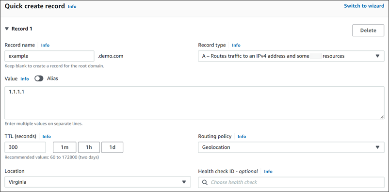

# Geolocation routing in private hosted zones

For private hosted zones, Route 53 responds to DNS queries based on the AWS Region of the VPC that the query originated from.
For the list of AWS Regions, see
[Regions and zones](../../../AWSEC2/latest/UserGuide/using-regions-availability-zones.md "../../../AWSEC2/latest/UserGuide/using-regions-availability-zones.md") in the _Amazon EC2 user guide_.

If the DNS query originates from an on-premises part of a hybrid network, it will be considered as having originated from the
AWS Region that the VPC is located in.

If you include health checks, you can create default records for:

- IP addresses that aren't mapped to geographic locations.
- DNS queries that come from locations that you haven't created geolocation records for.
  If the geolocation record for the DNS query's region is unhealthy, the default record will
  be returned (if it is healthy).

In the example configuration in the following figure, DNS queries coming from an us-east-1 AWS Region (Virginia) will be routed to the 1.1.1.1 endpoint.

