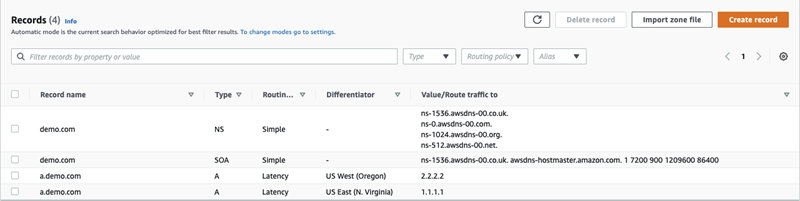

# Latency-based routing in private hosted zones

For private hosted zones, Route 53 answers DNS queries with an endpoint that is in the same AWS Region,
or is closest in distance to the AWS Region of the VPC that the query originated from.

###### Note

If you have an outbound endpoint forwarded to an inbound endpoint, the record will resolve based on where the inbound endpoint is,
not the outbound endpoint.

If you include health checks, and the record with the lowest latency to the query's origin
is unhealthy, a healthy endpoint with the next lowest latency is
returned.

In the example configuration in the following figure, DNS queries coming from a us-east-1 AWS Region, or closest to it, will be routed to the 1.1.1.1 endpoint.
DNS queries from
us-west-2, or closest to it, will be routed to the 2.2.2.2 endpoint.

