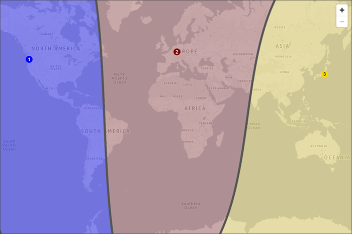
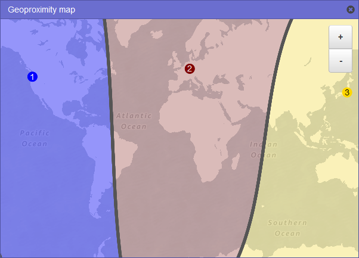

# Creating and managing traffic policies

###### Topics

- [Creating a traffic policy](#traffic-policies-creating "#traffic-policies-creating")
- [Values that you specify when you create a traffic policy](#traffic-policies-creating-values "#traffic-policies-creating-values")
- [Viewing a map that shows the effect of geoproximity settings](#traffic-flow-geoproximity-map "#traffic-flow-geoproximity-map")
- [Creating additional versions of a traffic policy](#traffic-policies-creating-versions "#traffic-policies-creating-versions")
- [Creating a traffic policy by using a JSON document](#traffic-policy-import "#traffic-policy-import")
- [Viewing traffic policy versions and the associated policy records](#traffic-policies-viewing "#traffic-policies-viewing")
- [Deleting traffic policy versions and traffic policies](#traffic-policies-deleting "#traffic-policies-deleting")

## Creating a traffic policy

To create a traffic policy, perform the following procedure.

###### Note

We're updating the Traffic Flow console for Route 53. During the transition period, you can continue
to use the old console.

Choose the tab for the console you are using.

- [New console](#traffic-policies-creating-new "#traffic-policies-creating-new")
- [Old console](#traffic-policies-creating-old "#traffic-policies-creating-old")

New console

###### To create a traffic policy

1. Design your configuration. For information about how complex DNS routing configurations work, see
   [Configuring DNS failover](dns-failover-configuring.md "dns-failover-configuring.md") in
   [Creating Amazon Route 53 health checks](dns-failover.md "dns-failover.md") .
2. Based on the design for your configuration, create the health checks that you want to use for your endpoints.
3. Sign in to the AWS Management Console and open the Route 53 console at
   [https://console.aws.amazon.com/route53/](https://console.aws.amazon.com/route53/ "https://console.aws.amazon.com/route53/").
4. In the navigation pane, choose **Traffic policies**.
5. Choose **Create traffic policy**.
6. Enter a name and an optional description, and then choose **Next**.
7. On the editor, choose the DNS resource record type in the **Properties**
   pane. This type will be assigned to all resource records that
   you create for this traffic policy.

Choose **Confirm**. For more information, see
[Values that you specify when you create a traffic policy](#traffic-policies-creating-values "#traffic-policies-creating-values"). 8. In the editor page, choose **Connect to** and then choose one of
**New routing rule**, **New endpoint**, **Existing routing rule**,
or **Existing endpoint**. If you selected a **New routing rule**, in the **Properties** pane select the routing rule and choose
**Confirm**.
Then, in the **Properties** pane,
enter the appropriate values. Repeat this process until your policy is done.
For more information about the values for each connection type, see
[Values that you specify when you create a traffic policy](#traffic-policies-creating-values "#traffic-policies-creating-values").

You can delete rules, endpoints, and branches of a traffic policy in the following ways:

    * To delete a rule or an endpoint, select the rule or the endpoint in the editor, and then
     choose **Delete** in
     **Properties** pane.

    ###### Important

    If you delete a rule that has child rules and endpoints, Amazon Route 53 also deletes all of the children.
    * If you connect two rules to the same child rule or endpoint and you want to delete one of the
     connections, select the connection that you want to
     delete, and chose the **Delete** in the
     **Properties** pane for that
     connection.

9. Choose **Create policy**.
10. On the **Create policy records** page, use the new traffic policy to create
    one or more policy records in one hosted zone. For more
    information, see [Values that you specify when you create or update a policy record](traffic-policy-records.md#traffic-policy-records-creating-values "traffic-policy-records.md#traffic-policy-records-creating-values").
    You can also create policy records later, either in the same
    hosted zone or in additional hosted zones.

If you don't want to create policy records now, choose **Cancel**, and the console displays
the list of traffic policies and policy records that you have created by using the current AWS account. 11. If you specified settings for policy records in the preceding step, choose **Create policy records**.

Old console

###### To create a traffic policy

1. Design your configuration. For information about how complex DNS routing configurations work, see
   [Configuring DNS failover](dns-failover-configuring.md "dns-failover-configuring.md") in
   [Creating Amazon Route 53 health checks](dns-failover.md "dns-failover.md") .
2. Based on the design for your configuration, create the health checks that you want to use for your endpoints.
3. Sign in to the AWS Management Console and open the Route 53 console at
   [https://console.aws.amazon.com/route53/](https://console.aws.amazon.com/route53/ "https://console.aws.amazon.com/route53/").
4. In the navigation pane, choose **Traffic policies**.
5. Choose **Create traffic policy**.
6. On the **Name policy** page, specify the applicable values. For more information, see
   [Values that you specify when you create a traffic policy](#traffic-policies-creating-values "#traffic-policies-creating-values").
7. Choose **Next**.
8. On the **Create traffic policy** _policy name_ **v1** page,
   specify the applicable values. For more information, see
   [Values that you specify when you create a traffic policy](#traffic-policies-creating-values "#traffic-policies-creating-values").

You can delete rules, endpoints, and branches of a traffic policy in the following ways:

    * To delete a rule or an endpoint, click the **x** in the upper-right corner
     of the box.

    ###### Important

    If you delete a rule that has child rules and endpoints, Amazon Route 53 also deletes all of the children.
    * If you connect two rules to the same child rule or endpoint and you want to delete one of the
     connections, pause your cursor on the connection that you want to delete, and click the **x**
     for that connection.

9. Choose **Create traffic policy**.
10. _Optional_: On the **Create policy records with traffic policy** page,
    use the new traffic policy to create one or more policy records in one hosted zone. For more information, see
    [Values that you specify when you create or update a policy record](traffic-policy-records.md#traffic-policy-records-creating-values "traffic-policy-records.md#traffic-policy-records-creating-values").
    You can also create policy records later, either in the same hosted zone or in additional hosted zones.

If you don't want to create policy records now, choose **Skip this step**, and the console displays
the list of traffic policies and policy records that you have created by using the current AWS account. 11. If you specified settings for policy records in the preceding step, choose **Create policy record**.

## Values that you specify when you create a traffic policy

###### Note

We're updating the Traffic Flow console for Route 53. During the transition period, you can continue
to use the old console. The following list applies for both console, except where noted.

When you create a traffic policy, you specify the following values.

- [Policy name](#traffic-policies-creating-values-policy-name "#traffic-policies-creating-values-policy-name")
- [Version](#traffic-policies-creating-values-version "#traffic-policies-creating-values-version")
- [Version description](#traffic-policies-creating-values-version-description "#traffic-policies-creating-values-version-description")
- [DNS type](#traffic-policies-creating-values-dns-type "#traffic-policies-creating-values-dns-type")
- [Connect to](#traffic-policies-creating-values-connect-to "#traffic-policies-creating-values-connect-to")
- [Value type](#traffic-policies-creating-values-value-type "#traffic-policies-creating-values-value-type")
- [Value](#traffic-policies-creating-values-value "#traffic-policies-creating-values-value")
- [Key (new console only)](#traffic-policies-creating-values-key "#traffic-policies-creating-values-key")

### Policy name

Enter a name that describes the traffic policy. This value appears in the list of traffic policies
in the console. You can't change the name of a traffic policy after you create it.

### Version

This value is assigned automatically by Amazon Route 53 when you create a traffic policy or a new version of an existing policy.

### Version description

Enter a description that applies to this version of the traffic policy. This value appears in the list of
traffic policy versions in the console.

### DNS type

Choose the DNS type that you want Amazon Route 53 to assign to all of the records
when you create a policy record by using this traffic policy version. For a list of supported types, see
[Supported DNS record types](ResourceRecordTypes.md "ResourceRecordTypes.md").

###### Important

If you're creating a new version of an existing traffic policy, you can change the DNS type.
However, you can't edit a policy record and choose a traffic policy version that has a DNS type that is
different from the traffic policy version that you used to create the policy record. For example, if you
created a policy record by using a traffic policy version that has a **DNS type** of A, you can't
edit the policy record and choose a traffic policy version that has any other value for **DNS type**.

If you want to route traffic to the following AWS resources, choose the applicable value:

- **CloudFront distribution** – Choose **A: IP address in
  IPv4 format** or **AAAA: IP address in IPv6
  format**.

###### Note

CloudFront alias endpoints don't support evaluate health check. You can however, create a health check to monitor CloudFront endpoints. For more information, see
[Creating and updating health checks](health-checks-creating.md "health-checks-creating.md").

- **ELB Application load balancer** – Choose either
  **A: IP address in IPv4 format** or **AAAA:
  IP address in IPv6 format**.
- **ELB Classic load balancer** – Choose either **A:
  IP address in IPv4 format** or **AAAA: IP address
  in IPv6 format**.
- **ELB Network load balancer** – Choose either
  **A: IP address in IPv4 format** or **AAAA:
  IP address in IPv6 format**.
- **Elastic Beanstalk environment**:
  Choose **A: IP address in IPv4 format**.
- **Amazon S3 bucket configured as a website endpoint**:
  Choose **A: IP address in IPv4 format**.

### Connect to

Choose the applicable rule or endpoint based on the design for your configuration.

**Failover rule**
Choose this option when you want to configure active-passive failover, in which one resource
takes all traffic when it's available and the other resource takes all traffic when the first resource isn't available.

For more information, see [Active-passive failover](dns-failover-types.md#dns-failover-types-active-passive "dns-failover-types.md#dns-failover-types-active-passive").

###### Note

Evaluate target health is checked by default and it will evaluate the health of the target endpoint to which traffic is routed via an alias record.
If you endpoint doesn't receive DNS traffic via an alias record, uncheck this and create a health check if you want to monitor the endpoint health.
For more information, see [Creating and updating health checks](health-checks-creating.md "health-checks-creating.md").

**Geolocation rule**
Choose this option when you want Amazon Route 53 to respond to DNS queries based on the location of your users.

For more information, see [Geolocation routing](routing-policy-geo.md "routing-policy-geo.md").

When you choose **Geolocation rule**, you also choose the country or the state in the
United States that requests originate from.

###### Note

Evaluate target health is checked by default and it will evaluate the health of the target endpoint to which traffic is routed via an alias record.
If you endpoint doesn't receive DNS traffic via an alias record, uncheck this and create a health check if you want to monitor the endpoint health.
For more information, see [Creating and updating health checks](health-checks-creating.md "health-checks-creating.md").

**Latency rule**
Choose this option when you have resources in multiple Amazon EC2 data centers that perform the same function,
and you want Route 53 to respond to DNS queries with the resources that provide the best latency.

When you choose **Latency rule**, you also choose an AWS Region.

For more information, see [Latency-based routing](routing-policy-latency.md "routing-policy-latency.md").

###### Note

Evaluate target health is checked by default and it will evaluate the health of the target endpoint to which traffic is routed via an alias record.
If you endpoint doesn't receive DNS traffic via an alias record, uncheck this and create a health check if you want to monitor the endpoint health.
For more information, see [Creating and updating health checks](health-checks-creating.md "health-checks-creating.md").

**Geoproximity rule**
Choose this option when you want Route 53 to respond to DNS queries based on the location of
your resources and, optionally, on a bias that you specify. The bias allows you to send more traffic
to a resource or more traffic away from a resource.

When you choose **Geoproximity rule**, enter the following values:

**Endpoint location**
Choose the applicable value:

- **Custom (enter coordinates)** – If your endpoint is not an AWS resource,
  choose **Custom (enter coordinates)**.
- **An AWS Region** – If your endpoint is an AWS resource, choose
  the AWS Region that you created the resource in.
- **An AWS Local Zone** – If your endpoint is an AWS resource, choose
  the AWS Local Zone that you created the resource in.

If you use AWS Local Zones, you must first enable them. For more information, see
[Getting started with Local Zones](../../../local-zones/latest/ug/getting-started.md "../../../local-zones/latest/ug/getting-started.md") in the
_AWS Local Zones User Guide_.

For available Local Zones, see [AWS Local Zones locations](https://aws.amazon.com/about-aws/global-infrastructure/localzones/locations/ "https://aws.amazon.com/about-aws/global-infrastructure/localzones/locations/").

To learn about the difference between AWS Regions and Local Zones, see [Regions and Zones](../../../AWSEC2/latest/UserGuide/using-regions-availability-zones.md "../../../AWSEC2/latest/UserGuide/using-regions-availability-zones.md") in the _Amazon EC2 User Guide_.

###### Important

A single geoproximity routing policy cannot contain two or more locations that are geographically situated within the same metropolitan area.

Additionally, some AWS Regions and Local Zones, such as US West (Oregon) and Portland, US, are situated too close to one another to be used
within the same geoproximity routing policy. If you require traffic routing to more than one location within the same metropolitan area,
instead define a geoproximity routing policy that results in a 50/50 weighted routing rule (WRR) for two different endpoints in the area,
thereby distributing traffic evenly between those endpoints.

**Coordinates**
If you chose **Custom (enter coordinates)** for **Endpoint location**,
enter the latitude and longitude of the location of the resource. Note the following:

- Latitude represents the location south (negative) or north (positive) of the equator.
  Valid values are -90 degrees to 90 degrees.
- Longitude represents the location west (negative) or east (positive) of the prime meridian.
  Valid values are -180 degrees to 180 degrees.
- You can get latitude and longitude from some online mapping applications. For example, in
  Google Maps, the URL for a location specifies the latitude and longitude:

https://www.google.com/maps/@**47.6086111**,-**122.3409953**,20z

- You can enter up to two decimals of precision, for example, **47.63**. If you specify
  a value with greater precision, Route 53 truncates the value to two places after the decimal. For latitude and
  for longitude at the equator, 0.01 degree is approximately 0.69 miles.

**Bias**
To optionally change the size of the geographic region from which Route 53 routes traffic to a resource,
specify the applicable value for **Bias**:

- To expand the size of the geographic region from which Route 53 routes traffic to a resource,
  specify a positive integer from 1 to 99 for the bias. Route 53 shrinks the size of adjacent regions.
- To shrink the size of the geographic region from which Route 53 routes traffic to a resource,
  specify a negative bias of -1 to -99. Route 53 expands the size of adjacent regions.

###### Important

The effect of changing the value of **Bias** is relative, based on the location
of other resources, rather than absolute, based on distance. As a result, the effect of a change is difficult to predict.
For example, depending on where your resources are, changing the bias from 10 to 15 can mean the difference
between adding or subtracting a significant amount of traffic from the New York City metropolitan area.
We recommend that you change the bias in small increments and evaluate the results, and then make additional changes
if appropriate.

For more information, see [Geoproximity routing](routing-policy-geoproximity.md "routing-policy-geoproximity.md").

###### Note

Evaluate target health is checked by default and it will evaluate the health of the target endpoint to which traffic is routed via an alias record.
If you endpoint doesn't receive DNS traffic via an alias record, uncheck this and create a health check if you want to monitor the endpoint health.
For more information, see [Creating and updating health checks](health-checks-creating.md "health-checks-creating.md").

**Multivalue answer rule**
Choose this option when you want Route 53 to respond to DNS queries with up to eight healthy answers,
selected approximately at random.

For more information, see [Multivalue answer routing](routing-policy-multivalue.md "routing-policy-multivalue.md").

###### Note

Evaluate target health is checked by default and it will evaluate the health of the target endpoint to which traffic is routed via an alias record.
If you endpoint doesn't receive DNS traffic via an alias record, uncheck this and create a health check if you want to monitor the endpoint health.
For more information, see [Creating and updating health checks](health-checks-creating.md "health-checks-creating.md").

**Weighted rule**
Choose this option when you have multiple resources that perform the same function
(for example, web servers that serve the same website) and you want Route 53 to route traffic to those resources
in proportions that you specify (for example, 1/3 to one server and 2/3 to the other).

When you choose **Weighted rule**, enter the weight that you want to apply to this rule.

For more information, see [Weighted routing](routing-policy-weighted.md "routing-policy-weighted.md").

###### Note

Evaluate target health is checked by default and it will evaluate the health of the target endpoint to which traffic is routed via an alias record.
If you endpoint doesn't receive DNS traffic via an alias record, uncheck this and create a health check if you want to monitor the endpoint health.
For more information, see [Creating and updating health checks](health-checks-creating.md "health-checks-creating.md").

**Endpoint**
Choose this option to specify the resource, such as a CloudFront distribution or an Elastic Load Balancing load balancer,
that you want to route DNS queries to.

**Existing rule**
Choose this option when you want to route DNS queries to an existing rule in this traffic policy.
For example, you might create two or more geolocation rules that route queries for different countries to the same
failover rule. The failover rule might then routes queries to two Elastic Load Balancing load balancers.

This option isn't available if the traffic policy doesn't include any rules.

**Existing endpoint**
Choose this option when you want to route DNS queries to an existing endpoint. For example,
if you have two failover rules, you might want to route DNS queries for both **On failover**
(secondary) options to the same Elastic Load Balancing load balancer.

This option isn't available if the traffic policy doesn't include any endpoints.

### Value type

Choose the applicable option:

**CloudFront distribution**
Choose this option if you want to route traffic to a CloudFront distribution. The option is
available only if you chose **A: IP address in IPv4
format** for **DNS type** or
**AAAA: IP address in IPv6 format** for
**DNS type**.

###### Note

CloudFront alias endpoints don't support evaluate health check. You can however, create a health check to monitor CloudFront endpoints. For more information, see
[Creating and updating health checks](health-checks-creating.md "health-checks-creating.md").

**ELB Application load balancer**
Choose this option if you want to route traffic to an Elastic Load Balancing Application load balancer. The
option is available only if you chose either **A: IP address
in IPv4 format** or **AAAA: IP address in IPv6
format** for **DNS type**.

**ELB Classic load balancer**
Choose this option if you want to route traffic to an Elastic Load Balancing Classic load balancer. The option
is available only if you chose either **A: IP address in
IPv4 format** or **AAAA: IP address in IPv6
format** for **DNS type**.

**ELB Network load balancer**
Choose this option if you want to route traffic to an Elastic Load Balancing Network load balancer. The option
is available only if you chose either **A: IP address in
IPv4 format** or **AAAA: IP address in IPv6
format** for **DNS type**.

**Elastic Beanstalk environment**
Choose this option if you want to route traffic to an Elastic Beanstalk environment. The option is available only if you chose **A: IP address in IPv4 format**
for **DNS type**.

**S3 website endpoint**
Choose this option if you want to route traffic to an Amazon S3 bucket that is configured as a
website endpoint. The option is available only if you chose **A: IP address in IPv4 format**
for **DNS type**.

**Type _DNS type_ value**
Choose this option if you want Route 53 to respond to DNS queries using the value in the
**Value** field. For example, if you chose **A** for the value of
**DNS type** when you created this traffic policy, this option in the **Value type**
list will be **Type A value**. This requires that you enter an IP address in IPv4 format
in the **Value** field. Route 53 will respond to DNS queries that are routed to this
endpoint with the IP address in the **Value** field.

### Value

Choose or enter a value based on the option that you chose for **Value type**:

**CloudFront distribution**
Choose a CloudFront distribution from the list of distributions that are associated with the
current AWS account.

**ELB Application load balancer**
Choose an Elastic Load Balancing Application load balancer from the list of load balancers that are associated with the
current AWS account.

**ELB Classic load balancer**
Choose an Elastic Load Balancing Classic load balancer from the list of load balancers that are associated with the
current AWS account.

**ELB Network load balancer**
Choose an Elastic Load Balancing Network load balancer from the list of load balancers that are associated with the
current AWS account.

**Elastic Beanstalk environment**
Choose an Elastic Beanstalk environment from the list of environments
that are associated with the current AWS account.

**S3 website endpoint**
Choose an Amazon S3 bucket from the list of Amazon S3 buckets that are configured as website endpoints
and that are associated with the current AWS account.

###### Important

When you create a policy record based on this traffic policy, the bucket that you choose here
must match the domain name (such as www.example.com) that you specify for
[Policy record DNS name](traffic-policy-records.md#traffic-policy-records-creating-values-policy-record-dns-name "traffic-policy-records.md#traffic-policy-records-creating-values-policy-record-dns-name")
in the policy record. If **Value** and **Policy record DNS name** don't match,
Amazon S3 won't respond to DNS queries for the domain name.

**Type _DNS type_ value**
Enter a value that corresponds with the value that you specified for **DNS type**
when you started this traffic policy. For example, if you chose **MX** for **DNS type**,
enter two values: the priority that you want to assign to a mail server and the domain name of the mail server, such as
`10 sydney.mail.example.com`.

For more information about supported DNS types, see
[Supported DNS record types](ResourceRecordTypes.md "ResourceRecordTypes.md").

### Key (new console only)

Enter a friendly name for a routing rule or an endpoint for **Key**. This value displays as the name of a node in the editor.

## Viewing a map that shows the effect of geoproximity settings

A _geoproximity rule_ lets you specify the locations of your resources,
both in AWS Regions , or Local Zones, and, using latitude and longitude, in
non-AWS locations. When you create a geoproximity rule, by default, Route 53 routes
internet traffic to the resource that is closest to your users. You can also choose
to route more traffic or less traffic to a resource by specifying a
_bias_, which expands or shrinks the geographic area from
which traffic is routed to a resource. For more information about geoproximity
routing, see [Geoproximity routing](routing-policy-geoproximity.md "routing-policy-geoproximity.md").

###### Note

We're updating the Traffic Flow console for Route 53. During the transition period, you can continue
to use the old console.

Choose the tab for the console you are using.

- [New console](#traffic-flow-geoprox-map-new "#traffic-flow-geoprox-map-new")
- [Old console](#traffic-flow-geoprox-map-old "#traffic-flow-geoprox-map-old")

New console
You can display a map that shows the effect of your current geoproximity settings. For example, if you have resources in the
US West (Oregon), Europe (Frankfurt), and Asia Pacific (Tokyo) Regions, and if you don't specify a bias, the map looks like this.

The map for a geoproximity rule automatically displays in the **Properties** and updates as you add or delete regions.

Note the following:

- The map is accurate to within approximately 10 miles (16 kilometers).
- The map automatically adjusts when you add, edit, or delete Regions, or when you change the bias setting for a Region.
- The Region number and color in each rule definition correspond with numbers and colors on the map.
- You can zoom in and zoom out to see more or less detail. Use the + and - buttons on the map, a
  touchpad, or the wheel on a mouse to change the zoom level. If
  you don't see the Region, or the Region number, you can enlarge the
  **Properties** pane and they will
  appear.
- You can move the map around inside the map window to see specific areas. Use a touchpad, or click and drag the map with a mouse.
  You can also move the map window in a browser window.
- If you have more than one geoproximity rule in a policy, you can view the map for only one rule at a time.

Old console
You can display a map that shows the effect of your current geoproximity settings. For example, if you have resources in the
US West (Oregon), Europe (Frankfurt), and Asia Pacific (Tokyo) Regions, and if you don't specify a bias, the map looks like this.

To display the map for a geoproximity rule, choose the graph icon next to **Show geoproximity map**.
(This icon appears at the top of the rule.) To hide the map, choose the icon again or choose the **x** in the
upper right corner of the map.

Note the following:

- The map is accurate to within approximately 10 miles (16 kilometers).
- The map automatically adjusts when you add, edit, or delete Regions, or when you change the bias setting for a Region.
- The Region number and color in each rule definition correspond with numbers and colors on the map.
- You can zoom in and zoom out to see more or less detail. Use the + and - buttons on the map, a touchpad, or the wheel on a mouse
  to change the zoom level.
- You can move the map around inside the map window to see specific areas. Use a touchpad, or click and drag the map with a mouse.
  You can also move the map window in a browser window.
- If you have more than one geoproximity rule in a policy, you can view the map for only one rule at a time.

## Creating additional versions of a traffic policy

When you edit a traffic policy, Amazon Route 53 automatically creates another version of the traffic policy and retains the previous
versions unless you choose to delete them. The new version has the same name as the traffic policy that you're editing;
it's distinguished from the original version by a version number that Route 53 increments automatically. You can base the
new version of a traffic policy on any existing version of a traffic policy that has the same name.

Route 53 doesn't reuse version numbers for new versions of a given traffic policy. For example, if you create three versions of
**MyTrafficPolicy**, delete the last two versions, and then create another version, the new version is version 4.
By retaining the previous versions, Route 53 ensures that you can roll back to a previous configuration if a new configuration
doesn't route traffic as you wanted it to.

To create a new traffic policy version, perform the following procedure.

###### Note

We're updating the Traffic Flow console for Route 53. During the transition period, you can continue
to use the old console.

Choose the tab for the console you are using.

- [New console](#traffic-policies-creating-versions-new-console "#traffic-policies-creating-versions-new-console")
- [Old console](#traffic-policies-creating-versions-old-console "#traffic-policies-creating-versions-old-console")

New console

###### To create another version of a traffic policy

1. Sign in to the AWS Management Console and open the Route 53 console at
   [https://console.aws.amazon.com/route53/](https://console.aws.amazon.com/route53/ "https://console.aws.amazon.com/route53/").
2. In the navigation pane, choose **Traffic policies**.
3. Choose the name of the traffic policy that you want to create a new version of.
4. In the **Traffic policy versions** table at the top of the page, select the check box
   for the traffic policy version that you want to use as a basis for the new traffic policy version.
5. Choose **Edit policy as new version**.
6. On the **Edit policy as a new version** dialog box,
   enter a description for the new traffic policy version.
   We recommend that you specify a description that distinguishes this version from other versions of the same
   traffic policy. When you create a new policy record, the value that you specify appears in the list of available
   versions for this traffic policy.
7. Choose **Next**.
8. Update the configuration as applicable. For more information, see
   [Values that you specify when you create a traffic policy](#traffic-policies-creating-values "#traffic-policies-creating-values").

You can delete rules, endpoints, and branches of a traffic policy in the following ways:

    * To delete a rule or an endpoint, choose it in the editor and then choose
     **Delete** in the **Properties** pane.

    ###### Important

    If you delete a rule that has child rules and endpoints, Route 53 also deletes all of the children.
    * If you connect two rules to the same child rule or endpoint and you want to delete one of the
     connections, select the connection that you want to
     delete, and then choose **Delete** in
     the **Properties** pane.

9. When you're finished editing, choose **Save as new version**.
10. _Optional_: Specify the settings to create one or more policy records in one hosted zone
    by using the new traffic policy version. For more information, see
    [Values that you specify when you create or update a policy record](traffic-policy-records.md#traffic-policy-records-creating-values "traffic-policy-records.md#traffic-policy-records-creating-values").
    You can also create policy records later, either in the same hosted zone or in additional hosted zones.

If you don't want to create policy records now, choose **Cancel**, and the console displays
the list of traffic policies and policy records that you have created by using the current AWS account. 11. If you specified settings for policy records in the preceding step, choose
**Create policy record**.

Old console

###### To create another version of a traffic policy

1. Sign in to the AWS Management Console and open the Route 53 console at
   [https://console.aws.amazon.com/route53/](https://console.aws.amazon.com/route53/ "https://console.aws.amazon.com/route53/").
2. In the navigation pane, choose **Traffic policies**.
3. Choose the name of the traffic policy that you want to create a new version of.
4. In the **Traffic policy versions** table at the top of the page, select the check box
   for the traffic policy version that you want to use as a basis for the new traffic policy version.
5. Choose **Edit policy as new version**.
6. On the **Update description** page, enter a description for the new traffic policy version.
   We recommend that you specify a description that distinguishes this version from other versions of the same
   traffic policy. When you create a new policy record, the value that you specify appears in the list of available
   versions for this traffic policy.
7. Choose **Next**.
8. Update the configuration as applicable. For more information, see
   [Values that you specify when you create a traffic policy](#traffic-policies-creating-values "#traffic-policies-creating-values").

You can delete rules, endpoints, and branches of a traffic policy in the following ways:

    * To delete a rule or an endpoint, click the **x** in the upper-right corner
     of the box.

    ###### Important

    If you delete a rule that has child rules and endpoints, Route 53 also deletes all of the children.
    * If you connect two rules to the same child rule or endpoint and you want to delete one of the
     connections, pause your cursor on the connection that you want to delete, and click the **x**
     for that connection.

9. When you're finished editing, choose **Save as new version**.
10. _Optional_: Specify the settings to create one or more policy records in one hosted zone
    by using the new traffic policy version. For more information, see
    [Values that you specify when you create or update a policy record](traffic-policy-records.md#traffic-policy-records-creating-values "traffic-policy-records.md#traffic-policy-records-creating-values").
    You can also create policy records later, either in the same hosted zone or in additional hosted zones.

If you don't want to create policy records now, choose **Skip this step**, and the console displays
the list of traffic policies and policy records that you have created by using the current AWS account. 11. If you specified settings for policy records in the preceding step, choose
**Create policy record**.

## Creating a traffic policy by using a JSON document

You can create a new traffic policy or a new version of an existing traffic policy by importing a document in JSON format
that describes all of the endpoints and rules that you want to include in the traffic policy. For information about the
format of the JSON document and several examples that you can copy and revise, see
[Traffic policy document format](../APIReference/api-policies-traffic-policy-document-format.md "../APIReference/api-policies-traffic-policy-document-format.md")
in the _Amazon Route 53 API Reference_.

The easiest way to get the JSON-formatted document for an existing traffic policy version is to use the
`get-traffic-policy` command in the AWS CLI. For more information, see
[get-traffic-policy](../../../cli/latest/reference/route53/get-traffic-policy.md "../../../cli/latest/reference/route53/get-traffic-policy.md") in the _AWS CLI Command Reference_.

The JSON file created by the `get-traffic-policy` command includes backward slashes (\) as escape characters. Before you import the
JSON file, replace all the backward slashes with null characters.

###### Note

We're updating the Traffic Flow console for Route 53. During the transition period, you can continue
to use the old console.

Choose the tab for the console you are using.

- [New console](#traffic-policy-import-new-console "#traffic-policy-import-new-console")
- [Old console](#traffic-policy-import-old-console "#traffic-policy-import-old-console")

New console

###### To create a traffic policy by importing a JSON document

1. Sign in to the AWS Management Console and open the Route 53 console at
   [https://console.aws.amazon.com/route53/](https://console.aws.amazon.com/route53/ "https://console.aws.amazon.com/route53/").
2. To create a new traffic policy by importing a JSON document, perform the following steps:
   1. In the navigation pane, choose **Traffic policies**.
   2. Choose **Create traffic policy**.
   3. On the **Name policy** page, specify the applicable values. For more information, see
      [Values that you specify when you create a traffic policy](#traffic-policies-creating-values "#traffic-policies-creating-values").
   4. Skip to step 4.

3. To create a new version of an existing traffic policy by importing a JSON document, perform the following steps:
   1. In the navigation pane, choose **Traffic policies**.
   2. Choose the name of the traffic policy that you want to base the new version on.
   3. In the **Traffic policy versions** table, select the check box for the version that
      you want to base the new version on.
   4. Choose **Edit policy as new version**.
   5. On the **Update description** page, enter a description for the new version.
   6. Skip to step 4.

4. Choose **Next**.
5. On the editor page choose the json editor (
   
   ) icon on the upper right corner of the editor.
6. Enter a new traffic policy, paste an example traffic policy, or paste an existing traffic policy.

For example policies, see [Traffic Flow policy JSON examples](../APIReference/api-policies-traffic-policy-document-format.md#traffic-policy-document-format-examples "../APIReference/api-policies-traffic-policy-document-format.md#traffic-policy-document-format-examples"). 7. Choose **Update**.

Old console

###### To create a traffic policy by importing a JSON document

1. Sign in to the AWS Management Console and open the Route 53 console at
   [https://console.aws.amazon.com/route53/](https://console.aws.amazon.com/route53/ "https://console.aws.amazon.com/route53/").
2. To create a new traffic policy by importing a JSON document, perform the following steps:
   1. In the navigation pane, choose **Traffic policies**.
   2. Choose **Create traffic policy**.
   3. On the **Name policy** page, specify the applicable values. For more information, see
      [Values that you specify when you create a traffic policy](#traffic-policies-creating-values "#traffic-policies-creating-values").
   4. Skip to step 4.

3. To create a new version of an existing traffic policy by importing a JSON document, perform the following steps:
   1. In the navigation pane, choose **Traffic policies**.
   2. Choose the name of the traffic policy that you want to base the new version on.
   3. In the **Traffic policy versions** table, select the check box for the version that
      you want to base the new version on.
   4. Choose **Edit policy as new version**.
   5. On the **Update description** page, enter a description for the new version.
   6. Skip to step 4.

4. Choose **Next**.
5. Choose **Import traffic policy**.
6. Enter a new traffic policy, paste an example traffic policy, or paste an existing traffic policy.

For example policies, see [Traffic Flow policy JSON examples](../APIReference/api-policies-traffic-policy-document-format.md#traffic-policy-document-format-examples "../APIReference/api-policies-traffic-policy-document-format.md#traffic-policy-document-format-examples") 7. Choose **Import traffic policy**.

## Viewing traffic policy versions and the associated policy records

You can view all of the versions that you've created for a traffic policy as well as all of the policy records
that you've created by using each of the versions of the traffic policy.

###### Note

We're updating the Traffic Flow console for Route 53. During the transition period, you can continue
to use the old console.

Choose the tab for the console you are using.

- [New console](#traffic-policy-view-new-console "#traffic-policy-view-new-console")
- [Old console](#traffic-policy-view-old-console "#traffic-policy-view-old-console")

New console

###### To view traffic policy versions and the associated policy records

1. Sign in to the AWS Management Console and open the Route 53 console at
   [https://console.aws.amazon.com/route53/](https://console.aws.amazon.com/route53/ "https://console.aws.amazon.com/route53/").
2. In the navigation pane, choose **Traffic policies**.
3. Choose the linked name of a traffic policy.
4. The top table lists all of the versions that you've created of a traffic policy. The table includes the following
   information:

**Version number**
The number of each version of a traffic policy that you've created. If you choose the version number,
the console displays the configuration for that version.

**Number of policy records**
The number of policy records that you've created by using this traffic policy version.

**DNS type**
The DNS type that you specified when you created the traffic policy version.

**Version descriptions**
The description that you specified when you created the traffic policy version. 5. The bottom table lists all of the policy records that you've created by using the traffic policy versions in the
top table. The table includes the following information:

**DNS name**
The DNS names that you've associated the traffic policy with.

**Status**
Possible values include the following:

**Applied**
Route 53 has finished creating or updating a policy record and the corresponding records.

**Creating**
Route 53 is creating the records for a new policy record.

**Updating**
You have updated a policy record and Route 53 is in the process of creating a new group of
records that will replace the existing group of records
for the specified DNS name.

**Deleting**
Route 53 is in the process of deleting a policy record and the associated records.

**Failed**
Route 53 wasn't able to create or update the policy record and the associated records.

**DNS type**
The DNS type of all of the records that Route 53 created for this policy record. When you
edit a policy record, you must specify a traffic policy version that has the same DNS type as the DNS type for the
policy record that you're editing.

**Version**
Indicates the version of the traffic policy that you used to create the policy record.

**TTL (in seconds)**
The amount of time, in seconds, that you want DNS recursive resolvers to cache information
about this record. If you specify a longer value (for example, 172,800 seconds, or two days),
you pay less for Route 53 service because recursive resolvers send requests to Route 53 less often. However, it takes
longer for changes to the records (for example, a new IP address) to take effect because
recursive resolvers use the values in their cache for longer periods instead of asking Route 53 for the latest information.

Old console

###### To view traffic policy versions and the associated policy records

1. Sign in to the AWS Management Console and open the Route 53 console at
   [https://console.aws.amazon.com/route53/](https://console.aws.amazon.com/route53/ "https://console.aws.amazon.com/route53/").
2. In the navigation pane, choose **Traffic policies**.
3. Choose the name of a traffic policy.
4. The top table lists all of the versions that you've created of a traffic policy. The table includes the following
   information:

**Version number**
The number of each version of a traffic policy that you've created. If you choose the version number,
the console displays the configuration for that version.

**Number of policy records**
The number of policy records that you've created by using this traffic policy version.

**DNS type**
The DNS type that you specified when you created the traffic policy version.

**Version description**
The description that you specified when you created the traffic policy version. 5. The bottom table lists all of the policy records that you've created by using the traffic policy versions in the
top table. The table includes the following information:

**Policy record DNS name**
The DNS names that you've associated the traffic policy with.

**Status**
Possible values include the following:

**Applied**
Route 53 has finished creating or updating a policy record and the corresponding records.

**Creating**
Route 53 is creating the records for a new policy record.

**Updating**
You have updated a policy record and Route 53 is in the process of creating a new group of
records that will replace the existing group of records
for the specified DNS name.

**Deleting**
Route 53 is in the process of deleting a policy record and the associated records.

**Failed**
Route 53 wasn't able to create or update the policy record and the associated records.

**Version used**
Indicates the version of the traffic policy that you used to create the policy record.

**DNS type**
The DNS type of all of the records that Route 53 created for this policy record. When you
edit a policy record, you must specify a traffic policy version that has the same DNS type as the DNS type for the
policy record that you're editing.

**TTL (in seconds)**
The amount of time, in seconds, that you want DNS recursive resolvers to cache information
about this record. If you specify a longer value (for example, 172,800 seconds, or two days),
you pay less for Route 53 service because recursive resolvers send requests to Route 53 less often. However, it takes
longer for changes to the records (for example, a new IP address) to take effect because
recursive resolvers use the values in their cache for longer periods instead of asking Route 53 for the latest information.

## Deleting traffic policy versions and traffic policies

To delete a traffic policy, you must delete all of the versions (including the original) that you've created for the traffic policy.
In addition, to delete a traffic policy version, you must delete all of the policy records that you created by using the
traffic policy version.

###### Important

If you delete policy records that Amazon Route 53 is using to respond to DNS queries, Route 53 will stop responding to
queries for the corresponding DNS names. For example, if Route 53 is using the policy record for www.example.com to respond to
DNS queries for www.example.com and you delete the policy record, your users will not be able to access your website or
web application by using the domain name www.example.com.

To delete traffic policy versions and, optionally, a traffic policy, perform the following procedure:

###### Note

We're updating the Traffic Flow console for Route 53. During the transition period, you can continue
to use the old console.

Choose the tab for the console you are using.

- [New console](#traffic-policy-delete-new-console "#traffic-policy-delete-new-console")
- [Old console](#traffic-policy-delete-old-console "#traffic-policy-delete-old-console")

New console

###### To delete traffic policy versions and a traffic policy

1. Sign in to the AWS Management Console and open the Route 53 console at
   [https://console.aws.amazon.com/route53/](https://console.aws.amazon.com/route53/ "https://console.aws.amazon.com/route53/").
2. In the navigation pane, choose **Traffic policies**.
3. Choose the linked name of the traffic policy for which you want to delete traffic policy versions and that,
   optionally, you want to delete completely.
4. If the traffic policy versions that you want to delete in the top table appear in the **Version**
   column in the **Policy records** table, select the check boxes for the corresponding policy records in the bottom table.

For example, if you want to delete version 3 of a traffic policy but you created one of the policy records in the bottom table
by using version 3, select the check box for that policy record. 5. Choose **Delete policy records** and in the **Delete policy record** dialog box, choose **Confirm**. 6. Refresh the page until the policy records that you deleted
no longer appear in the table. 7. In the top table, select the check boxes for the traffic policy versions that you want to delete. 8. Choose **Delete**. 9. If you deleted all traffic policy versions in the preceding step and you want to delete the traffic policy, too,
refresh the page to refresh the display until the table is empty. 10. In the navigation pane, choose **Traffic policies**. 11. In the list of traffic policies, select the check box for the traffic policy that you want to delete. 12. Choose **Delete traffic policy**.

Old console

###### To delete traffic policy versions and a traffic policy

1. Sign in to the AWS Management Console and open the Route 53 console at
   [https://console.aws.amazon.com/route53/](https://console.aws.amazon.com/route53/ "https://console.aws.amazon.com/route53/").
2. In the navigation pane, choose **Traffic policies**.
3. Choose the name of the traffic policy for which you want to delete traffic policy versions and that,
   optionally, you want to delete completely.
4. If the traffic policy versions that you want to delete in the top table appear in the **Version used**
   column in the bottom table, select the check boxes for the corresponding policy records in the bottom table.

For example, if you want to delete version 3 of a traffic policy but you created one of the policy records in the bottom table
by using version 3, select the check box for that policy record. 5. Choose **Delete policy records**. 6. Choose the refresh button for the bottom table to refresh the display until the policy records that you deleted
no longer appear in the table. 7. In the top table, select the check boxes for the traffic policy versions that you want to delete. 8. Choose **Delete version**. 9. If you deleted all traffic policy versions in the preceding step and you want to delete the traffic policy, too,
choose the refresh button for the top table to refresh the display until the table is empty. 10. In the navigation pane, choose **Traffic policies**. 11. In the list of traffic policies, select the check box for the traffic policy that you want to delete. 12. Choose **Delete traffic policy**.
