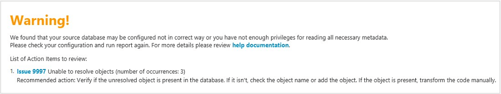

# Assessment report warning message

To assess the complexity of converting to another database engine, AWS SCT requires
access to objects in your source database. When SCT can’t perform an assessment
because problems were encountered during scanning, a warning message is issued that
indicates overall conversion percentage is reduced.

Following are reasons why AWS SCT might encounter problems during scanning:

- The user account connected to the database doesn’t have access to all
  of the needed objects.
- An object cited in the schema no longer exists in the database.
- SCT is trying to assess an object that is encrypted.
  For more information about SCT required security permissions and privileges for your
  database, see [Connecting to source databases with the AWS Schema Conversion Tool](CHAP_Source.md "CHAP_Source.md") for the appropriate source database
  section in this guide.
