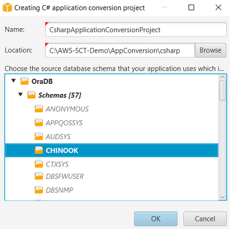
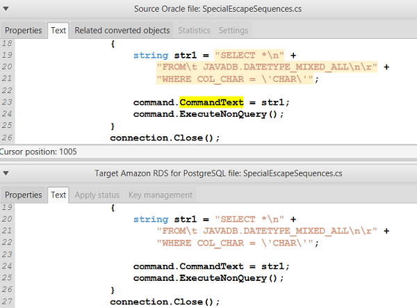
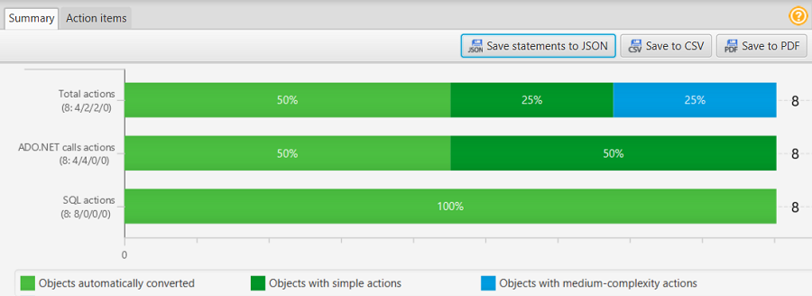

# Converting SQL code in C# applications with AWS Schema Conversion Tool

For an Oracle to PostgreSQL conversion, you can use AWS Schema Conversion Tool (AWS SCT) to convert SQL code
embedded into your C# applications. This specific C# application converter understands
the application logic. It collects statements that are located in different application objects,
such as functions, parameters, local variables, and so on.

Because of this deep analysis, the C# application SQL code converter provides better
conversion results than the generic converter.

## Creating C# application conversion projects in AWS SCT

You can create a C# application conversion project only for converting Oracle
database schemas to PostgreSQL database schemas. Make sure that you add a mapping
rule in your project that includes a source Oracle schema and a target PostgreSQL
database. For more information, see [Mapping data types in the AWS Schema Conversion Tool](CHAP_Mapping.md "CHAP_Mapping.md").

You can add multiple application conversion projects in a single AWS SCT project.
Use the following procedure to create a C# application conversion project.

###### To create a C# application conversion project

1. Create a database conversion project, and add a source Oracle database.
   For more information, see [Starting and managing Projects in AWS SCT](CHAP_UserInterface.md "CHAP_UserInterface.md") and [Adding servers to project in AWS SCT](CHAP_UserInterface.md "CHAP_UserInterface.md").
2. Add a mapping rule that includes your source Oracle database and a target PostgreSQL database.
   You can add a target PostgreSQL database or use a virtual PostgreSQL target database platform
   in a mapping rule. For more information, see [Mapping data types in the AWS Schema Conversion Tool](CHAP_Mapping.md "CHAP_Mapping.md") and [Mapping to virtual targets in the AWS Schema Conversion Tool](CHAP_Mapping.md "CHAP_Mapping.md").
3. On the **View** menu, choose **Main view**.
4. On the **Applications** menu, choose **New C#
   application**.

The **Creating a C# application conversion project** dialog box appears.

 5. For **Name**, enter a name for your C# application conversion project.
Because each database schema conversion project can have one or more child application conversion
projects, choose a name that makes sense if you add multiple projects. 6. For **Location**, enter the location of the source code for your application. 7. In the source tree, choose the schema that your application uses. Make sure that this schema
is part of a mapping rule. AWS SCT highlights the schemas that are part of a mapping rule
in bold. 8. Choose **OK** to create your C# application conversion project. 9. Find your C# application conversion project in the **Applications** node
in the left panel.

## Converting your C# application SQL code in AWS SCT

After you add your C# application to the AWS SCT project, convert SQL code from
this application to a format compatible with your target database platform.
Use the following procedure to analyze and convert the SQL code
embedded in your C# application in the AWS Schema Conversion Tool.

###### To convert your SQL code

1. Expand the **C#** node under **Applications**
   in the left panel.
2. Choose the application to convert, and open the context (right-click) menu.
3. Choose **Convert**. AWS SCT analyzes your source code
   files, determines the application logic, and loads code metadata into the
   project. This code metadata includes C# classes, objects, methods, global
   variables, interfaces, and so on.

In the target database panel, AWS SCT creates the similar folders structure to your
source application project. Here you can review the converted application code.

 4. Save your converted application code. For more information, see
[Saving your converted application code](#CHAP_Converting.App.Csharp.Save "#CHAP_Converting.App.Csharp.Save").

Your C# applications might include SQL code that interacts with different source databases. You can
migrate to PostgreSQL several of these source databases. In this case, make sure that you don't convert
SQL code that interacts with databases which you excluded from the migration scope. You can exclude
source files of your C# application from the conversion scope. To do so, clear the check boxes for the
names of files that you want to exclude from the conversion scope.

After you change the conversion scope, AWS SCT still analyzes SQL code all source files of your
C# applications. Then, AWS SCT copies to the target folder all source files that you excluded from
the conversion scope. This operation makes it possible to build your application after you save
your converted application files.

## Saving your converted application code with AWS SCT

Use the following procedure to save your converted application code.

###### To save your converted application code

1. Expand the **C#** node under **Applications**
   in the target database panel.
2. Choose your converted application, and choose
   **Save**.
3. Enter the path to the folder to save the converted application code, and
   choose **Select folder**.

## Managing C# application conversion projects in AWS SCT

You can add multiple C# application conversion projects, update the application code in the
AWS SCT project, or remove a C# conversion project from your AWS SCT project.

###### To add an additional C# application conversion project

1. Expand the **Applications** node in the left panel.
2. Choose the **C#** node, and open the context (right-click) menu.
3. Choose **New application**.
4. Enter the information that is required to create a new C# application conversion
   project. For more information, see [Creating C# application conversion projects](#CHAP_Converting.App.Csharp.Create "#CHAP_Converting.App.Csharp.Create").

After you make changes in your source application code, upload it into the AWS SCT project.

###### To upload the updated application code

1. Expand the **C#** node under **Applications**
   in the left panel.
2. Choose the application to update, and open the context (right-click) menu.
3. Choose **Refresh** and then choose **Yes**.

AWS SCT uploads your application code from the source files and removes conversion results.
To keep code changes that you made in AWS SCT and the conversion results, create a new C#
conversion project.

###### To remove a C# application conversion project

1. Expand the **C#** node under **Applications**
   in the left panel.
2. Choose the application to remove, and open the context (right-click) menu.
3. Choose **Delete** and then choose **OK**.

## Creating a C# application conversion assessment report in AWS SCT

The _C# application conversion assessment report_ provides information
about converting the SQL code embedded in your C# application to a format compatible with
your target database. The assessment report provides conversion details for all SQL execution
points and all source code files. The assessment report also includes action items for SQL code
that AWS SCT can't convert.

Use the following procedure to create a C# application conversion assessment report.

###### To create a C# application conversion assessment report

1. Expand the **C#** node under **Applications**
   in the left panel.
2. Choose the application to convert, and open the context (right-click) menu.
3. Choose **Convert**.
4. On the **View** menu,
   choose **Assessment report view**.
5. View the **Summary** tab.

The **Summary** tab, shown following, displays the
executive summary information from the C# application assessment report. It
shows conversion results for all SQL execution points and all source code
files.

 6. Choose **Save statements to JSON** to save the extracted
SQL code from your C# application as a JSON file. 7. (Optional) Save a local copy of the report as either a PDF file or a
comma-separated values (CSV) file:

    * Choose **Save to PDF** at upper right to save the
     report as a PDF file.

     The PDF file contains the executive summary, action items, and recommendations
     for application conversion.
    * Choose **Save to CSV** at upper right to save the
     report as a CSV file.

    The CSV file contains action items, recommended actions, and an estimated complexity
     of manual effort required to convert the SQL code.
