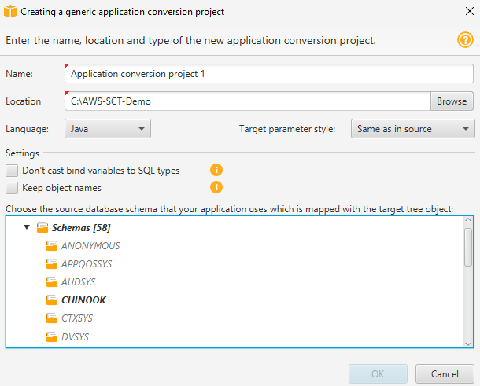
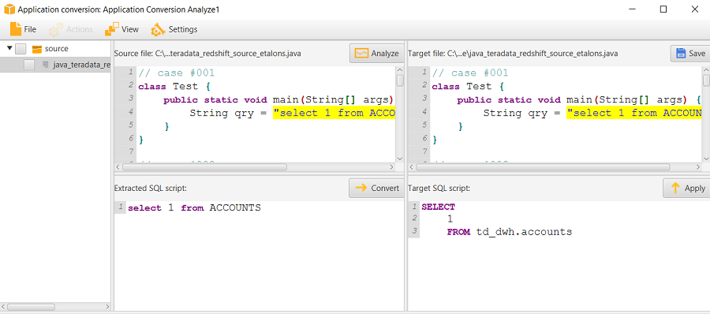
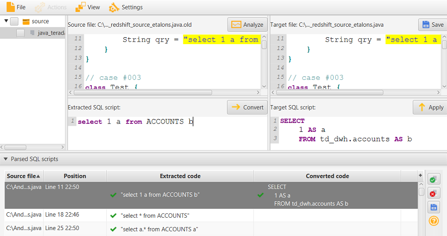
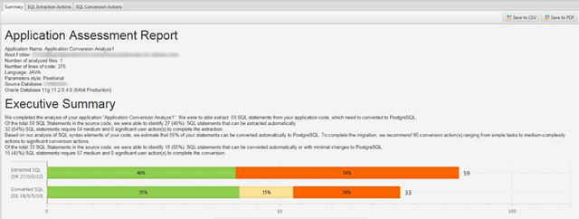

# Converting SQL code in your applications with

AWS SCT

You can use AWS SCT to convert SQL code embedded into your applications. The generic
AWS SCT application converter treats your application code as plain text. It scans your
application code and extracts SQL code with regular expressions. This converter supports
different types of source code files and works with application code that is written in
any programming language.

The generic application converter has the following limitations. It doesn't dive deep
into the application logic that is specific for the programming language of your application.
Also, the generic converter doesn't support SQL statements from different application objects,
such as functions, parameters, local variables, and so on.

To improve your application SQL code conversion, use language-specific application
SQL code converters. For more information, see [SQL code in C# applications](CHAP_Converting.App.md "CHAP_Converting.App.md"), [SQL code in Java](CHAP_Converting.App.md "CHAP_Converting.App.md"), and [SQL code in Pro\*C](CHAP_Converting.App.md "CHAP_Converting.App.md").

## Creating generic application conversion projects in AWS SCT

In the AWS Schema Conversion Tool,
the application conversion project is a child of the
database schema conversion project.
Each database schema conversion project can have
one or more child application conversion projects.

###### Note

AWS SCT does not support conversion between the following sources and targets:

- Oracle to Oracle
- PostgreSQL to PostgreSQL or Aurora PostgreSQL
- MySQL to MySQL
- SQL Server to SQL Server
- Amazon Redshift to Amazon Redshift
- SQL Server to Babelfish
- SQL Server Integration Services to AWS Glue
- Apache Cassandra to Amazon DynamoDB

Use the following procedure to create a generic application conversion project.

###### To create an application conversion project

1. In the AWS Schema Conversion Tool, choose **New generic application** on
   the **Applications** menu.

The **New application conversion project** dialog box appears.

 2. Add the following project information.

| For this parameter                    | Do this                                                                                                                                                                                                                                                                                                                                                                                                                       |
| ------------------------------------- | ----------------------------------------------------------------------------------------------------------------------------------------------------------------------------------------------------------------------------------------------------------------------------------------------------------------------------------------------------------------------------------------------------------------------------- |
| **Name**                              | Enter a name for your application conversion project.<br>Each database schema conversion project can have<br>one or more child application conversion projects,<br>so choose a name that makes sense if you add more projects later.                                                                                                                                                                                          |
| **Location**                          | Enter the location of the source code for your application.                                                                                                                                                                                                                                                                                                                                                                   |
| **Language**                          | Choose one of the following:<br>• **Java**<br>• **C++**<br>• **C#**<br>• **Any**                                                                                                                                                                                                                                                                                                                                              |
| **Target parameter style**            | Choose the syntax to use for bind variables in the converted code.<br>Different database platforms use different syntax for bind variables.<br>Choose one of the following options:<br>• **Same as in source**<br>• **Positional (?)**<br>• **Indexed (:1)**<br>• **Indexed ($1)**<br>• **Named (@name)**<br>• **Named (:name)**<br>• **Named (&name)**<br>• **Named ($name)**<br>• **Named (#name)**<br>• **Named (!name!)** |
| **Choose the source database schema** | In the source tree, choose the schema that your application uses.<br>Make sure that this schema is part of a mapping rule.                                                                                                                                                                                                                                                                                                    |

3. Select **Don't cast bind variables to SQL types** to avoid conversion
   of bind variables types to SQL types. This option is available only for an Oracle to PostgreSQL
   conversion.

For example, your source application code includes the following Oracle query:

```
SELECT * FROM ACCOUNT WHERE id = ?
```

When you select **Don't cast bind variables to SQL types**,
AWS SCT converts this query as shown following.

```
SELECT * FROM account WHERE id = ?
```

When you clear **Don't cast bind variables to SQL types**,
AWS SCT changes the bind variable type to the `NUMERIC` data type.
The conversion result is shown following.

```
SELECT * FROM account WHERE id = (?)::NUMERIC
```

4. Select **Keep object names** to avoid adding the schema name
   to the name of the converted object. This option is available only for an Oracle
   to PostgreSQL conversion.

For example, suppose that your source application code includes the following
Oracle query.

```
SELECT * FROM ACCOUNT
```

When you select **Keep object names**,
AWS SCT converts this query as shown following.

```
SELECT * FROM account
```

When you clear **Keep object names**,
AWS SCT adds the schema name to the name of the table.
The conversion result is shown following.

```
SELECT * FROM schema_name.account
```

If your source code includes the names of the parent objects in the names
of the objects, AWS SCT uses this format in the converted code. In this case,
ignore the **Keep object names** option because AWS SCT
adds the names of the parent objects in the converted code. 5. Choose **OK** to create your application conversion project.

The project window opens.



## Managing application conversion projects in AWS SCT

You can open an existing application conversion project and add
multiple application conversion projects.

After you create an application conversion project, the project window opens automatically.
You can close the application conversion project window and get back to it later.

###### To open an existing application conversion project

1. In the left panel, choose the application conversion project node, and open the context
   (right-click) menu.
2. Choose **Manage application**.

###### To add an additional application conversion project

1. In the left panel, choose the application conversion project node, and open the context
   (right-click) menu.
2. Choose **New application**.
3. Enter the information that is required to create a new application conversion project.
   For more information, see [Creating generic application conversion projects](#CHAP_Converting.App.Project "#CHAP_Converting.App.Project").

## Analyzing and converting your SQL code in AWS SCT

Use the following procedure to analyze and convert your SQL code
in the AWS Schema Conversion Tool.

###### To analyze and convert your SQL code

1. Open an existing application conversion project, and choose
   **Analyze**.

AWS SCT analyzes your application code and extracts the SQL code.
AWS SCT displays the extracted SQL code in the **Parsed SQL scripts** list. 2. For **Parsed SQL scripts**, choose an item to review its
extracted SQL code. AWS SCT displays the code of the selected item in the
**Extracted SQL script** pane. 3. Choose **Convert** to convert the SQL code the
**Extracted SQL script** pane. AWS SCT converts the
code to a format compatible with your target database.

You can edit the converted SQL code. For more information, see [Editing and saving your converted SQL code](#CHAP_Converting.App.Edit "#CHAP_Converting.App.Edit").

 4. When you create an application conversion assessment report, AWS SCT converts all extracted SQL code items.
For more information, see [Creating and using the assessment report](#CHAP_Converting.App.AssessmentReport "#CHAP_Converting.App.AssessmentReport").

## Creating and using the AWS SCT assessment report in AWS SCT

The _application conversion assessment report_ provides information about converting
the application SQL code to a format compatible with your target database. The report details all extracted
SQL code, all converted SQL code, and action items for SQL code that AWS SCT can't convert.

### Creating an application conversion assessment report

Use the following procedure to create an application conversion assessment report.

###### To create an application conversion assessment report

1. In the application conversion project window, choose **Create
   report** on the **Actions** menu.

AWS SCT creates the application conversion assessment report and opens it in the
application conversion project window. 2. Review the **Summary** tab.

The **Summary** tab, shown following, displays the
summary information from the application assessment report. It shows the
SQL code items that were converted automatically, and items that were
not converted automatically.

 3. Choose **SQL extraction actions**.

Review the list of SQL code items that AWS SCT can't extract from your source code. 4. Choose **SQL conversion actions**.

Review the list of SQL code items that AWS SCT can't convert
automatically. Use recommended actions to manually convert the SQL code.
For information about how to edit your converted SQL code, see [Editing and saving your converted SQL code with AWS SCT](#CHAP_Converting.App.Edit "#CHAP_Converting.App.Edit"). 5. (Optional) Save a local copy of the report as either a PDF file or a
comma-separated values (CSV) file:

    * Choose **Save to PDF** at upper right to save the
     report as a PDF file.


     The PDF file contains the executive summary, action items, and recommendations
     for application conversion.
    * Choose **Save to CSV** at upper right to save the
     report as a CSV file.


    The CSV file contains action items, recommended actions, and an estimated complexity
     of manual effort required to convert the SQL code.

## Editing and saving your converted SQL code with AWS SCT

The assessment report includes a list of SQL code items that AWS SCT can't convert.
For each item, AWS SCT creates an action item on the **SQL conversion actions** tab.
For these items, you can edit the SQL code manually to perform the conversion.

Use the following procedure to edit your converted SQL code, apply the changes, and then save them.

###### To edit, apply changes to, and save your converted SQL code

1. Edit your converted SQL code directly in the **Target SQL script** pane.
   If there is no converted code shown, you can click in the pane and start typing.
2. After you are finished editing your converted SQL code, choose **Apply**.
   At this point, the changes are saved in memory, but not yet written to your file.
3. Choose **Save** to save your changes to your file.

When you choose **Save**, you overwrite your original file. Make a copy
of your original file before saving so you have a record of your original application code.
