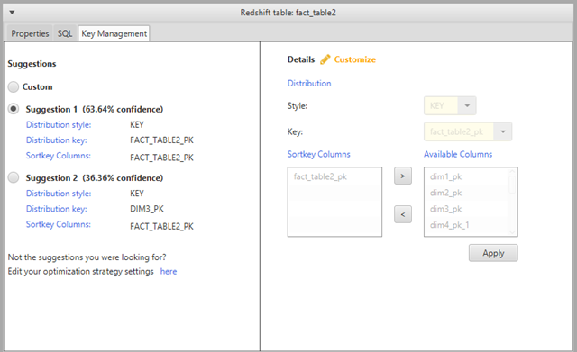

# Converting data from Amazon Redshift using AWS Schema Conversion Tool

You can use the AWS Schema Conversion Tool to optimize your Amazon Redshift database.
Using your Amazon Redshift database as a source,
and a test Amazon Redshift database as the target,
AWS SCT recommends sort keys and distribution keys
to optimize your database.

## Optimizing your Amazon Redshift database

Use the following procedure to optimize your Amazon Redshift database.

###### To optimize your Amazon Redshift database

1. Take a manual snapshot of your Amazon Redshift cluster as a backup.
   You can delete the snapshot after you are done optimizing your Amazon Redshift cluster
   and testing any changes that you make.
   For more information, see
   [Amazon Redshift snapshots](../../../redshift/latest/mgmt/working-with-snapshots.md "../../../redshift/latest/mgmt/working-with-snapshots.md").
2. Choose a schema object to convert from the left panel of your project.
   Open the context (right-click) menu for the object,
   and then choose **Collect Statistics**.

AWS SCT uses the statistics
to make suggestions for sort keys and distribution keys. 3. Choose a schema object to optimize from the left panel of your project.
Open the context (right-click) menu for the object,
and then choose **Run Optimization**.

AWS SCT makes suggestions for sort keys and distribution keys. 4. To review the suggestions,
expand the tables node under your schema in the left panel of your project,
and then choose a table.
Choose the **Key Management** tab as shown following.

The left pane contains key suggestions,
and includes the confidence rating for each suggestion.
You can choose one of the suggestions,
or you can customize the key by editing it in the right pane. 5. You can create a report that contains the optimization suggestions.
To create the report, do the following:

    1. Choose a schema object that you optimized from the left panel of your project.
     Open the context (right-click) menu for the object,
     and then choose **Create Report**.

    The report opens in the main window,
     and the **Summary** tab appears.
     The number of objects with optimization suggestions appears in the report.
    2. Choose the **Action Items** tab
     to see the key suggestions in a report format.
    3. You can save a local copy of the optimization report as either a
     PDF file or a comma-separated values (CSV) file. The CSV file contains only action
     item information. The PDF file contains both the summary and action item
     information.

6. To apply suggested optimizations to your database,
   choose an object in the right panel of your project.
   Open the context (right-click) menu for the object,
   and then choose **Apply to database**.
