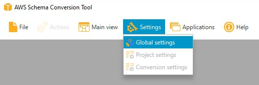
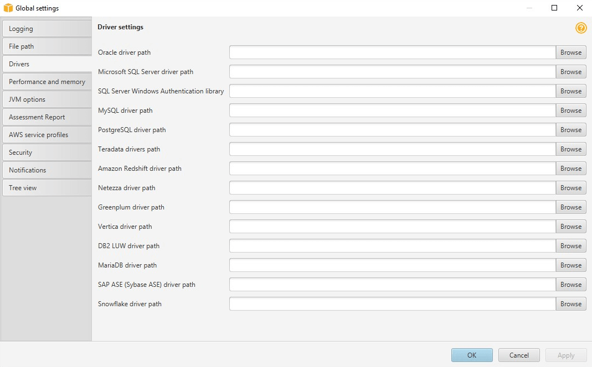

# Installing JDBC drivers for AWS Schema Conversion Tool

For AWS SCT to work correctly, download the JDBC drivers
for your source and target database engines. If you use a
virtual target database platform, you don't need to download
the JDBC driver for your target database engine. For more
information, see [Mapping to virtual targets in the AWS Schema Conversion Tool](CHAP_Mapping.md "CHAP_Mapping.md").

After you download the drivers,
you give the location of the driver files.
For more information, see
[Storing driver paths in the global settings](#CHAP_Installing.JDBCDrivers.Settings "#CHAP_Installing.JDBCDrivers.Settings").

You can download the database drivers from the following locations.

###### Important

Download the latest version of the driver available. The following table
includes the lowest version of database driver supported by AWS SCT.

| Database engine                             | Drivers                                                                                                                                                                                                                        | Download location                                                                                                                                                                                                                                                                                                                                                                                                                                                                                                               |
| ------------------------------------------- | ------------------------------------------------------------------------------------------------------------------------------------------------------------------------------------------------------------------------------ | ------------------------------------------------------------------------------------------------------------------------------------------------------------------------------------------------------------------------------------------------------------------------------------------------------------------------------------------------------------------------------------------------------------------------------------------------------------------------------------------------------------------------------- | ------------------------------------------------------------------------------------------------------------------------------------------------------------------------------------------------------------------------------------------------------------------------------------------------------------------------------------------------------------------------------------------------------------------------------------------------------------------------------------------------------------------------------------------------------------------------------------------------------------------------------------------------------------------------------------------------------------------------------------------------------------------------------------------------------------------------- | -------------------------------------------------------------------------------------------------------------------------------- |
| Amazon Aurora MySQL-Compatible Edition      | `mysql-connector-java-5.1.6.jar`                                                                                                                                                                                               | [https://www.mysql.com/products/connector/](https://www.mysql.com/products/connector/ "https://www.mysql.com/products/connector/")                                                                                                                                                                                                                                                                                                                                                                                              |
| Amazon Aurora PostgreSQL-Compatible Edition | `postgresql-42.2.19.jar`                                                                                                                                                                                                       | [https://jdbc.postgresql.org/download/postgresql-42.2.19.jar](https://jdbc.postgresql.org/download/postgresql-42.2.19.jar "https://jdbc.postgresql.org/download/postgresql-42.2.19.jar")                                                                                                                                                                                                                                                                                                                                        |
| Amazon EMR                                  | `HiveJDBC42.jar`                                                                                                                                                                                                               | [http://awssupportdatasvcs.com/bootstrap-actions/Simba/latest/](http://awssupportdatasvcs.com/bootstrap-actions/Simba/latest/ "http://awssupportdatasvcs.com/bootstrap-actions/Simba/latest/")                                                                                                                                                                                                                                                                                                                                  |
| Amazon Redshift                             | `redshift-jdbc42-2.1.0.9.jar`                                                                                                                                                                                                  | [https://s3.amazonaws.com/redshift-downloads/drivers/jdbc/2.1.0.9/redshift-jdbc42-2.1.0.9.zip](https://s3.amazonaws.com/redshift-downloads/drivers/jdbc/2.1.0.9/redshift-jdbc42-2.1.0.9.zip "https://s3.amazonaws.com/redshift-downloads/drivers/jdbc/2.1.0.9/redshift-jdbc42-2.1.0.9.zip")                                                                                                                                                                                                                                     |
| Amazon Redshift Serverless                  | `redshift-jdbc42-2.1.0.9.jar`                                                                                                                                                                                                  | [https://s3.amazonaws.com/redshift-downloads/drivers/jdbc/2.1.0.9/redshift-jdbc42-2.1.0.9.zip](https://s3.amazonaws.com/redshift-downloads/drivers/jdbc/2.1.0.9/redshift-jdbc42-2.1.0.9.zip "https://s3.amazonaws.com/redshift-downloads/drivers/jdbc/2.1.0.9/redshift-jdbc42-2.1.0.9.zip")                                                                                                                                                                                                                                     |
| Apache Hive                                 | `hive-jdbc-2.3.4-standalone.jar`                                                                                                                                                                                               | [https://repo1.maven.org/maven2/org/apache/hive/hive-jdbc/2.3.4/hive-jdbc-2.3.4-standalone.jar](https://repo1.maven.org/maven2/org/apache/hive/hive-jdbc/2.3.4/hive-jdbc-2.3.4-standalone.jar "https://repo1.maven.org/maven2/org/apache/hive/hive-jdbc/2.3.4/hive-jdbc-2.3.4-standalone.jar")                                                                                                                                                                                                                                  |
| Azure SQL Database                          | `mssql-jdbc-7.2.2.jre11.jar`                                                                                                                                                                                                   | [https://docs.microsoft.com/en-us/sql/connect/jdbc/release-notes-for-the-jdbc-driver?view=sql-server-ver15#72](https://docs.microsoft.com/en-us/sql/connect/jdbc/release-notes-for-the-jdbc-driver?view=sql-server-ver15#72 "https://docs.microsoft.com/en-us/sql/connect/jdbc/release-notes-for-the-jdbc-driver?view=sql-server-ver15#72")                                                                                                                                                                                     |
| Azure Synapse Analytics                     | `mssql-jdbc-7.2.2.jre11.jar`                                                                                                                                                                                                   | [https://docs.microsoft.com/en-us/sql/connect/jdbc/release-notes-for-the-jdbc-driver?view=sql-server-ver15#72](https://docs.microsoft.com/en-us/sql/connect/jdbc/release-notes-for-the-jdbc-driver?view=sql-server-ver15#72 "https://docs.microsoft.com/en-us/sql/connect/jdbc/release-notes-for-the-jdbc-driver?view=sql-server-ver15#72")                                                                                                                                                                                     |
| Greenplum Database                          | `postgresql-42.2.19.jar`                                                                                                                                                                                                       | [https://jdbc.postgresql.org/download/postgresql-42.2.19.jar](https://jdbc.postgresql.org/download/postgresql-42.2.19.jar "https://jdbc.postgresql.org/download/postgresql-42.2.19.jar")                                                                                                                                                                                                                                                                                                                                        |
| IBM Db2 for z/OS                            | `db2jcc-db2jcc4.jar`                                                                                                                                                                                                           | [https://www.ibm.com/support/pages/db2-jdbc-driver-versions-and-downloads-db2-zos](https://www.ibm.com/support/pages/db2-jdbc-driver-versions-and-downloads-db2-zos "https://www.ibm.com/support/pages/db2-jdbc-driver-versions-and-downloads-db2-zos")                                                                                                                                                                                                                                                                         |
| IBM Db2 LUW                                 | `db2jcc-db2jcc4.jar`                                                                                                                                                                                                           | [https://www.ibm.com/support/pages/node/382667](https://www.ibm.com/support/pages/node/382667 "https://www.ibm.com/support/pages/node/382667")                                                                                                                                                                                                                                                                                                                                                                                  |
| MariaDB                                     | `mariadb-java-client-2.4.1.jar`                                                                                                                                                                                                | [https://downloads.mariadb.com/Connectors/java/connector-java-2.4.1/mariadb-java-client-2.4.1.jar](https://downloads.mariadb.com/Connectors/java/connector-java-2.4.1/mariadb-java-client-2.4.1.jar "https://downloads.mariadb.com/Connectors/java/connector-java-2.4.1/mariadb-java-client-2.4.1.jar")                                                                                                                                                                                                                         |
| Microsoft SQL Server                        | `mssql-jdbc-10.2.jar`                                                                                                                                                                                                          | [https://docs.microsoft.com/en-us/sql/connect/jdbc/download-microsoft-jdbc-driver-for-sql-server?view=sql-server-ver15](https://docs.microsoft.com/en-us/sql/connect/jdbc/download-microsoft-jdbc-driver-for-sql-server?view=sql-server-ver15 "https://docs.microsoft.com/en-us/sql/connect/jdbc/download-microsoft-jdbc-driver-for-sql-server?view=sql-server-ver15") NoteAWS SCT does not support the latest JDBC driver version 18.2.1.0 for MSSQL. we recommend installing JDBC driver version 10.2 `mssql-jdbc-10.2.jar).` |
| MySQL                                       | `mysql-connector-java-8.0.15.jar`                                                                                                                                                                                              | [https://dev.mysql.com/downloads/connector/j/](https://dev.mysql.com/downloads/connector/j/ "https://dev.mysql.com/downloads/connector/j/")                                                                                                                                                                                                                                                                                                                                                                                     |
| Netezza                                     | `nzjdbc.jar` Use the client tools software. Download driver version 7.2.1, which is backwards compatible with data warehouse version 7.2.0.                                                                                    | [http://www.ibm.com/support/knowledgecenter/SSULQD_7.2.1/com.ibm.nz.datacon.doc/c_datacon_plg_overview.html](http://www.ibm.com/support/knowledgecenter/SSULQD_7.2.1/com.ibm.nz.datacon.doc/c_datacon_plg_overview.html "http://www.ibm.com/support/knowledgecenter/SSULQD_7.2.1/com.ibm.nz.datacon.doc/c_datacon_plg_overview.html")                                                                                                                                                                                           |
| Oracle                                      | `ojdbc8.jar` Driver versions 8 and higher are supported.                                                                                                                                                                       | [https://www.oracle.com/database/technologies/jdbc-ucp-122-downloads.html](https://www.oracle.com/database/technologies/jdbc-ucp-122-downloads.html "https://www.oracle.com/database/technologies/jdbc-ucp-122-downloads.html")                                                                                                                                                                                                                                                                                                 |
| PostgreSQL                                  | `postgresql-42.2.19.jar`                                                                                                                                                                                                       | [https://jdbc.postgresql.org/download/postgresql-42.2.19.jar](https://jdbc.postgresql.org/download/postgresql-42.2.19.jar "https://jdbc.postgresql.org/download/postgresql-42.2.19.jar")                                                                                                                                                                                                                                                                                                                                        |
| SAP ASE (Sybase ASE)                        | `jconn4.jar`                                                                                                                                                                                                                   | [The jConnect JDBC driver](https://infocenter.sybase.com/help/index.jsp?topic=/com.sybase.help.sqlanywhere.12.0.1/dbprogramming/jconnect-using-jdbxextra.html "https://infocenter.sybase.com/help/index.jsp?topic=/com.sybase.help.sqlanywhere.12.0.1/dbprogramming/jconnect-using-jdbxextra.html")                                                                                                                                                                                                                             |
| Snowflake                                   | `snowflake-jdbc-3.9.2.jar` For more information, see [_Downloading / Integrating the JDBC Driver_](https://docs.snowflake.com/en/user-guide/jdbc-download.html "https://docs.snowflake.com/en/user-guide/jdbc-download.html"). | [https://repo1.maven.org/maven2/net/snowflake/snowflake-jdbc/3.9.2/snowflake-jdbc-3.9.2.jar](https://repo1.maven.org/maven2/net/snowflake/snowflake-jdbc/3.9.2/snowflake-jdbc-3.9.2.jar "https://repo1.maven.org/maven2/net/snowflake/snowflake-jdbc/3.9.2/snowflake-jdbc-3.9.2.jar")                                                                                                                                                                                                                                           |
| Teradata                                    | `terajdbc4.jar` `tdgssconfig.jar` For Teradata JDBC driver version 16.20.00.11 and higher, you don't need the `tdgssconfig.jar` file.                                                                                          | [https://downloads.teradata.com/download/connectivity/jdbc-driver](https://downloads.teradata.com/download/connectivity/jdbc-driver "https://downloads.teradata.com/download/connectivity/jdbc-driver")                                                                                                                                                                                                                                                                                                                         |
| Vertica                                     | `vertica-jdbc-9.1.1-0.jar` Driver versions 7.2.0 and higher are supported.                                                                                                                                                     | [https://www.vertica.com/client_drivers/9.1.x/9.1.1-0/vertica-jdbc-9.1.1-0.jar](https://www.vertica.com/client_drivers/9.1.x/9.1.1-0/vertica-jdbc-9.1.1-0.jar "https://www.vertica.com/client_drivers/9.1.x/9.1.1-0/vertica-jdbc-9.1.1-0.jar")                                                                                                                                                                                                                                                                                  | ## Installing JDBC drivers on Linux You can use the following steps to install the JDBC drivers on your Linux system for use with AWS SCT. ###### To install JDBC drivers on your Linux system 1. Create a directory to store the JDBC drivers in. `PROMPT>sudo mkdir –p /usr/local/jdbc-drivers` 2. Install the JDBC driver for your database engine using the commands shown following.                                                                                                                                                                                                                                                                                                                                                                                                                                 |
| Database engine                             | Installation commands                                                                                                                                                                                                          |                                                                                                                                                                                                                                                                                                                                                                                                                                                                                                                                 | ---                                                                                                                                                                                                                                                                                                                                                                                                                                                                                                                                                                                                                                                                                                                                                                                                                       | ---                                                                                                                              |
| Amazon Aurora (MySQL compatible)            | `PROMPT> cd /usr/local/jdbc-drivers PROMPT> sudo tar xzvf /tmp/mysql-connector-java-X.X.X.tar.gz`                                                                                                                              |                                                                                                                                                                                                                                                                                                                                                                                                                                                                                                                                 | Amazon Aurora (PostgreSQL compatible)                                                                                                                                                                                                                                                                                                                                                                                                                                                                                                                                                                                                                                                                                                                                                                                     | `PROMPT> cd /usr/local/jdbc-drivers PROMPT> sudo cp -a /tmp/postgresql-X.X.X.jre7.tar .`                                         |
|                                             | Microsoft SQL Server                                                                                                                                                                                                           | `PROMPT> cd /usr/local/jdbc-drivers PROMPT> sudo tar xzvf /tmp/sqljdbc_X.X.X_enu.tar.gz`                                                                                                                                                                                                                                                                                                                                                                                                                                        |
| MySQL                                       | `PROMPT> cd /usr/local/jdbc-drivers PROMPT> sudo tar xzvf /tmp/mysql-connector-java-X.X.X.tar.gz`                                                                                                                              |                                                                                                                                                                                                                                                                                                                                                                                                                                                                                                                                 | Oracle                                                                                                                                                                                                                                                                                                                                                                                                                                                                                                                                                                                                                                                                                                                                                                                                                    | `PROMPT> cd /usr/local/jdbc-drivers PROMPT> sudo mkdir oracle-jdbc PROMPT> cd oracle-jdbc PROMPT> sudo cp  -a /tmp/ojdbc8.jar .` |
|                                             | PostgreSQL                                                                                                                                                                                                                     | `PROMPT> cd /usr/local/jdbc-drivers PROMPT> sudo cp -a /tmp/postgresql-X.X.X.jre7.tar .`                                                                                                                                                                                                                                                                                                                                                                                                                                        | ## Storing driver paths in the global settings After you have downloaded and installed the required JDBC drivers, you can set the location of the drivers globally in the AWS SCT settings. If you don't set the location of the drivers globally, the application asks you for the location of the drivers when you connect to a database. ###### To update the driver file locations 1. In AWS SCT, choose **Settings**, and then choose **Global Settings**.  2. For **Global settings**, choose **Drivers**. Add the file path to the JDBC driver for your source database engine and your target Amazon RDS DB instance database engine.  3. When you are finished adding the driver paths, choose **OK**. |
