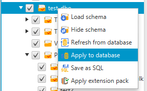

# Applying the converted schemas in AWS Schema Conversion Tool

You can apply the converted database schema to your target DB instance. After the
schema has been applied to your target DB instance, you can update the schema based on
the action items in the database migration assessment report.

###### Warning

The following procedure overwrites the existing target schema. Be careful not to
overwrite schemas unintentionally. Be careful not to overwrite schemas in your
target DB instance that you have already modified, or you overwrite those changes.

###### To apply the converted database schema to your target database instance

1. Choose **Connect to the server** at the top of the right panel
   of your project to connect to your target database. If you're connected to your target
   database, then skip this step.
2. Choose the schema element in the right panel
   of your project that displays the planned schema for your target DB instance.
3. Open the context (right-click) menu for the schema element,
   and then choose **Apply to database**.

The converted schema is applied to the target DB instance.
