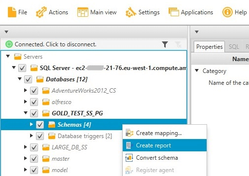
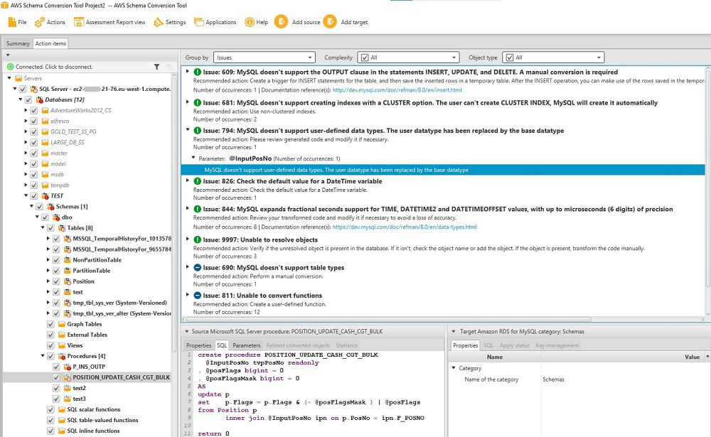
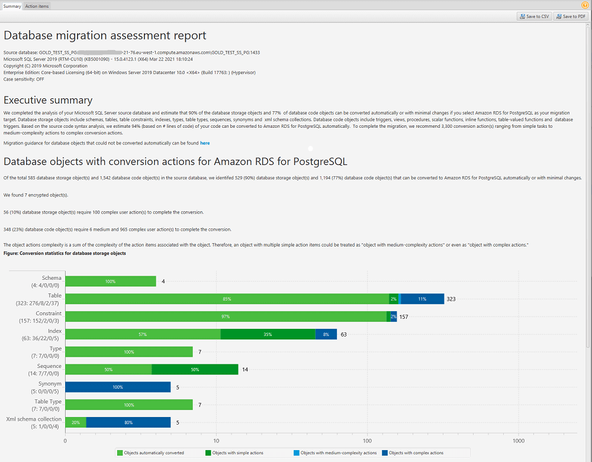

# Viewing the Assessment Report in AWS Schema Conversion Tool

The _database migration assessment report_ summarizes all of the
action items for schemas that can't be converted automatically to the engine of your
target Amazon RDS DB instance. The report also includes estimates of the amount of effort
that it will take to write the equivalent code for your target DB instance.

You can create a database migration assessment report after you add the source databases
and target platforms to your project and specify mapping rules.

###### To create and view the database migration assessment report

1. Make sure that you created a mapping rule for the source database schema
   to create an assessment report for. For more information, see [Mapping new data types in the AWS Schema Conversion Tool](CHAP_Mapping.New.md "CHAP_Mapping.New.md").
2. On the **View** menu, choose **Main view**.
3. In the left panel that displays the schema from your source database, choose
   schema objects to create an assessment report for.

Make sure that you selected the check boxes for all schema objects
to create an assessment report for. 4. Open the context (right-click) menu for the object, and then choose
**Create report**.

The assessment report view opens. 5. Choose the **Action items** tab.

The **Action items** tab displays a list of items that
describe the schema that can't be converted automatically. Choose one of the
action items in the list. AWS SCT highlights the item from your schema that the
action item applies to, as shown following.

 6. Choose the **Summary** tab.

The **Summary** tab displays the summary information from
the database migration assessment report.
It shows the number of items that were converted automatically,
and the number of items that were not converted automatically.
The summary also includes an estimate of the time that it will take
to create schema in your target DB instance that are equivalent to those in your
source database.

The section **License Evaluation and Cloud Support** contains
information about moving your existing on-premises database schema to an Amazon RDS
DB instance running the same engine. For example, if you want to change license
types, this section of the report tells you which features from your current
database to remove.

An example of an assessment report summary is shown following.

 7. Choose the **Summary** tab, and then
choose **Save to PDF**.
The database migration assessment report is saved as a PDF file.
The PDF file contains both the summary
and action item information.

You can also choose **Save to CSV** to save the report as a
CSV file. When you choose this option, AWS SCT creates three CSV files.
These files contain the following information:

    * A list of conversion action items with recommended actions.
    * A summary of conversion action items with an estimate of the effort required to convert an occurrence of the action item.
    * An executive summary with a number of action items categorized by the estimated time to convert.

