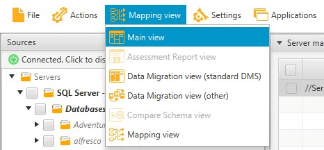
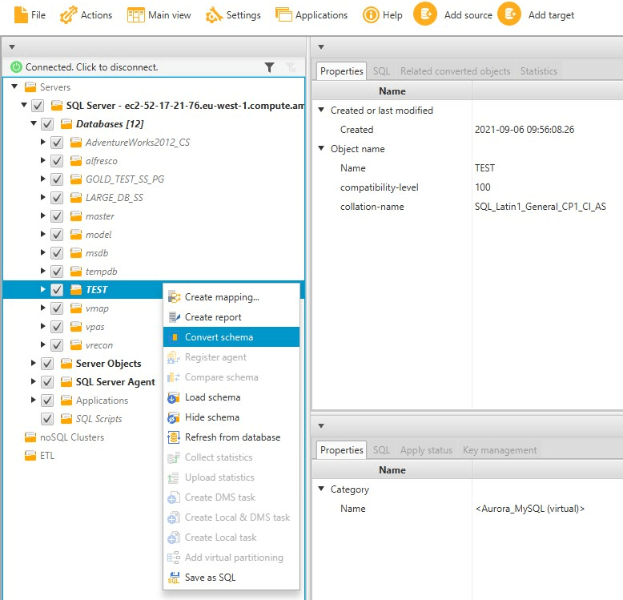
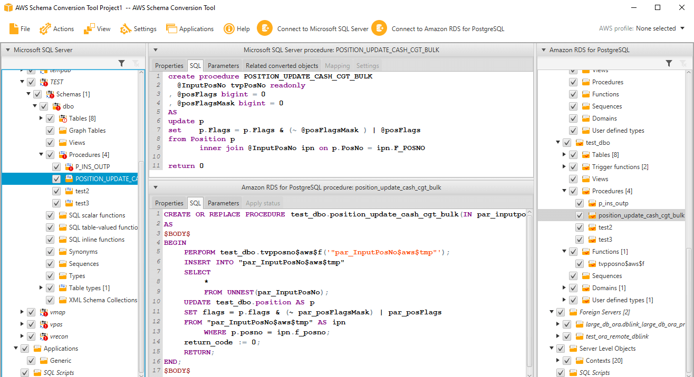

# Converting Schemas in AWS Schema Conversion Tool

After you added source and target databases to your project and created mapping rules, you can convert your source database schemas. Use the following procedure to convert schema.

###### To convert your schema

1. Choose **View**,
   and then choose **Main view**.

 2. In the left panel that displays the schema from your source database, select
the check box for the name of the object to convert. Next, choose this object.
AWS SCT highlights the object name in blue. Open the context (right-click) menu
for the object, and choose **Convert schema**.

To convert several database objects, select the check boxes for all objects.
Next, choose the parent node. For example, for tables, the parent node is
**Tables**. Make sure that AWS SCT highlights the name of
the parent node in blue. Open the context (right-click) menu
for the parent node, and choose **Convert schema**.

 3. When AWS SCT finishes converting the schema,
you can view the proposed schema in the panel on the right of your project.

At this point, no schema is applied to your target database instance. The
planned schema is part of your project. If you choose a converted schema item,
you can see the planned schema command in the panel at lower center for your
target database instance.

You can edit the schema in this window.
The edited schema is stored as part of your project
and is written to the target database instance
when you choose to apply your converted schema.

