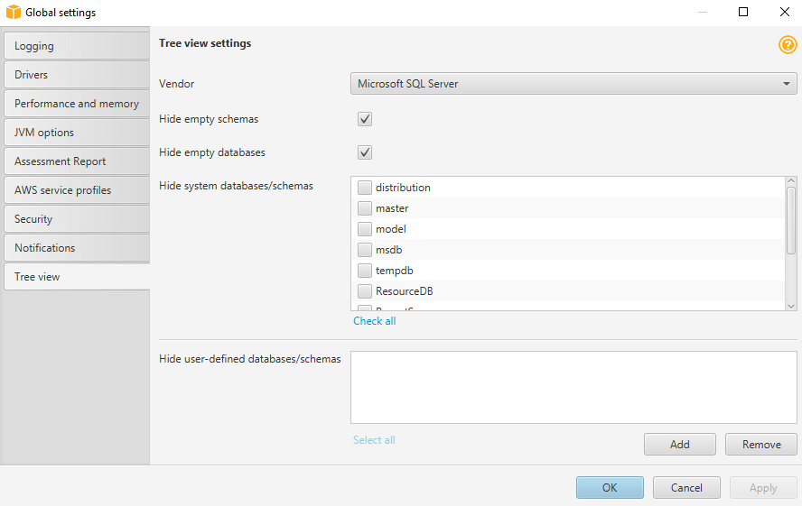

# Hiding schemas in AWS Schema Conversion Tool

Use tree view settings to specify what schemas and databases you want to see in
the AWS SCT tree view. You can hide empty schemas, empty databases, system databases,
and user-defined databases and schemas.

###### To hide databases and schemas in tree view

1. Open an AWS SCT project.
2. Connect to the data store that you want to show in tree view.
3. Choose **Settings**, **Global settings**, **Tree
   view**.

 4. In the **Tree view settings** section, do the
following:

    * For **Vendor**, choose database platform.
    * Choose **Hide empty schemas** to hide empty schemas
     for the selected database platform.
    * Choose **Hide empty databases** to hide empty databases
     for the selected database platform.
    * For **Hide system databases/schemas**, choose system databases
     and schemas by name to hide them.
    * For **Hide user-defined
     databases/schemas**, enter the names of user-defined
     databases and schemas that you want to hide, and then choose
     **Add**. The names are case insensitive.

5. Choose **OK**.
