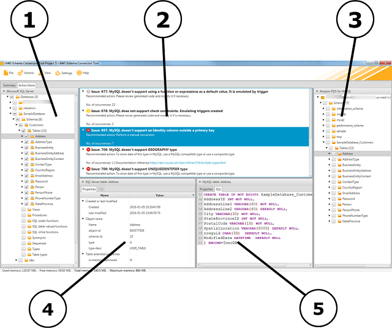

# Viewing the Project Window in AWS SCT

The illustration following is what you see in AWS SCT
when you create a schema migration project,
and then convert a schema.

1. In the left panel, the schema from your source database is presented in a tree view. Your
   database schema is "lazy loaded." In other words, when you select an item from
   the tree view, AWS SCT gets and displays the current schema from your
   source database.
2. In the top middle panel, action items appear for schema elements from the source database
   engine that couldn't be converted automatically to the target database
   engine.
3. In the right panel, the schema from your target DB instance is presented in a tree view. Your
   database schema is "lazy loaded." That is, at the point when you select an item from the tree
   view, AWS SCT gets and displays the current schema from your target
   database.

4. In the lower left panel, when you choose a schema element, properties are
   displayed. These describe the source schema element and the SQL command to
   create that element in the source database.
5. In the lower right panel, when you choose a schema element, properties are
   displayed. These describe the target schema element and the SQL command to
   create that element in the target database. You can edit this SQL command and
   save the updated command with your project.
