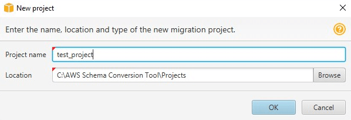

# Starting and managing Projects in AWS SCT

To start the AWS Schema Conversion Tool, double-click the application icon.

Use the following procedure to create an AWS Schema Conversion Tool project.

###### To create your project

1. Start the AWS Schema Conversion Tool.
2. On the **File** menu, choose **New
   project**. The **New project** dialog box appears.

 3. Enter a name for your project, which is stored locally on your computer. 4. Enter the location for your local project file. 5. Choose **OK** to create your AWS SCT project. 6. Choose **Add source** to add a new source database to your AWS SCT project. You can add multiple source databases to your AWS SCT project. 7. Choose **Add target** to add a new target platform in your AWS SCT project. You can add multiple target platforms to your AWS SCT project. 8. Choose the source database schema in the left panel. 9. In the right panel, specify the target database platform for the selected source schema. 10. Choose **Create mapping**. This button becomes active after you
choose the source database schema and the target database platform. For more information,
see [Data type mapping](CHAP_Mapping.md "CHAP_Mapping.md").

Now, your AWS SCT project is set up. You can save your project, create database migration assessment report, and convert your source database schemas.
