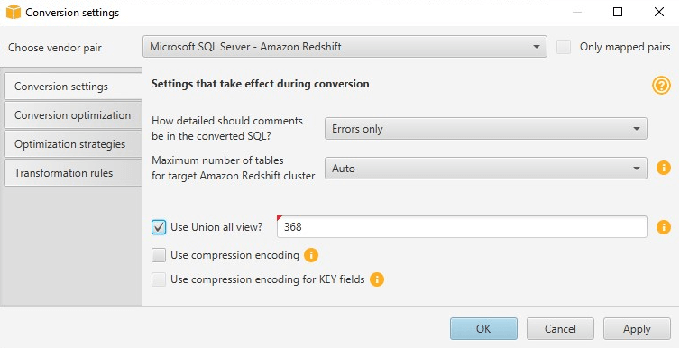

# Creating UNION ALL view in the AWS Schema Conversion Tool

If a source table is partitioned, AWS SCT creates _n_ target tables,
where _n_ is the
number of partitions on the source table. AWS SCT creates a UNION ALL view on top of the
target tables to represent the source table. If you use an AWS SCT data extractor to
migrate your data, the source table partitions will be extracted and loaded in parallel
by separate subtasks.

###### To use Union All view for a project

1. Start AWS SCT. Create a new project or open an existing AWS SCT project.
2. On the **Settings** menu, choose **Conversion settings**.
3. Choose a pair of OLAP databases from the list at the top.
4. Turn on **Use Union all view?**

 5. Choose **OK** to save the settings and close the
**Conversion settings** dialog box.
