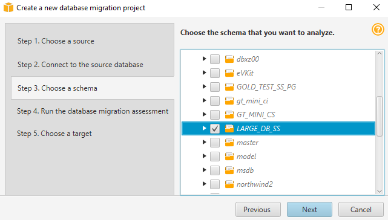
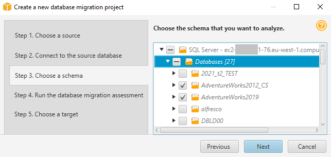

# Using the AWS SCT Wizard

You can create a new database migration project using the new project wizard. This
wizard assists you in determining your migration target and connecting to your databases.
It estimates how complex a migration might be for all supported target destinations.
After you run the wizard, AWS SCT produces a summary report for the migration of your
database to different target destinations. You can use this report to compare possible
target destinations and choose the optimal migration path.

###### To run the new project wizard

1.  Choose your source database.
    1. Start the AWS Schema Conversion Tool.
    2. On the **File** menu, choose **New project wizard**. The
       **Create a new database migration project** dialog
       box opens.
    3. To enter the source database connection information, use the
       following instructions:

    | Parameter              | Action                                                                                                                                                                                                                                                                                                                                                                                                                                                                                                                                                                                                                                                                                              |
    | ---------------------- | --------------------------------------------------------------------------------------------------------------------------------------------------------------------------------------------------------------------------------------------------------------------------------------------------------------------------------------------------------------------------------------------------------------------------------------------------------------------------------------------------------------------------------------------------------------------------------------------------------------------------------------------------------------------------------------------------- |
    | **Project name**       | Enter a name for your project, which is stored locally on your computer.                                                                                                                                                                                                                                                                                                                                                                                                                                                                                                                                                                                                                         |
    | **Location**           | Enter the location for your local project file.                                                                                                                                                                                                                                                                                                                                                                                                                                                                                                                                                                                                                                                  |
    | **Source type**        | Choose one of the following options: **SQL database**, **NoSQL database**, or **ETL**. If you want to see the summary report that includes all the migration destinations, choose **SQL database**.                                                                                                                                                                                                                                                                                                                                                                                                                                                                                     |
    | **Source engine**      | Choose your source database engine.                                                                                                                                                                                                                                                                                                                                                                                                                                                                                                                                                                                                                                                                 |
    | **Migration strategy** | Choose one of the following options: • **I want to switch engines and optimize for the cloud\* • – This option converts your source database to a new database engine. • **I want to keep the same engine but optimize for the cloud* • – This option keeps your database engine as is and moves the database from on-premises to the cloud. • \*\*I want to see a combined report for database engine switch and optimization for the cloud* • – This option compares the migration complexity of all available migration options. If you want to see the aggregated assessment report that includes all migration destinations, choose the last option. |
    4. Choose **Next**. The **Connect to the source database**
       page opens.

2.  Connect to your source database.
    1. Provide your connection information for the source database. The connection
       parameters depend on your source database engine. Make sure the user that you
       use for the analysis of your source database has the applicable permissions. For
       more information, see [Connecting to source databases with the AWS Schema Conversion Tool](CHAP_Source.md "CHAP_Source.md").
    2. Choose **Next**. The **Choose a schema**
       page opens.

3.  Choose your database schema.
    1. Select the check box for the name of schemas that you want to assess and then
       choose the schema itself. The schema name is highlighted in blue when selected
       and the **Next** button is available.

     2. If you want to assess several database schemas, then select the
    check boxes for all the schemas and then choose the parent node. For a
    successful assessment, you must choose the parent node. For example, for a
    source SQL Server database, choose the **Databases** node. The
    name of the parent node is highlighted in blue and the **Next**
    button is available.

     3. Choose **Next**. AWS SCT analyzes your source database schemas and creates a
    database migration assessment report. The number of database objects in
    your source database schemas affects the time it takes to run the
    assessment. When complete, the **Run the database migration
    assessment** page opens.

4.  Run the database migration assessment.
    1. You can review and compare the assessment reports for different migration
       targets or save a local copy of the assessment report files for the further
       analysis.
    2. Save a local copy of the database migration assessment report. Choose
       **Save**, then enter the path to the folder to save
       the files, and choose **Save**. AWS SCT saves the
       assessment report files to the specified folder.
    3. Choose **Next**. The **Choose a target**
       page opens.

5.  Choose your target database.

        1. For **Target engine**, choose the target database engine that you decide to
         use based on the assessment report.
        2. Provide your connection information for your target database. The connection
         parameters that you see depend on your selected target database engine. Make
         sure the user specified for the target database has the required permissions.
         For more information about the required permissions, see the sections that
         describe permissions for target databases in [Connecting to source databases with the AWS Schema Conversion Tool](CHAP_Source.md "CHAP_Source.md") and [Permissions for Amazon Redshift as a target](CHAP_Converting.DW.md#CHAP_Converting.DW.ConfigureTarget "CHAP_Converting.DW.md#CHAP_Converting.DW.ConfigureTarget").
        3. Choose **Finish**. AWS SCT creates your project
         and adds the mapping rules. For more information, see [Data type mapping](CHAP_Mapping.md "CHAP_Mapping.md").

    Now you can use the AWS SCT project to convert your source database objects.
