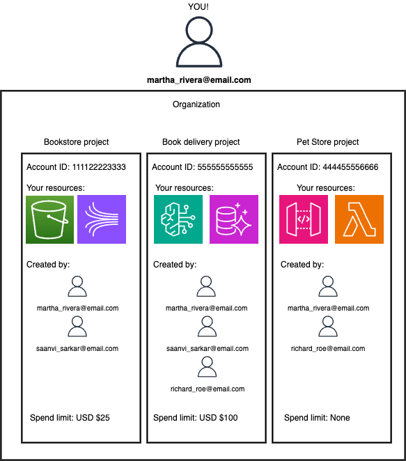

# Sign up for AWS (new)

###### Warning

We're currently releasing our new experience to a limited number of customers. You might not be able to access this experience yet.

When you use Sign up for AWS (new), you create a preconfigured AWS
environment that lets you use a login that you already own like Google or GitHub to access your
AWS resources.
Your resources are organized in projects. A project contains an AWS account and
settings for sharing with other collaborators. If you use the paid plan, your project
can also have a set monthly pre-tax cost, called a spend limit. All of the projects you
own make up your organization. You manage your organization, access your projects, and
add collaborators in AWS Settings.

When you sign up for AWS using Sign up for AWS (new), AWS also creates a
AWS Builder ID account, which is a personal profile that represents you as an individual. You can
only have one AWS Builder ID for each email address. If you've created a AWS Builder ID but have not created an AWS account,
you might have some settings already made for you and you'll have to modify those
later.

For more information about Sign up for AWS (new), see the following documentation:

- [Compare sign-up options](sign-up-for-aws.md "sign-up-for-aws.md")
- [Supported AWS services for Sign up for AWS (new)](supported-services-sign-up-new.md "supported-services-sign-up-new.md")

## Sign up using Sign up for AWS (new)

When you sign up for AWS, we might request payment information. Our verification process
holds USD $1 (or equivalent) for 3-5 days to verify your account and prevent fraud. You will
not incur charges until you upgrade to a paid plan. You can manage your payment method or
close your accounts at any time through AWS Settings. In addition, when you sign up for
AWS, you might be ineligible for the Free Tier. In that case, you'll need to provide your
payment information, and you'll be placed on the Paid Plan. When you're on the Paid Plan, you
can set spend limits to operate within a predictable and controlled budget.

Sign up for AWS (new) supports using Google, GitHub, Apple, or Amazon for your account. If you're
already signed into a Google account in your browser, that account will be used when you
sign up for AWS.

###### To sign up for AWS using Sign up for AWS (new)

1. Go to [aws.amazon.com](https://aws.amazon.com "https://aws.amazon.com") and choose
   **Sign up**.
2. On the banner explaining the differences between Sign up for AWS (new) and Sign up for AWS (advanced), choose **Sign up for AWS**.
3. Choose a login such as Google, Apple, GitHub, or Amazon.
4. You'll be directed to the login for your provider. After you log in, you'll be
   redirected to AWS sign up.
5. Enter your name and choose **Continue**.

This name is shared with collaborators when you give them access to your projects. 6. Verify the email associated with your login by entering a verification code. When
you've verified your email, choose **Continue**.

This email is shared with collaborators when you give them access to your projects. 7. Enter a strong password for your account and choose
**Continue**.

AWS requires that your password meet the following conditions:

    * It must have a minimum of 8 characters and a maximum of 128
     characters.
    * It must include a minimum of three of the following mix of character
     types: uppercase, lowercase, numbers, and ! @ # $ % ^ & \* () <> [] {} |
     \_+-= symbols.
    * It must not be identical to your AWS account name or email
     address.

8. Enter your contact details and choose **Continue**. 9. AWS will provision your first project in one of three AWS Regions with a
new name. For more information, see [AWS Regions for your projects](project-regions.md "project-regions.md"). You can change the
name at any time.

You can now access the AWS Management Console. To access AWS Settings, choose
**Manage projects** from the AWS Management Console. In AWS Settings, you can invite
collaborators, create new projects, and modify your billing and other settings.

## Next steps

After you sign up for AWS, you can connect an AI coding tool, add team
members to collaborate, and if you have a paid plan, create a spend limit.

- [Connect an AI coding tool](connect-ai-coding-tool.md "connect-ai-coding-tool.md")
- [Invite team members to collaborate in AWS Settings](invite-team-members.md "invite-team-members.md")
- [Create a spend limit in AWS Settings](create-spend-limit.md "create-spend-limit.md")
