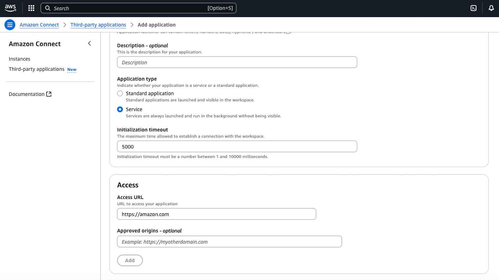

# Creating a third-party service

## Third-party service setup

Following the instructions here to properly integrate your service with the
agent workspace. First, install the app package:

```

% npm install --save @amazon-connect/app
```

Then, add the following initialization code to your app:

```

import { AmazonConnectService } from "@amazon-connect/app";

const { provider } = AmazonConnectService.init({
  onCreate: (event) => {
    const { instanceId } = event.context;
    console.log('Service creation complete: ', instanceId);
  }
});
```

When building a third-party service:

1. Use AmazonConnectService from @amazon-connect/app to initialize your
   service
2. Complete all initialization within the timeout period (30 seconds)
   1. This is a separate timeout from the initializationTimeout
      configured for the service
   2. initializationTimeout is the time the agent workspace will wait for a
      service to successfully connect, before onCreate is triggered

3. Handle initialization failures to prevent agent workspace loading issues

Here is an example of proper initialization with timeout handling:

```

import { AmazonConnectService } from "@amazon-connect/app";

export function initService() {
  AmazonConnectService.init({
    onCreate: async (event) => {
      // This is where you set up your service's functionality
      // Add all of your service setup code here - examples include:
      // - Set up event listeners
      // - Establish connections
      // - Load configurations
      // - etc.
      let timeoutId: NodeJS.Timeout;

      const INIT_TIMEOUT = 25000; // 25 seconds
      const { context } = event;
      const { instanceId } = event.context;
      const provider = context.getProvider();

      const cleanup = () => {
        if (timeoutId) {
          clearTimeout(timeoutId);
        }
        // Add any other cleanup logic here
        // For example: close connections, remove event listeners, etc.
      };

      try {
        // Create a promise that will reject after the timeout
        const timeoutPromise = new Promise((_, reject) => {
          timeoutId = setTimeout(() => {
            reject(new Error('Service creation timed out'));
          }, INIT_TIMEOUT);
        });

        // Race between your code and the timeout
        await Promise.race([
          executeServiceCode(),
          timeoutPromise
        ]);

        console.log('Service creation complete: ', instanceId);

      } catch (error) {
        console.error('Service creation failed:', error);
        // Send fatal error to terminate the service
        provider.sendFatalError('Service creation failed');
      } finally {
        cleanup();
      }
    }
  });
}

async function executeServiceCode() {
  // Your service implementation goes here
  console.log('Executing service code');
}

initService();
```

## AWS console setup

Create a new third-party service by creating a third-party application with the
following settings either via APIs or in the AWS Console:

- `isService` set to true
  - An app that is configured as a service will be started when the
    agent workspace is loaded and will run hidden for the lifetime of
    the agent workspace. An application that runs as a service in the
    agent workspace must be integrated with the app Amazon Connect SDK package. If the
    service fails to start before the InitializationTimeout, then an
    error will be sent to agent workspace causing the agent workspace to fail

- Set a `InitializationTimeout` in milliseconds up to 10000 (10
  seconds)
  - The InitializationTimeout parameter controls the maximum time
    allowed for the initial handshake/connection between the service and
    the agent workspace. This is required to be set for applications
    configured with isService to true.


