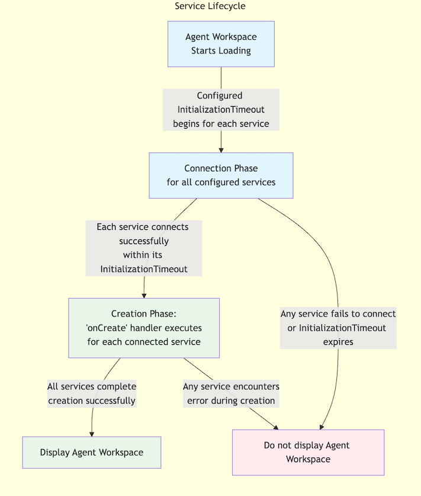

# Agent Workspace Startup

Process

Third-party services follow this process in the Amazon Connect agent
workspace:

1. **Workspace Startup**: When an agent logs in and the
   workspace starts loading, all configured services will begin their startup
   process.
   1. The configured InitializationTimeout will be in effect until the third
      party service has officially connected to the workspace.

2. **Workspace Loading**: The workspace will not fully load and
   become accessible to the agent until all services have successfully
   connected.
3. **Service Startup**: Once connected, the logic within the
   onCreate handler will begin to run.
4. **Service Runtime**: Once created, services continue running
   for the remainder of the workspace session.

###### Important

Services directly impact the workspace startup process. If any service fails to
start within its configured timeout, an error will be displayed which will prevent
agents from accessing the workspace.
