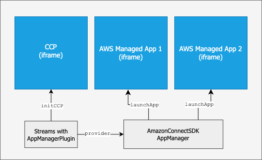

# Integrating AWS-managed applications

with Amazon Connect Streams

This guide demonstrates how to integrate AWS-managed applications with your existing
applications built using Amazon Connect Streams. This integration extends your custom
agent application with AWS-managed applications from the Amazon Connect agent workspace.
By embedding AWS-managed applications into your custom agent application, you can
leverage their features without additional development effort, while maintaining control
over application access through Security Profiles.

## Amazon Connect

Streams

Amazon Connect Streams is a JavaScript library that integrates the Contact Control Panel (CCP) and other agent functionality into existing web applications. This library enables you to embed the CCP user interface as well as handle agent and contact state events so that you can build a custom agent application. See the [Amazon
Connect Streams documentation](https://github.com/amazon-connect/amazon-connect-streams/blob/master/Documentation.md "https://github.com/amazon-connect/amazon-connect-streams/blob/master/Documentation.md").

## AWS-managed applications

Amazon Connect provides AWS-managed applications, such as [Worklist](../../../connect/latest/adminguide/worklist-app.md "../../../connect/latest/adminguide/worklist-app.md") that are accessible in the [Amazon
Connect agent workspace](../../../connect/latest/adminguide/agent-workspace.md "../../../connect/latest/adminguide/agent-workspace.md").

## Amazon Connect SDK

The Amazon Connect SDK is a collection of packages that helps you build applications applications that interact with and extend Amazon Connect’s native functionality. See the [Amazon Connect SDK repository on GitHub.](https://github.com/amazon-connect/AmazonConnectSDK "https://github.com/amazon-connect/AmazonConnectSDK") .

## AppManager

AppManager provides APIs to discover, launch, and manage AWS-managed applications.
It's available within the Amazon Connect SDK `@amazon-connect/app-manager`
package.

## Integration architecture

The following diagram illustrates the components and integration flow for AWS-managed applications using Streams and AppManager.

Application launch follows this sequence:

1. Your web application initializes the CCP with the
   AppManager plugin.
2. The `launchApp` method in AppManager is invoked with the
   application name or Amazon Resource Name (ARN).
3. AppManager creates an `AppHost` object to manage the
   application instance.
4. An iframe element is provided to the `AppHost`.
5. AppManager configures the iframe with appropriate URL and security
   attributes.
6. The application loads and establishes secure communication.
