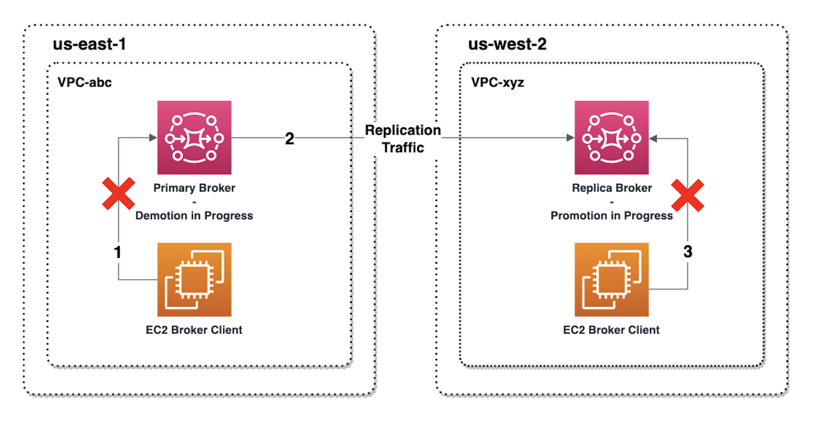
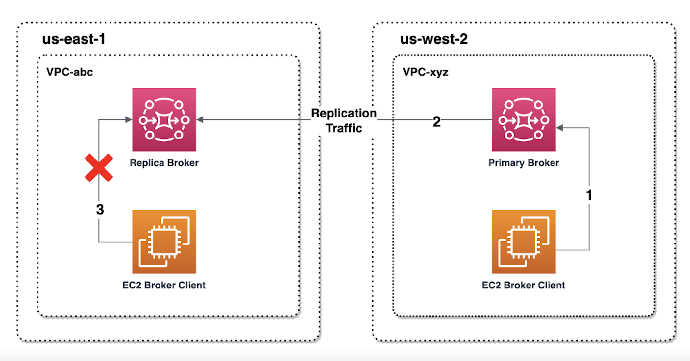

# Initiating switchover or failover to promote an Amazon MQ replica broker to primary broker role

You can initiate a switchover or failover when you want to promote the replica broker to the primary broker role.
When you promote the replica broker, the primary broker is demoted to the replica broker role.

A **switchover** prioritizes consistency over availability.
Brokers are guaranteed to have identical state when this failover operation completes.
With a switchover, there may be a period where neither broker is available for client connections while inter-broker consistency is established.
Both brokers will have the same state at the instant when the replica is promoted. Switchover success depends on the health of both regions and the inter-region network to succeed.

A **failover** prioritizes availability over consistency.
Brokers are not guaranteed to have identical states when this operation completes.
With a failover, the replica broker is guaranteed to become immediately available to serve client traffic, without waiting for any replication data to be synchronized, or for the primary to receive the shutdown signal.
Failover depends on neither the health of the original primary region nor the inter-region network to succeed.

The following diagram illustrates a switchover in which neither broker accepts client connections while the replication queue is being drained and broker states are synchronized.
In this process, the client in the primary broker’s VPC is unable to produce further state changes while the operation is in progress, and the primary broker is being demoted to a replica.
When the replication queue is drained and the two brokers achieve identical state, the client in the replica broker’s VPC is unable to connect to the replica broker until the failover operation completes,
and the replica broker is promoted to primary.

The following diagram illustrates the broker status after the switchover process is complete. The original replica broker has now been promoted to the primary broker role and is accepting client connections.
The client can produce and consume data from the broker.

## Promote the replica broker using the console

To promote the replica broker using switchover or failover, follow these steps in the Amazon MQ console.

###### Note

You cannot initiate switchover or failover on a primary broker.

1. Switch to the region for your replica broker. From your Brokers table, select the existing replica broker you will promote to primary.
2. On the **Broker details page**, do the following:
   1. Select **Promote replica**.
   2. In the pop up window, chose _Switchover_ or _Failover_.
   3. Type “confirm” in the text box to confirm your choice.
   4. Choose **Confirm**.

After initiating failover, the broker status changes to _Failover in progress_.
The blue progress bar at the top of the Brokers page becomes green when failover is complete.

###### Note

The configuration is only replicated at the time the replicat broker is created. Any update afterwards is not replicated.
