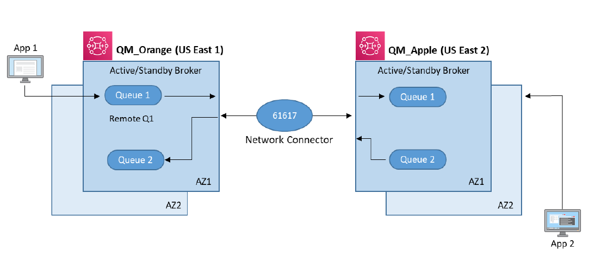

# Replicating IBM MQ architecture with Amazon MQ

Amazon MQ provides a variety of broker configurations,
various instance sizes for different workloads, and broker options such as single instance, single instance mesh,
active/standby instance or active/standby mesh for high availabilty and message durability. To learn more about supported
broker options, see [Amazon MQ Broker Architecture](../developer-guide/amazon-mq-broker-architecture.md "../developer-guide/amazon-mq-broker-architecture.md").

In this section, we replicate the IBM MQ system shown in the previous section with Amazon MQ,
while keeping the same configuration.

Amazon MQ manages the work involved in setting up an ActiveMQ message broker, from
provisioning the infrastructure capacity (server instances and
storage) to installing the broker software. Once
your broker is up and running, Amazon MQ automates common
administrative tasks such as patching the ActiveMQ software that
power your brokers.

###### Note

If you wish to use a single region, you can simply
deploy your Amazon MQ brokers in one region with the active/standby configuration. You
can also optimize the performance of your Amazon MQ brokers by taking advantage of
the [Apache ActiveMQ optimization settings](https://activemq.apache.org/performance-tuning "https://activemq.apache.org/performance-tuning").

The following diagram illustrates Amazon MQ configured across two regions
with a linear connection between two active/standby brokers:

For _App 1_ to communicate with _App 2_:

1. Client applications can use a
   _transport_ connector and
   put messages onto a Queue or publish to a Topic.
2. Brokers connect to each other over a
   _network_ connector either
   in one direction or both directions in cases where
   request-reply messaging is required.
3. Queues and users can be created and managed in the AWS Console.
   To learn more, see [Amazon MQ Basic Elements](../developer-guide/amazon-mq-basic-elements.md "../developer-guide/amazon-mq-basic-elements.md").

###### Note

- A _transmit queue_ in IBM MQ is a local queue, except it is used
  to forward messages to a remote IBM MQ queue manager through a
  sender-receiver channel pair. In Amazon MQ, a transmit queue is not
  required.
  Once 2 brokers are connected using a
  [network connector](../developer-guide/child-element-details.md#networkConnector "../developer-guide/child-element-details.md#networkConnector"),
  they begin to share all queues/topics, and their data.
- A _remote queue_ in IBM MQ is a local impression of a remote queue
  available at a remote IBM MQ queue manager. For external
  applications, there is no difference between local or remote
  queues. In Amazon MQ, there is no remote queue mechanism and
  it is not required.
- Sender or receiver channels in IBM MQ are used as network
  paths to connect 2 IBM MQ queue managers. In Amazon MQ, this
  functionality is implemented using
  [network connectors](../developer-guide/child-element-details.md#networkConnector "../developer-guide/child-element-details.md#networkConnector").
- Currently, Amazon MQ only supports JMS 1.1. Applications
  written for JMS 2.0 can be migrated to Amazon MQ using the
  [Qpid](https://qpid.apache.org/ "https://qpid.apache.org/") JMS
  library, which uses _AMQP_ instead of the default,
  higher-performing _Openwire_ protocol.
  For more details, refer to the
  [Amazon MQ workshop](https://github.com/aws-samples/amazon-mq-workshop/tree/master/amqp-client "https://github.com/aws-samples/amazon-mq-workshop/tree/master/amqp-client").
