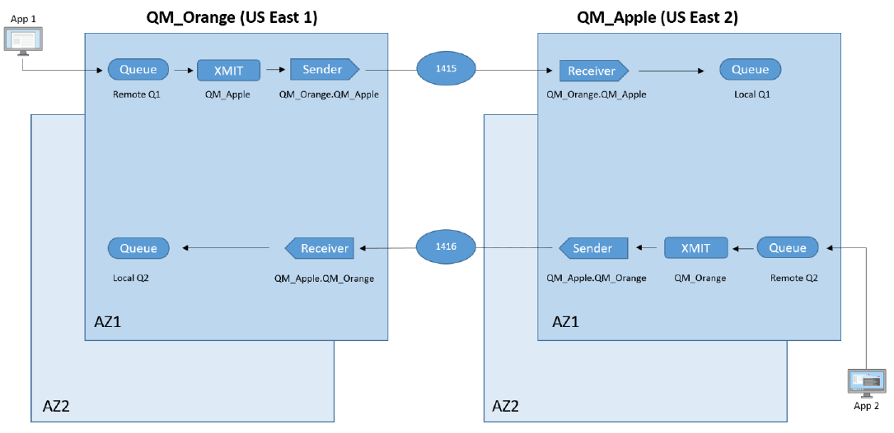
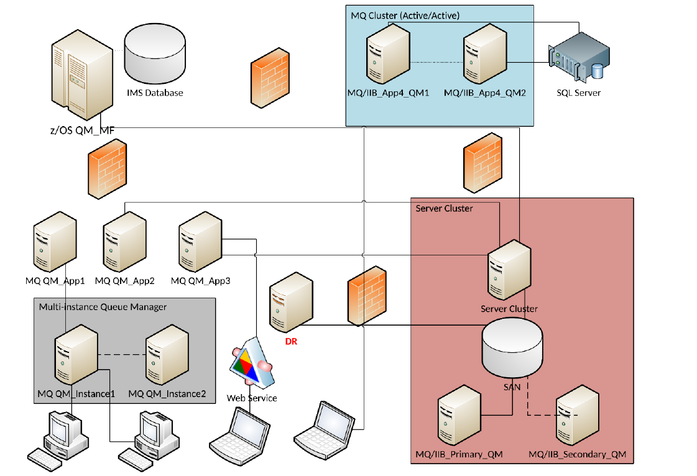

# Which IBM MQ architectures are used for migrating to Amazon MQ?

You can migrate from IBM MQ to Amazon MQ using IBM MQ high availability topology running on AWS
or IBM MQ HA/DR topology running on-premises.

## Option one: IBM MQ high availability topology running on AWS

The below diagram shows a typical architecture of IBM MQ
connections between two IBM MQ queue managers in a High Availability cluster
as seen in many enterprise applications. IBM MQ queue manager
**QM_ORANGE** is deployed in the _us-east-1_
region and **QM_APPLE** is deployed in the
_us-east-2_ region.

For application _App 1_ to communicate with _App 2_:

1. _App 1_ uses a communications channel to send messages to
   **QM_ORANGE** on `Remote Q1`.
2. Messages from several such queues, though not shown in the
   diagram, are pooled into transmission `Queue Q` **QM_APPLE**.
3. Sender channels read messages from the transmission queue,
   and communicate with a receiver channel to place messages on `Local Q1`
   on queue manager **QM_APPLE** ,which are then consumed by
   _App 2_.

## Option Two: IBM MQ HA/DR topology running on-premises

In the above diagram, the **MQ Cluster** is comprised of two separate queue managers and
all messages are routed via cluster channels and queueing. If one queue manager fails, messages are then re-routed to
another queue manager.

The **Server Cluster** is made up of just
a single queue manager with three distinct IP addresses. In this configuration,
all applications are connected to the Server Cluster IP addresses.
If failure is detected, the _SAN_ begins pointing to the secondary server. In case, of a failure event,
channel connections do not have to be changed, and connectivity remains uninterrupted for users.

The **Multi-Instance queue manager** is comprised of a single queue manager with
identical queues on both servers, and two distinct IP addresses. If failure is detected, a queue manager must be
manually activated on the seconrd server and channel connections must be changed, resulting in possible service interruptions.

To ensure disaster recovery, data is replicated in real-time to a separate server in a
different location. In case of a disaster, manual effort is required to process the data stored on the Disaster Recovery (DR) server, and change
channel connections, resulting in possible service interruptions.
