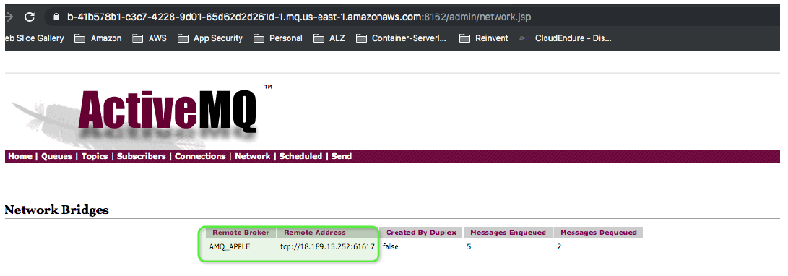
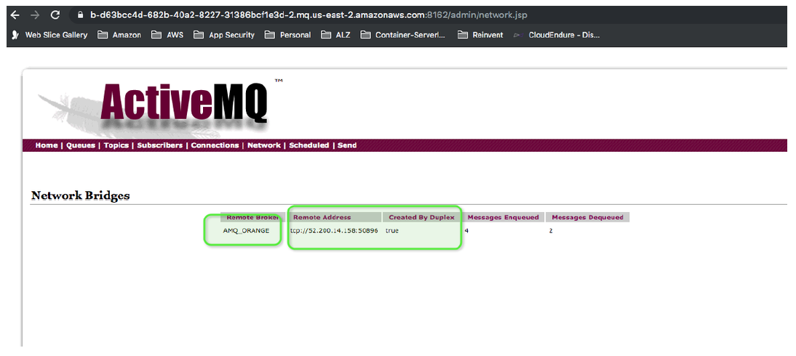
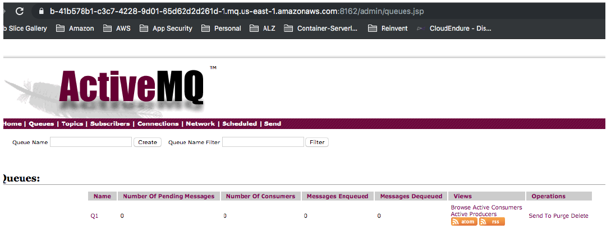
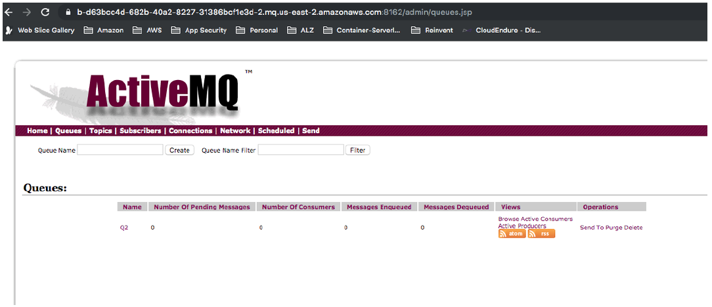

# Re-platforming IBM MQ to Amazon MQ

The following procedure shows how you can migrate an
[IBM MQ](ibm-mq-typical-architecture.md "ibm-mq-typical-architecture.md") to an equivalent Amazon MQ
without impacting _App 1_ or _App 2_:

1. Create an [active/standby broker](../developer-guide/active-standby-broker-deployment.md "../developer-guide/active-standby-broker-deployment.md")
   in _us-east-1_ and another in _us-east-2_ named as
   **AMQ_ORANGE** and **AMQ_APPLE**.
2. Create a _Network Bridge_ between 2 brokers by adding a duplex network
   connector definition to one of the queues:

```
<networkConnectors>
    <networkConnector duplex="true" name="connector_AMQ_ORANGE_to_AMQ_APPLE" uri="masterslave:(ssl://b-d63bcc4d-682b-40a2-8227-31386bcf1e3d-1.mq.us-east-2.amazonaws.com:61617,ssl://b-d63bcc4d-682b-40a2-8227-31386bcf1e3d-2.mq.us-east-2.amazonaws.com:61617)" userName="amqadmin"/>
</networkConnectors>

```

After the reboot of **AMQ_ORANGE**, there should be a Network Bridge
created between both brokers as illustrated below:





###### Note

Steps 1 and 2 can be replicated using a
AWS CloudFormation template. For more information about using AWS CloudFormation to set up
Amazon MQ brokers, see the Amazon MQ [AWS CloudFormation Template Reference](../../../AWSCloudFormation/latest/UserGuide/AWS_AmazonMQ.md "../../../AWSCloudFormation/latest/UserGuide/AWS_AmazonMQ.md"). 3. Log in to IBM MQ Queue Manager Host and list the
queues/topics definitions. In **QM_ORANGE**, you can list the queues and topics from IBM MQ using
the following command:

```
`$` `sudo dmpmqcfg -m QM_ORANGE -t queue -o 1line |
 grep -v "SYSTEM" |
 grep -v "AUTHREC" |
 grep -v "*" |
 gawk -F: '{ print $1 }‘`

```

The output:

```
DEFINE QREMOTE('Q1') RQMNAME('QM_APPLE') RNAME('Q1') XMITQ('QM_APPLE') REPLACE
DEFINE QLOCAL('Q2') DISTL(NO) MAXDEPTH(5000) REPLACE
DEFINE QLOCAL('QM_APPLE') GET(DISABLED) MAXDEPTH(5000) USAGE(XMITQ) REPLACE
```

In the example above, `Q1` is the link to the remote queue,
`QM_APPLE` is the transit queue, and `Q2` is the local queue.
We only need local queue `Q2` for the Amazon MQ setup, which can be
defined in the broker configuration as `<queue physicalName="Q2"/>`

`Q1` is a local queue on `QM_APPLE` and `Q2`
is a local queue in `QM_ORANGE`.
You can configure these resources accordingly in **AMQ_APPLE** and **AMQ_ORANGE**
by using the following configuration

```
<destinations>
    <queue physicalName="localQ1"/>
</destinations>

```

Similairly, get the list of queues and topics from `QM_APPLE`. 4. Manually create a dead letter queue strategy in the AMQ
configuration file.

The defaultdead letter queue in ActiveMQ is called
`ActiveMQ.DLQ`. All un-deliverable messages
will get routed to this queue. To streamline this process, you can set up an
`individualDeadLetterStrategy` in the
destination policy map of the `activemq.xml`
configuration file, allowing you to specify a specific dead
letter queue prefix for a given queue or topic. You can apply
this strategy using a wild-card so that all queues
can be set up with their own dead-letter queues, as is shown in the example
below:

```
<broker>
    <destinationPolicy>
        <policyMap>
            <policyEntries>
                <!-- Set the following policy on all queues using the '>' wildcard -->
                <policyEntry queue=">">
                    <deadLetterStrategy>
                        <!-- Use the prefix 'DLQ.' for the destination name, and make the DLQ a queue rather than a topic -->
                        <individualDeadLetterStrategy queuePrefix="DLQ." useQueueForQueueMessages="true"/>
                    </deadLetterStrategy>
                </policyEntry>
            </policyEntries>
        </policyMap>
    </destinationPolicy>
</broker>

```

###### Note

**Dead-Letter queue expiration -** By default, ActiveMQ will
**never** expire messages sent to a Dead-Letter Queue (DLQ).
However, beginning with ActiveMQ 5.12, the `deadLetterStrategy`
supports an expiration attribute whose value is given in milliseconds as shown below:

```
<broker>
    <destinationPolicy>
        <policyMap>
            <policyEntries>
                <policyEntry queue="QueueWhereItIsOkToExpireDLQEntries">
                    <deadLetterStrategy>
                        <.... expiration="300000"/>
                    </deadLetterStrategy>
                </policyEntry>
            </policyEntries>
        </policyMap>
    </destinationPolicy>
</broker>


```

5. Create local queue `Q1` on **AMQ_ORANGE** and
   `Q2` on **AMQ_APPLE** as shown in the following:




