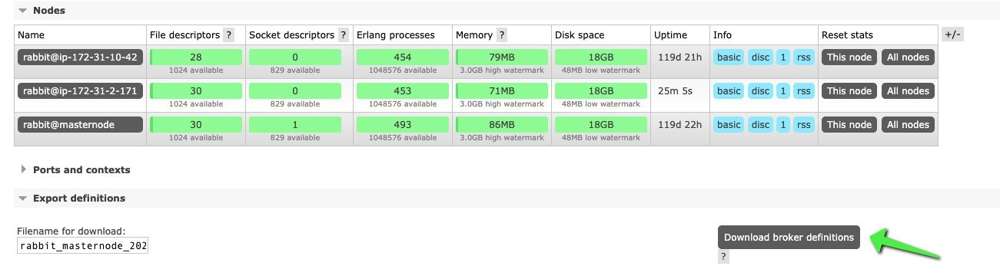
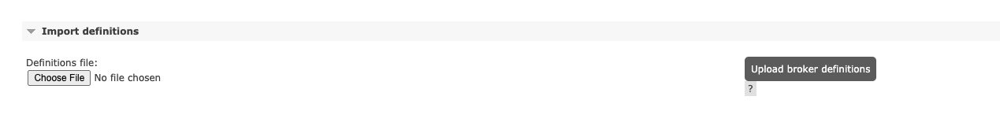

# Migrating to Amazon MQ for RabbitMQ

Amazon MQ supports migration from self managed Classic Mirrored Queues to Amazon MQ managed Classic Mirrored Queues
on all supported cluster instances running RabbitMQ version `3.10.x` or higher.

You can export the configuration from your self-managed RabbitMQ cluster and import it into Amazon MQ
for RabbitMQ. Queue, exchange, user, and policy definitions are imported.
You can edit the exported JSON from the existing RabbitMQ cluster to remove the definitions that are not supported.
The current default queue type is Classic Mirrored Queues. We recommend Customers use the latest
[Amazon MQ for RabbitMQ supported version](../developer-guide/rabbitmq-version-management.md "../developer-guide/rabbitmq-version-management.md")
when using Classic Mirrored Queues.

###### Important

Amazon MQ for RabbitMQ has an enforced policy of `ha-mode=all` and `ha-sync-mode=automatic`
which will override any custom policy.

## Prerequisites

Complete the following prerequisites before migrating to Amazon MQ for RabbitMQ:

- Review the [Concepts for migrating to Amazon MQ](concept-chapter-about.md#key-concepts "concept-chapter-about.md#key-concepts")
  and [Options for migrating to Amazon MQ](migration-approaches.md "migration-approaches.md") for migration to AWS managed Amazon MQ
- Create a RabbitMQ broker: You will import the configuration from your self-managed RabbitMQ cluster
  into an existing Amazon MQ for RabbitMQ broker. For instructions on how to create a Amazon MQ for RabbitMQ broker,
  see [Creating and connecting to a RabbitMQ broker](../developer-guide/getting-started-rabbitmq.md "../developer-guide/getting-started-rabbitmq.md").

## Step 1: Exporting definitions

To export the definitions from a self-managed RabbitMQ cluster and import them into Amazon MQ for RabbitMQ, do the following:

1. Go to the RabbitMQ console of your existing self-managed cluster by signing on to any of the brokers.
   Choose the overview tab, then select `Export Definitions` to produce a link to export the definition.

 2. Next, login to the Amazon MQ RabbitMQ console. Navigate to the existing broker you would like to apply the configurations to.
Click on the overview tab, then click import definitions to upload the configuration file that you exported in the previous step.

 3. Once the configuration file is imported, you can view all the queues and exchange definitions that were defined in the self-managed broker.

## Step 2: Moving existing messages to your new Amazon MQ managed broker

Amazon MQ for RabbitMQ currently supports the Federation and Shovel plugins for moving messages from a self-managed RabbitMQ broker to an Amazon MQ for RabbitMQ broker.

**Shovel**

The Shovel plugin is used to move messages from an on-premises RabbitMQ broker without internet access to a private Amazon MQ managed broker.
The Shovel plug in is configured on the on-premises broker to push messages to the Amazon MQ managed broker.
Using the Shovel plug in requires a VPN connection between the Amazon Managed VPC and the on-premises network.
For more information on using the Shovel plug in, see
[How do I set up the RabbitMQ Shovel plugin on my Amazon MQ broker?](https://repost.aws/knowledge-center/mq-rabbitmq-shovel-plugin-setup "https://repost.aws/knowledge-center/mq-rabbitmq-shovel-plugin-setup")

**Federation**

The Federation plugin facilitates moving messages from a public upstream broker to a downstream broker.
The plugin is configured on the downstream broker, which in this case is the new Amazon MQ for RabbitMQ broker created in the previous section.
For more information on using the RabbitMQ federation plug in, see the [RabbitMQ Federation Plugin documentation](https://www.rabbitmq.com/federation.html "https://www.rabbitmq.com/federation.html").

## Additional resources

**Versions**

When you create a new Amazon MQ for RabbitMQ broker, you can specify any supported RabbitMQ engine version.
The different engine versions support certain features. For optimal performance, we suggest using
[the latest engine version](../developer-guide/rabbitmq-version-management.md "../developer-guide/rabbitmq-version-management.md").

**Sizing**

The broker instance type determines system throughput. Before migrating, review the
[sizing documentation](../developer-guide/ensuring-effective-amazon-mq-performance.md#broker-instance-types-choosing "../developer-guide/ensuring-effective-amazon-mq-performance.md#broker-instance-types-choosing")
to determine the best broker instance type for your application.

**Limits**

Amazon MQ for RabbitMQ brokers, configurations, users, data storage, and API throttling have default limits.
To request an increase for a limit, see
[AWS Service Quotas](../../../general/latest/gr/aws_service_limits.md "../../../general/latest/gr/aws_service_limits.md") in the Amazon Web Services General Reference.

**Best practices**

Learn more about ensuring effective performance in all areas of your RabbitMQ application
by reviewing the [RabbitMQ best practices documentation](../developer-guide/best-practices-rabbitmq.md "../developer-guide/best-practices-rabbitmq.md").
