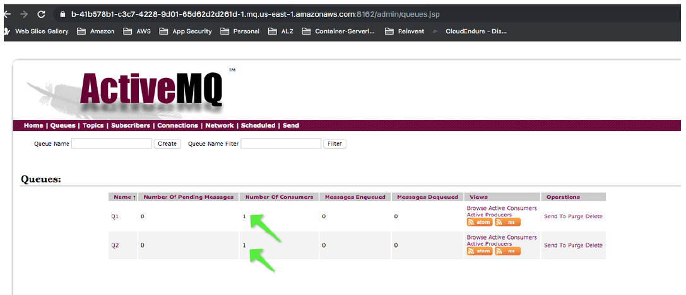
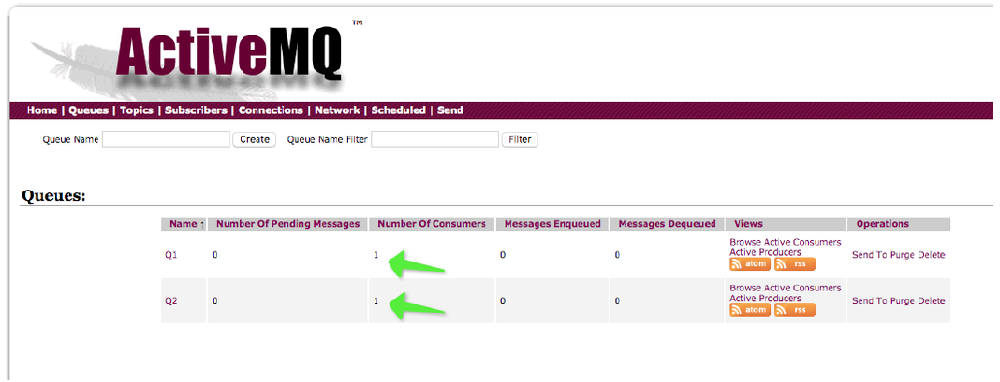

# Validating your migration to Amazon MQ

Learn how to test and validate the availbability of your brokers using the following procedure.

1. Subscribe to `Q1` on **AMQ_APPLE** and `Q2` on
   **AMQ_ORANGE**. Using a Network Bridge, create a queue replica
   on both sides.

###### Note

The process for external subscribers is the same
as subscribing to local queues.

The following example shows the **AMQ_ORANGE**
broker with consumers in _us-east-1_ and
**AMQ_APPLE** with consumers in _us-east-2_
:

 2. Both queues are now available to both brokers,
producers can send messages to any broker, and subscribers
can receive messages from any broker. For _JMS 1.1_ compliant applications,
change the endpoint URL to an ActiveMQ failover URL.

###### Note

To learn more about a phased migration approach from IBM MQ to Amazon MQ, refer to this
[post](https://aws.amazon.com/blogs//compute/migrating-from-ibm-mq-to-amazon-mq-using-a-phased-approach/ "https://aws.amazon.com/blogs//compute/migrating-from-ibm-mq-to-amazon-mq-using-a-phased-approach/").
