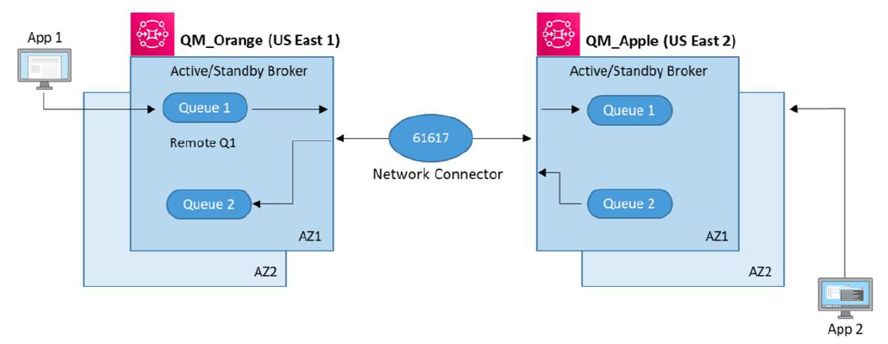

# Replicating TIBCO EMS architecture with Amazon MQ

Amazon MQ provides a variety of broker configurations,
various instance sizes for different workloads, and broker options such as single instance, single instance mesh,
active/standby instance or active/standby mesh for high availabilty and message durability. To learn more about supported
broker options, see [Amazon MQ Broker Architecture](../developer-guide/amazon-mq-broker-architecture.md "../developer-guide/amazon-mq-broker-architecture.md").

In this section, we replicate the architecture of the TIBCO EMS system shown in the previous section
with Amazon MQ while keeping the same configuration.

###### Note

If you wish to use a single region, you can simply
deploy your Amazon MQ brokers in one region with the active/standby configuration. You
can also optimize the performance of your Amazon MQ brokers by taking advantage of
the [Apache ActiveMQ optimization settings](https://activemq.apache.org/performance-tuning "https://activemq.apache.org/performance-tuning").

The following diagram illustrates Amazon MQ configured across two regions
with a linear connection between two active/standby brokers:

For _App 1_ to communicate with _App 2_:

1. Client applications can use a
   _transport_ connector and
   put messages onto a Queue or publish to a Topic.
2. Brokers connect to each other over a
   _network_ connector either
   in one direction or both directions in cases where
   request-reply messaging is required.
3. Queues and users can be created and managed in the AWS Console.
   To learn more, see [Amazon MQ Basic Elements](../developer-guide/amazon-mq-basic-elements.md "../developer-guide/amazon-mq-basic-elements.md").

###### Note

- A _Global Topic_ with the same name has to be created on other
  EMS Servers for forwarding messages to the Topic on those
  EMS Servers. In Amazon MQ, a _global topic_ is not required.

Once 2 brokers are connected using a
[network connector](../developer-guide/child-element-details.md#networkConnector "../developer-guide/child-element-details.md#networkConnector"),
they begin to share all queues/topics, and their data.

- In Amazon MQ, a _routed queue_ as implemented by a
  TIBCO EMS server is not required.

- A network bridge from a topic to a queue can be used in TIBCO EMS
  architecture to avoid the naming issue with routed queues
  and to provide multi-hop capability between EMS servers using a
  Topic. In Amazon MQ, queue names are consistent and all
  topic/queue messages are shared among a [Networks of Brokers](../developer-guide/network-of-brokers.md "../developer-guide/network-of-brokers.md").

- Currently, Amazon MQ only supports JMS 1.1. Applications
  written for JMS 2.0 can be migrated to Amazon MQ using the
  [Qpid](https://qpid.apache.org/ "https://qpid.apache.org/") JMS
  library, which uses _AMQP_ instead of the default,
  higher-performing _Openwire_ protocol.
  For more details, refer to the
  [Amazon MQ workshop](https://github.com/aws-samples/amazon-mq-workshop/tree/master/amqp-client "https://github.com/aws-samples/amazon-mq-workshop/tree/master/amqp-client").
