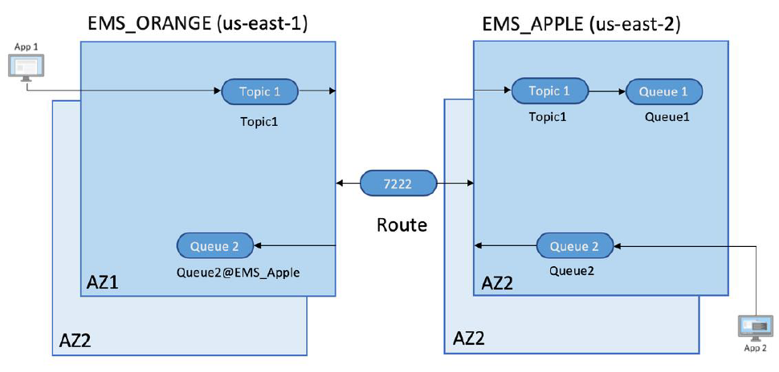
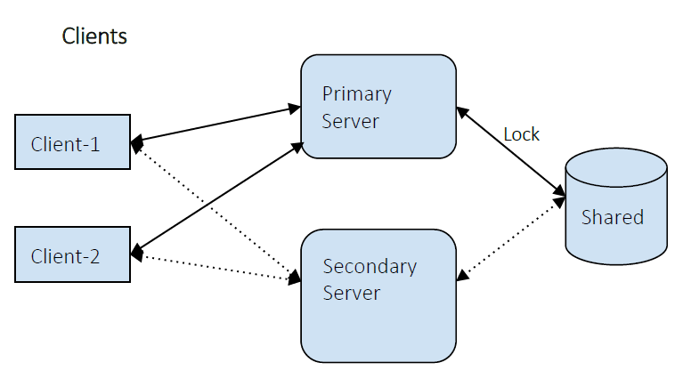

# Which TIBCO EMS architectures are used for migrating to Amazon MQ?

You can migrate from TIBCO EMS to Amazon MQ using cross-regional architecture in AWS or TIBCO EMS high availability architecture.

## Option 1: TIBCO EMS cross-regional architecture in AWS

The below diagram shows the typical architecture of TIBCO EMS
routing between two TIBCO EMS Servers in different regions, common in many enterprise systems.
TIBCO EMS Server **EMS_ORANGE** is
deployed in the _us-east-1_ region and
**EMS_APPLE** is deployed in
the _us-east-2_ region:

For application _App 1_ to communicate with _App 2_:

1. _App 1_ uses a topic destination, _Topic1_ on
   server **EMS_ORANGE** to publish messages.
2. Published messages are transmitted to topic
   _Topic1_ on server **EMS_APPLE** using the
   configured route.
3. On **EMS_APPLE**, a bridge is configured to move messages from
   topic, _Topic1_ to queue,
   _Queue1_. Messages are then consumed by _App 2_.

## Option 2: TIBCO EMS high availability architecture

In this configuration, High availability is provided by
configuring a pair of servers, _Primary_ and _Secondary_. In a typical enterprise architecture,
two high availability configurations,
_shared_ and _unshared_.
The shared state setup is the most widely used setup in
enterprise settings. The following diagram demonstrates the Shared State configuration for a pair of
messaging servers:

In the above diagram, a pair of messaging servers share a state by sharing
file-based storage. The primary server attains the lock on
the shared storage capacity, becomes active, and accepts client connections,
while the secondary server remains in passive mode. Meanwhile,
the primary and secondary servers will be made aware of
one another's status via periodic, heartbeat pings.

In te case of a failover, the secondary server will assume
the state of the primary server, and acquire the lock on the
shared state.

###### Note

The above configuration is unable to support more than two servers, and data
replication across the servers for durability.
