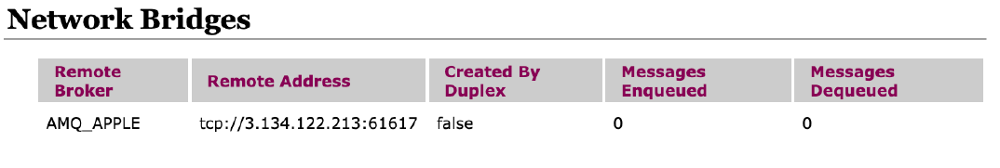

# Re-platforming TIBCO EMS to Amazon MQ

You can use the following procedure to migrate the TIBCO EMS architecture shown
[here](tibco-ems-typical-architecture.md "tibco-ems-typical-architecture.md") to an equivalent Amazon MQ
architecture without impacting _App 1_ or _App 2_:

1. Create an [active/standby broker](../developer-guide/active-standby-broker-deployment.md "../developer-guide/active-standby-broker-deployment.md")
   in _us-east-1_ and another in _us-east-2_ named as
   **AMQ_ORANGE** and **AMQ_APPLE**.
2. Create a _Network Bridge_ between 2 brokers by adding a duplex network
   connector definition to one of the queues:

```
<networkConnectors>
    <networkConnector duplex="true" name="connector_AMQ_ORANGE_to_AMQ_APPLE" uri="masterslave:(ssl://b-d63bcc4d-682b-40a2-8227-31386bcf1e3d-1.mq.us-east-2.amazonaws.com:61617,ssl://b-d63bcc4d-682b-40a2-8227-31386bcf1e3d-2.mq.us-east-2.amazonaws.com:61617)" userName="amqadmin"/>
</networkConnectors>

```

After the reboot of **AMQ_ORANGE**, there should be a Network Bridge
created between both brokers as illustrated below:



###### Note

Steps 1 and 2 can be replicated using a
AWS CloudFormation template. For more information about using AWS CloudFormation to set up
Amazon MQ brokers, see the Amazon MQ [AWS CloudFormation Template Reference](../../../AWSCloudFormation/latest/UserGuide/AWS_AmazonMQ.md "../../../AWSCloudFormation/latest/UserGuide/AWS_AmazonMQ.md"). 3. Retrieve the list of static TIBCO EMS server destinations from
the config files, `queues.conf` and
`topics.conf` or by using the following
`tibemsadmin` commands:

```
`show queues * static
show topics * static`

```

When finished, update the Amazon MQ broker **AMQ_ORANGE** configuration file to add
startup destinations as shown here:

```
<destinations>
    <queue physicalName="FOO.BAR"/>
    <topic physicalName="SOME.TOPIC"/>
</destinations>


```

4. Destination properties for TIBCO EMS can be found in queues.conf and topics.conf files.
   Per Destination level Policy can be set in Amazon MQ using the `destinationPolicy`
   section in the configuration file.
5. Retrieve the list of TIBCO EMS Bridges from `bridges.conf`. For example,
   the Bridge from source topic `NOTIFY.FOOBAR` to target queues `FOO` and `BAR`
   is shown as:

```
[topic:NOTIFY.FOOBAR]
queue=FOO
queue=BAR
```

When finished, up the Amazon MQ broker **AMQ_ORANGE** configuration
file to add Composite Destinations that match TIBCO EMS bridges.

###### Note

_Simple Topic to Queue_
bridges are needed in TIBCO EMS to support _m-hop_ routing. In
Amazon MQ this is not needed and queues can be used directly
with a [Network of Brokers](../developer-guide/network-of-brokers.md "../developer-guide/network-of-brokers.md").
