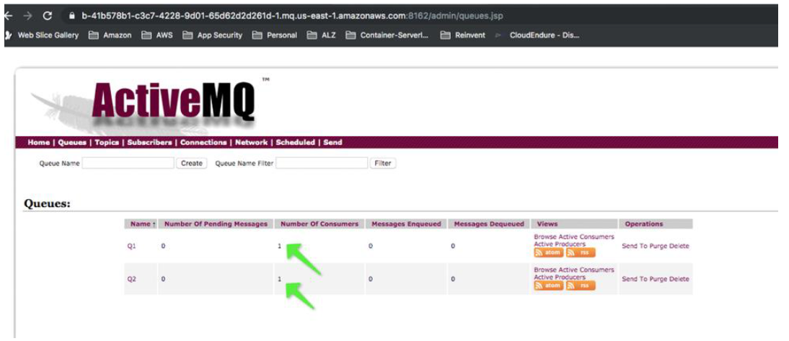
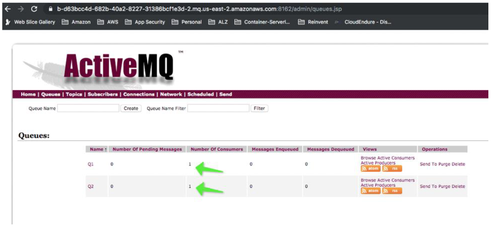

# Validating your migration to Amazon MQ

In the [Which TIBCO EMS architectures are used for migrating to Amazon MQ?](tibco-ems-typical-architecture.md "tibco-ems-typical-architecture.md") section,
a _Topic to Queue_ bridge was used to
forward messages to other EMS servers. In Amazon MQ, _App 1_ would
send messages directly to `Q1` because messages on a queue are
forwarded in a [Network of Brokers](../developer-guide/network-of-brokers.md "../developer-guide/network-of-brokers.md").

In the TIBCO EMS example, messages from _App 2_ are
sent to `Q2` and then forwarded to `Q2@EMS_APPLE`.
In Amazon MQ, the queue name, `Q2`, would
be the same on both message brokers, simplifying the
configuration of _App 1_.

The following example shows the **AMQ_ORANGE**
broker with consumers in _us-east-1_ and
**AMQ_APPLE** with consumers in _us-east-2_

